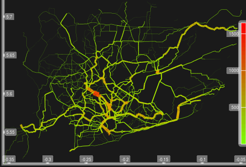

<!-- Note: this is where I'm adding the write-up for now for maximum visibility.
Can go elsewhere, e.g. as a vignette before this is open sourced. -->

```{r, echo = FALSE}
knitr::opts_chunk$set(
  out.width = "100%",
  collapse = TRUE,
  comment = "#>",
  fig.path = "README-",
  echo = FALSE
)
```

# Introduction

There is now incontrovertible evidence of health benefits of active travel, especially cycling [e.g. @celis-morales_association_2017].
This project aims to provide an evidence base to prioritise investment in cycling.

# Input data

Data were accessed from the following sources:

- Transport network and building data from ***OpenStreetMap (OSM)**, an open access, freely available, crowd-sourced online mapping database.
- Population density and some demographic data from [worldpop](http://www.worldpop.org.uk/)
<!-- - Topographic data from NASA's open SRTM data -->

<!-- Additional data on population densities will be obtained from WorldPop and from NASA's Socioeconomic Data and Applications Center (SDAC). The -->
<!-- former provides static fine-resolution data (100$m^2$, for the year 2013 only), while the latter provides coarser (1$km^2$) future projections -->
<!-- out to 2020. -->


# City overviews

This section provides a high-level overview about the geography of each city as it relates to active travel potential.
Both cities are included in this section, laying the ground for the next two sections which provide detailed results for Accra and then Kathmandu.
Comparing the cities at the outset will help put the results in perspective and lay the foundation for a discussion of how a tool building on this work could be useful to different stakeholders in each city.

## An overview of Accra from an active travel perspective

Monsuru (1 day's work)

- Institutions working in transport and their aims
- References about the transport system in Accra
- Photos of current set-up
- What is the current modal split?
- Recent transport policies.
- How well developed are other infrastructures (e.g. sewerage.)

## An overview of Kathmandu from an active travel perspective

# Results I: Accra

## Data quality

- How well is the road network represented on OSM?

```{r, fig.cap="Overview of Accra"}
knitr::include_graphics("fig/accra-osm-overview.png")
```


The aggregated flows for Accra are illustrated below.

```{r, fig.cap="Aggregated flows for Kathmandu"}

```

We have developed a method for re-allocating the results of the routing algorithm back onto the road network.
A custom level of road segmentation was developed to create this geographical aggregated flow map, which clearly shows routes with high cycling potential ([see interactive version](http://rpubs.com/RobinLovelace/341996)):

```{r, echo=FALSE, fig.cap="Illustration of interactive map demonstrating the preliminary results: the routes in Accra with highest cycling potential."}
knitr::include_graphics("fig/accra-flow1-interactive.png")
```


# Results II: Kathmandu

# Data deliverables

## OpenStreetMap data

The OpenStreetMap network for Accra has 145,827 street segments connecting
131,349 distinct points, and extends over 4,072km. The OSM data also include
24,490 buildings, of which 23,102 include geometric descriptions only, while the
remaining 1,388 buildings are divided between 28 distinct categories.

The equivalent network for Kathmandu has 79,832 street segments connecting
37,770 distinct points, and extends over 1,062km. The OSM data also include 82,333
buildings of which 75,778 include geometric descriptions only, while the
remaining 6,555 are divided between 344 distinct categories (in this case
including many named buildings).

```{r, echo=FALSE}
r = readRDS("extdata/r.rds")
names(r) = c("City", "Street nodes", "Street segments", "Network distance (km)", "Population (on network)", "N. Buildings", "nb_no_desc", "Num. Building Classes")
knitr::kable(r[-7])
```


The street network for Accra is more extensive, reflecting the greater spatial
extent of the city, while data on buildings are considerable more detailed for
Kathmandu than for Accra, presumably reflecting extensive humanitarian mapping
activity in response to the 2015 earthquake.

## Demographic data

Demographic data for Accra from worldpop include population density estimates
at 172,238 points, corresponding to estimates in roughly 30-by-30m grid cells.
Estimates are available for total population density, as well as distributed
between 14 5-year age classes from 0-5 years up to 60-65 years, and 65+ years.

Demographic data for Kathmandu are not as detailed, and also do not include age
classes...

# Discussion

## Policy relevance of results

<!-- To what extent has this deliverable (from phase 1) been delivered? -->
<!-- **Deliverables:** This phase will provide clean datasets and summary information about the 'data landscape' of each case study city. -->
<!-- This will relate primarily to population density, trip attractors and transport infrastructure from which to -->
<!-- We will also deliver summaries of the relationships between demographic and transport infrastructure data and an assessment of the quality of local data and priorities for future data collection. -->
<!-- The deliverables will be provided in the form of datasets provided to the WHO and interactive and high quality maps. -->

## The potential uses of an online toolkit

# Next steps

# References

<!-- Anything else to consider here guys? -->


