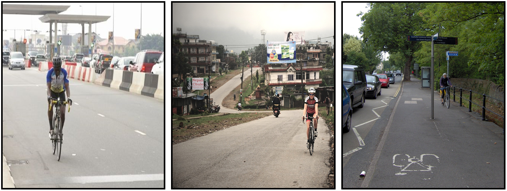
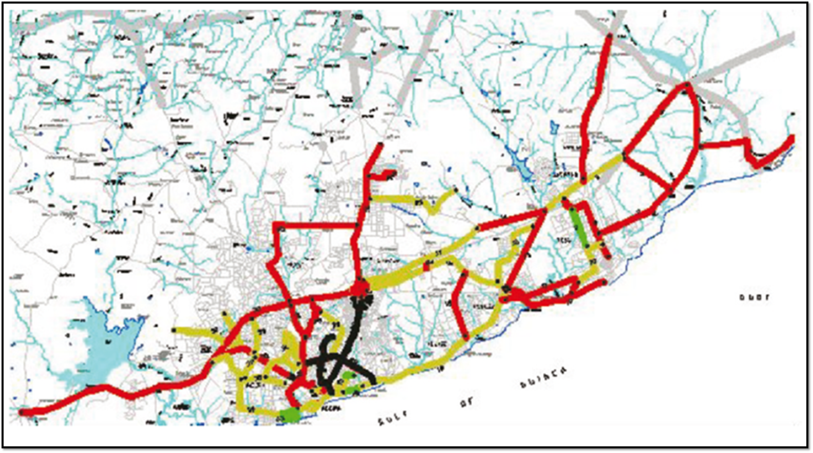
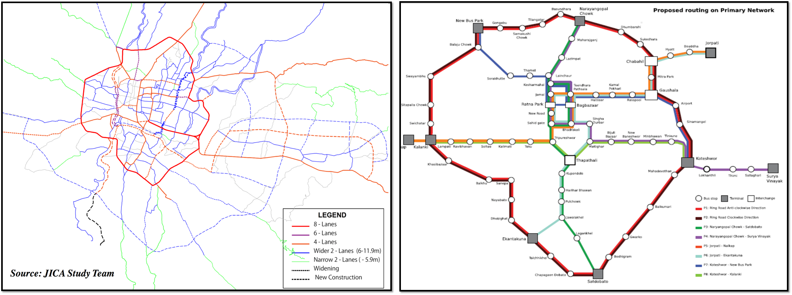
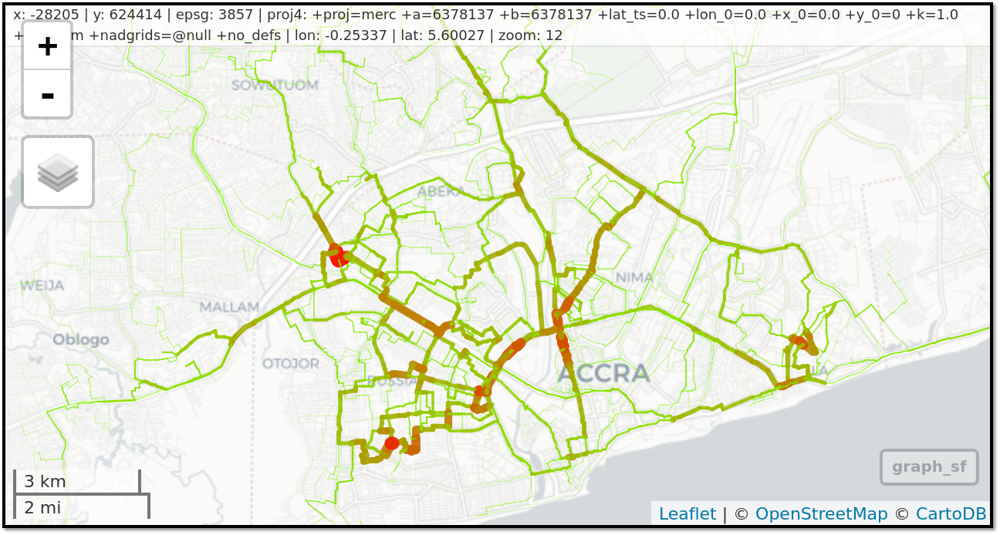
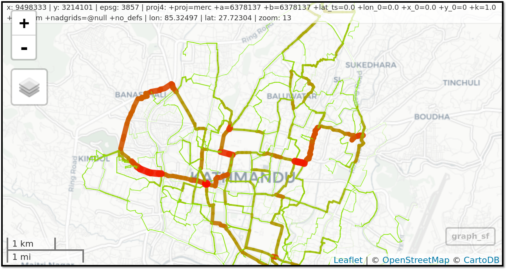

<!-- Note: this is where I'm adding the write-up for now for maximum visibility.
Can go elsewhere, e.g. as a vignette before this is open sourced. -->

```{r, echo = FALSE}
knitr::opts_chunk$set(
  out.width = "100%",
  collapse = TRUE,
  comment = "#>",
  fig.path = "README-",
  echo = FALSE
)
# add citation
# citr::tidy_bib_file(rmd_file = "README.Rmd", messy_bibliography = "~/allrefs.bib", file = "who.bib")
# export as low-res pdf:
msg = "gs -sDEVICE=pdfwrite -dCompatibilityLevel=1.4 -dPDFSETTINGS=/screen -dNOPAUSE -dQUIET -dBATCH -sOutputFile=who-toolkit-feasibility-study.pdf README.pdf"
system(msg)
```


# Introduction

The benefits of active travel for individual and urban health, the environment, and society are becoming increasingly apparent [@celis-morales_association_2017], and many cities are preparing ambitious walking and cycling plans.
However many transport authorities lack strong and actionable evidence to support this investment for a number of reasons, including:

- transport models have tended to focus on motor vehicles [@boyce_forecasting_2015]
- data on active travel tends to be sparse and inaccessible [@kuzmyak_estimating_2014]
- data and models that are available tend to be unavailable for many potential stakeholders (e.g. civil society groups) and in formats that are difficult to understand and use [@naess_transport_2014]

This project aims to tackle these problems by assessing the feasibility of tools to provide *actionable*, *publicly accessible* and *geographically detailed* evidence to prioritise investment in cycling for the case study cities of Accra, Ghana and Kathmandu, Nepal.

This document represents the results of a one-month-long project, which commenced on 18^th^ December 2017, and provides preliminary evidence for the feasibility of developing detailed models of how these cities might best adapt to encourage active transport.

Before diving into the case study cities and results of the feasibility study it is worth considering why it is important to map cycling potential **at high geographic resolution on the route network**.
Rather than repeat the work done in excellent literature reviews [@aldred_cycling_2017] or regression analyses at low geographical resolution [@mueller_health_2018] on the subject, we use a single case study to demonstrate the point.
Seville show the tranformative effect of constructing a high quality cycling network **which serves desire lines with high cycling potential**.

Seville demonstrates how building the right infrastructure (protected cycle paths) in the right places (along key transport corridors, which can be identified with methods outlined later in this report) can lead to dramatic uptake of cycling.
Despite high temperatures approaching those in Accra, cycling levels in the city quadrupled following investment in a carefully planned route network (illustrated in Figure \@ref(fig:sevnet)).
This network represents around 0.3 m of segregated cycle infrastructure per person (~200 km divided among the city's ~700,000 people) from less than 2% before 2006 to more than 8% (in the survey month of November) following infrastructure investment [@marques_how_2015].

```{r sevnet, fig.cap="The core cycling network in Seville (which has mean monthly summer temperatures of up to 28.2 °C), composed of the 'basic' (77 km) and 'complementary' (120 km) protected cylce path network [from @marques_how_2015]. As described in that paper network led the mode share of cycling in the city to increase fourfold and now the mode accounts for almost 10% of trips."}
# (120 + 77) * 100 / 700

```

The case of Seville raises the question: how can investment in cycling be as effective (or more so) as in Seville?
The methods outlined in this report, and the tool it proposes, demonstrate that it is possible to create a cycling strategy based on recently available open access data and emerging open source software.

# Input data and methods

Two approaches were taken in parallel for this study:
the collection and processing of open access data to gain an understanding of the feasibility of creating tools for active transport planning, and the analysis of secondary sources to ensure that any tools delivered in the case study cities are appropriate for local needs.

In terms of **primary data**, these were accessed from the following open access sources, all of which (except the third) are available worldwide:

- Transport network and building data from **OpenStreetMap (OSM)**, an open access, freely available, crowd-sourced online mapping database [@barrington-leigh_worlds_2017].
- Population density and some demographic data from [worldpop](http://www.worldpop.org.uk/) [@tatem_worldpop_2017]
- A 'benchmark' open access origin-destination dataset from the WICID census data portal for calibrating the route network model
<!-- - Topographic data from NASA's open SRTM data -->

<!-- Additional data on population densities will be obtained from WorldPop and from NASA's Socioeconomic Data and Applications Center (SDAC). The -->
<!-- former provides static fine-resolution data (100$m^2$, for the year 2013 only), while the latter provides coarser (1$km^2$) future projections -->
<!-- out to 2020. -->

The methods used to analyse the primary datasets involved a number of technical breakthroughs.
These allow us to estimate cycling potential down to the road network level based on open data with, to our knowledge, unprecedented computational efficiency.
This involved implementing a highly computationally efficient routing algorithm in C++ and, in a development that has arisen thanks to this project, new software for re-allocating the results of the routing algorithm back onto the road network.
A custom level of road segmentation was developed to create this geographical aggregated flow map, which clearly shows routes with high cycling potential, as illustrated in Figure \@ref(fig:seg) ([see interactive version at rpubs.com/RobinLovelace](http://rpubs.com/RobinLovelace/341996)):

```{r seg, echo=FALSE, fig.cap="Illustration of interactive map demonstrating the preliminary results: the routes in Accra with highest cycling potential."}
knitr::include_graphics("fig/accra-flow1-interactive.png")
```

In terms of **secondary data** we made use of the published academic literature, 'grey literature' on each of the case study cities, and reports and statistical data published by the local authorities.
More conventional methods were used to assess these data sources and make use of them to inform the feasibility of a tool for planning active transport futures in Accra and Kathmandu (similar resources exist for other cities although the transport policies of the case study cities seem to be particularly interesting and relatively well-documented for low-income nations).

The next two sections summarises each city in relation to active travel potential.
These foundations provide important context for the results and discussion sections.
Comparing the cities at the outset helps put the results in perspective and provides a foundation for a discussion of how a tool building on this work is likely to be useful to different stakeholders in each city.

Accra is the larger city, with a population approaching 5 million and a growth rate of around 3% per year in the Greater Accra Region according to the [Ghana Statistical Service](http://www.statsghana.gov.gh/docfiles/2010phc/Projected%20population%20by%20sex%202010%20-%202016.pdf).
Kathmandu has a population of just over 1.2 million, according to the [World Population Review](http://worldpopulationreview.com/world-cities/kathmandu-population/), with the larger Kathmandu region currently growing by over 4.5% per year.

The remainder of this section provides more depth on the transport contexts of each city which will inform the future development of tools for planning active travel futures.
Illustrative photos of cycling provision in each case study city are provided in Figure \@ref(fig:cyclists).

```{r cyclists, fig.cap="Figures illustrating cyclist in (a) Accra, (b) Kathmandu, (c) Bristol"}

```  

# Accra

<!-- Monsuru (1 day's work) -->
<!-- This section will provide background information on the following topics: -->

<!-- - Institutions working in transport and their aims -->
<!-- - References about the transport system in Accra -->
<!-- - Photos of current set-up -->
<!-- - What is the current modal split? -->
<!-- - Recent transport policies. -->
<!-- - How well developed are other infrastructures (e.g. sewerage.) -->

<!-- ### Greater Accra Metropolitan Area (GAMA) -->

The Greater Accra Metropolitan Area, simply referred to as Accra city, is the smallest geographical region of Ghana’s 10 administrative regions, covering only 1.4 percent of the total land area of Ghana (see Figure \@ref(fig:GAMA)). It is the second most populous region, after the Ashanti region. According to the Ghana Statistical Service, Accra city’s population is estimated to be approaching 5 million, with a growth rate of around 3% per year. Forty three percent of the population is estimated to be between the age of 15 and 35 years.(Ghana, Y.P.I., 2013).

```{r GAMA, fig.cap="Geographical location of Greater Accra Metropolitan Area (GAMA)"}
knitr::include_graphics("fig/study-area-accra.png")
```
 
GAMA contains 16 of the 216 local authority districts of the Republic of Ghana as shown in Figure \@ref(fig:GAMA). Administratively, the Accra Metropolitan local authority district serves as the capital of Accra city, and is administered by Accra Metropolitan Assembly, which is the political and administrative authority for the entire city of Accra.

**Demography and population of Accra**

The population of GAMA grew from 2,905,726 in 2000 to 4,010,054 in 2010 (Ghana Statistical Service, 2010). With a growth rate of 2.5% - below the current level of 3% - the population is estimated to increase to 5.9 million by 2040. The male and female population represents 49% and 51%, respectively. Based on the last population survey conducted in Ghana in 2010, the age distribution is given as follows: 0 -14 years as 31.3%, 15-35 years as 43.2%, and 36 and above as 25.5%.

The region occupies a total land area of 3,245 sq. km, which makes it the geographically smallest region of the country. It has a population density of 1,235.8 people per sq. km, and is 90.5% urban with an annual urban growth rate of 3.1%, and recorded a positive net migration value of 1,275,425 in 2010. GAMA's labour force participation rate for its population aged 15 - 64 is estimated as 74.7%.

```{r AccraPopDen, fig.cap="Accra population density (2013). Source: Thomas Brinkhoff: City Population, http://www.citypopulation.de "}
knitr::include_graphics("fig/accra_pop_density.png")
```

Accra metropolitan district has the highest population density in GAMA, followed by the districts that are closest to it as shown in Figure \@ref(fig:AccraPopDen). 

**Weather and Climate**

The annual average temperature of Accra city 27.6 °C, with mean monthly temperatures ranging from 25.9 °C in August (the coolest) 29.6 °C in March (the hottest). Relative humidity is high, ranging from 50% to 80%. Accra city, as with other southern cities, experiences two rainy seasons; April through June, and September through November. The harmattan is a dry desert wind that blows from the northeast from December to March. It lowers the humidity, bringing hot days and cool nights to northern parts of Ghana. This wind blows over the south in January. 

These atmospheric conditions have implications for cycling uptake, making it potentially uncomfortably hot and sweaty in the hotter months.
The impact of climate can be overestimated, however, as demonstrated by the Seville in Spain which has a mean monthly temperature of 28.2 °C in summer, just 1.4 °C less than Accra.

## Transport system

**Modal Split**

<!-- The vast majority of public transport services in Accra are provided by private operators, comprising of buses (locally called ‘tro-tros’) and taxis operators, which account for about 70 percent and 15 percent of passenger movements, respectively [@birago_level_2017]. The remaining 15 percent is split between people who walk and people who ride bicycles, estimated to be 11 percent and 4 percent, respectively, according to the Centre for Cycling Expertise, a Ghana-based, non-profit organisation in Accra focused on promoting cycling in cities.   -->
Over a half (56%) of daily passengers in Accra are carried by buses, and a further 15% by taxi, with approximately 1 million passenger trips made each day in and out of the central area by both mode of transportation (Quarshie, 2007). Additionally, a recent study by the World Bank in 2010 on Accra resident's primary transportation mode choice to and from shopping and work also indicates that buses (tro-tros) are the most popular mode of motorised transport, accounting for 70 percent of public transport. This is followed by private cars (10%), taxis (8%) with the Metro Mass Transit (MMT), quasi-private company buses, carrying the lowest proportion of 0.3%. The above studies emphasise the inefficiency of these vehicles in terms of the amount of road space used, congestion caused, and inconveniences caused to the passengers.

<!-- The buses are typically mini-buses or vans, with the most popular type being Nissan Urvan 15-seaters and Mercedes Benz Sprinter 17-seaters. The routes followed by the buses are typically fixed, while the routine patterns of taxis are flexible, depending largely on the drivers’ or passengers’ knowledge of the area in question. While there are bus terminals that usually mark the origin and destinations of bus journeys, drivers are generally allowed to pick up passengers in-between terminals. The transport fares are generally pre-decided for passengers, however, boarding in-between terminals often requires passengers to negotiate the fares with the bus drivers themselves. Generally, en-route boarding or alighting are considered illegal on heavy traffic routes. However, the lackadaisical attitude of the bus drivers regarding the legal consequences has further popularised the ‘tro-tro’ culture, as they are rarely caught by the police. -->

<!-- A large percentage of the buses and taxis operate under the control of Transport Unions through routing, loading by turns and permission to operate on specific routes. The Ghana Private Road Transport Union (GPRTU) is the biggest transport union and a member of the Ghana Trades Union Congress (TUC) oversees commercial vehicles, whose owners have registered with them (Okoye et al., 2010). The rest of the operators who do not belong to any transport unions are not allowed to load passengers at the Union’s bus terminals, and may have to depend solely on road-side pick-ups. These buses enjoy the flexibility of operating at any time and on any routes, and further, are not bound to pay the levies imposed by the Unions.  -->

**Issues with public transport**

The public transport operators have been criticised for their disregard of operational standards and the safety of passengers, especially during late evening operation [@agyemang_bus_2015]. It has been found that the transport unions had not been able to regulate some of the behaviour of their members (Addo, 2002). For example, it is a common practice among the drivers to increase their fares, especially after heavy downpours, at peak-hour times, or after slight fuel hikes. There are no regulations in place by the union to combat some of these unacceptable practices (Agyemang, 2009; 2013). Similar practices have also been observed among st taxi operators, who often charge double or triple the equivalent bus journey fare (Addo, 2002).


<!-- ```{r termin, fig.cap="The mini buses at a terminal loading passengers"} -->
<!-- knitr::include_graphics("fig/buses_at_terminal.png") -->
<!-- ``` -->

<!-- **Governments efforts to address the issues** -->
<!-- As a social policy intervention in 2003, the government instituted the Metro Mass Transit (MMT), a bus rapid transit (BRT)-like system for commuters within Accra city and beyond. This constituted the third generation of transport interventions in Accra, purposely to keep the activities of private operators in check, alongside encouraging better service. The first, in the late 80s and early 90s, and the second, in the late 90s, were infrastructure upgrades for roads and corresponding drainage. The coverage of the MMT network constituted only 3% of all the passengers’ movements and functioned until 2007 when it was phased out due to its inability to achieve its goals, which included providing adequate competitive environment in order to enforce good public transport services [@agyemang_traffic_2014]. Moreover, the MMT services ended up not being different to the existing transport services, due to the lack of several of the main components needed for ‘proper’ bus rapid transit infrastructures ([@levinson_bus_2003]; [@deng_recent_2011]), such as dedicated bus lanes and enhanced ticketing systems -->

<!-- In its continued effort to intervene in traffic management, the government commenced with a proper ‘BRT’ project in 2012, to cover Accra city and other major cities, such as the Ashanti Region and the Central Region of Ghana. Totalling $95 million, the project was supported by various financing from development partners, such as the World Bank, Agence Francaise de Development, and also received co-financing from the Federal government of Ghana. The new BRT system was meant to begin full operation in November of 2017.  -->

<!-- **Some stats on daily travels within Accra.** -->
<!-- With the increasing growth of car ownership in Accra city, the number of cars is estimated to increase from 181,000 in 2004 to over 1 million in 2023 (Quarshie, 2007). The highest traffic volumes are found in the Winneba Road and Liberation Road corridors, which have volumes of over 50,000 vehicles per day. Roughly, 10,000 vehicles enter the central area of Accra within the Ring Road in the morning peak hour. The average number of passengers per trip on the buses and taxis are estimated to be 13 and 2.3, respectively. Approximately 1.3 million passenger trips per day are estimated to enter or leave the areas within the Accra Ring Road and 1.6 million passenger trips go into, or out of, the area within the motorway extension (Quarshie, 2007). Approximately 56% of these trips are made by bus, and a further 15% by taxi, meaning that an approximate 1 million passenger trips are made each day, into and out of the central area of Accra. These vehicles are inefficient in terms of the amount of road space used, thereby are considered responsible for most of the traffic congestion observed around the area. Furthermore, due to the lack of proper maintenance of most of the vehicles, they constitute a significant source of carbon dioxide emissions in the city.  -->

**Making a case for cycling**

Traffic congestion is a major transport problem in Accra city, with 70% of major roads operating at an unacceptable level of capacity at certain times of the day. It has been argued that moving from low capacity vehicles, such as buses and taxis, to a high-capacity, well-planned BRT system may help to reduce this traffic congestion (Quarshie, 2007). However, relieving congestion alone will not necessarily alleviate problems ensuing from vehicular emissions, and there will still be a pressing need for investment in non-motorised active transport systems, such as cycling and walking. In developing countries, such active transport systems are generally not recognised as key components of urban transport; and transport policies commonly fail to acknowledge let alone plan for this increasingly important mode of transportation.

## Cycling infrastructure in Accra

**Peoples’ attitudes towards cycling**

A study conducted for the World Bank in 2010 estimated that only 1 to 4 percent of people in Accra city use a bicycle as their means of commuting within the city. However, according to an earlier study by the Centre for Cycling increasingly important Expertise (CCE), the estimate was given as 9-10%. Although, cycling is the predominant means of transportation in the northern (rural) parts of the country, it is generally not seen as an acceptable means of transport in the cities, such as Accra. An extensive study on bicycle use among the urban poor in Nima and Jamestown of Accra revealed the generally negative attitudes within certain communities toward cyclists [@turner_transport_1996].

Many people do not think that cycling is safe in the present urban settings, such as Accra city. This seems largely due to the belief that the existing transport infrastructure lacks adequate support for active, non-motorised transport systems, such as cycling.  

**Government sponsored infrastructures**

In a white paper prepared by the Ministry of Transportation in 2004, cycling was highlighted as a key component of the sustainable national transport policy. However, there has not been any real policy formulation regarding the incorporation of cycling within existing transport infrastructure, nor for promoting or encouraging cycling within the city. A further demonstration of the lack of enthusiasm for non-motorised transport options was revealed in the upgrade of the National Highway 1 (N1) motorway, which was completed in 2012. The project added more lanes to some of the sections of the N1 motorways, such as those connecting the neighbourhoods within Accra's functional boundaries. Along one expressway's 14km stretch for example, there are only 1.6km of segregated bicycling lanes, and only six bridges for cyclists and pedestrians to cross. This comparatively huge investment nevertheless resulted in cyclists being forced to share the road with the vehicles in most cases, thereby exacerbating the safety concerns that many people hold towards cycling. 

In 2008, the department of Urban Roads, in collaboration with the CCE, developed the first ever Bicycle Masterplan (BMP) for Accra city. This is shown in Figure \@ref(fig:ABMP) (Quarshie, 2007). A comprehensive study was also carried out in order to generate the technical details regarding the design, such as what type of bike facilities are required for a particular route (). 

```{r ABMP, fig.cap="Accra bicycle masterplan (Quarshie, 2007)"}

```

<!-- The region recorded the lowest Infant Mortality Rate (deaths of infants under age one) in 2011, with thirty-seven infant deaths per 1,000 live births.  Child Mortality Rate (deaths of children between ages one and four) was 19 deaths per 1,000 live births and Under Five Mortality (number of children who die by age five) was reported at 61 deaths per 1,000 live births. Maternal Mortality Rate (the number of deaths due to pregnancy related causes to the number of women of child-bearing age, 15 - 49 years) in the region, was 355 per 100,000 live births in 2010, this was lower than the national value of 485 per 100,000 live births. The Total Fertility Rate (TFR) of the region is slightly lower (2.5) as compared to the national TFR of 4.0, indicating that on the average women in the Greater Accra Region give birth to three children. In addition there are two births per every 100 adolescents in the region, which is the lowest among the regions. With regards to Contraceptive Prevalence Rate (CPR), the use of modern contraceptives among currently married women, it was 19.4 % in 2014, one of the lowest in the country. In 2013, the HIV prevalence rate in the region was 2.7%, higher than the national HIV prevalence of 1.3%. -->

# Kathmandu 

The Federal Democratic Republic of Nepal consists of 7 provinces. Kathmandu District lies within Bagmati province, along with twelve other districts, which together occupy about 14% of the country. Kathmandu District consists of eleven municipalities, one of which is the municipality of Kathmandu Metropolitan City, the capital city.

For most statistical surveys and also for transport planning purposes, Kathmandu municipality is considered as part of a different geographical unit: namely Kathmandu Valley (KV).
KV spans 3 districts, two municipalities of which are in Kathmandu District, one in Lalitpur District, and two in Bhaktapur District (Figure \@ref(fig:katbound).). This mismatch between administrative authorities presents a notable difficulty in composing, financing, and implementing transportation (and other) plans for this region (East-West Center, 2009). 

```{r katbound, fig.cap="Boundaries of Kathmandu, Lalitpur and Bhaktapur Districts, their municipalities, and Kathmandu Valley. Source: East-West Center, 2009"}
knitr::include_graphics("fig/KathmanduBoundaries.png")
```

**Demography and population of Kathmandu**

According to the Nepalese Central Bureau of Statistics (CBS, 2001), Kathmandu is by far the most densely populated of all 75 districts, with 1,081,845 inhabitants (4.67% of the total Nepalese population) and a population density of 2,738.9 people per square kilometre (p/km^2^) in 2001 (Figure \@ref(fig:katdens). The national average district density in 2001 was 157.3 p/km^2^ and the only other district to have a population density of over one thousand was Bhaktapur (1.894,6), which borders it to the east. The Kathmandu Valley is even more densely populated, at 4,400 p/km^2, and a density of 19,250 p/km^2^ in Kathmandu municipality alone (World Bank, 2013). In September 2017 the population of Kathmandu Valley was estimated at approximately 3 million permanent residents, with an additional floating population of 2.5 million. Since Kathmandu has had an annual growth rate of 4.63% for at least the last decade (compared to 1.53% nationally), this means an increase of the population with 57% over this period of time. New municipalities in Kathmandu Valley even exhibit annual growth rates of 5.7% (Pradhan, 2017).

```{r katdens, fig.cap="Kathmandu population density (2011). Source: Thomas Brinkhoff: City Population, http://www.citypopulation.de"}
knitr::include_graphics("fig/kathmandu_pop_density.png")
```

As Kathmandu Valley is the most urbanized region of Nepal, there is generally a good availability of utilities (water, gas, electricity), sanitation, education, and transportation, although recent rapid and haphazard urbanization has exacerbated conditions in the expanding areas, and has increased pressures on the existing infrastructure and facilities (East-West Center, 2009). In 2011 there were 1329 people per kilometre of sewerage service in Kathmandu municipality, with the Nepalese average being 1942. The roads in Kathmandu District were 67.7% black topped, 15.4% gravelled and 16.8% earthen in 2011. The district had 7896 people per km of road at the time, with a total road length of 220.89 km, and a density of 56 km of road per square km, as opposed to 2445 people/km and 7 km/km~2~ on average nationally. In Kathmandu Municipality nearly all roads were black topped in 2011 (99.7%), with the remainder being gravelled, and there were just over ten thousand people per kilometre of road (CBS, 2014.)

While the elevation in Kathmandu District varies between 1,262 and 2,732 meters above sea level, Kathmandu itself is relatively flat and located at an average elevation of 1400 meters (Wikipedia, 2018a; 2018b). A report from February 2009 (East-West Center, 2009) classified the dominant land-use type in Kathmandu Metropolitan City as "Mixed" in the "Built up" category, covering nearly half the city (48.89%), followed by "Cultivation" (16.80%) and "Open area" (10.77%). Beyond those categories, a substantial part of the city is classified as Road (7.29%) or "Road median" (0.8%).

**Weather and climate in Kathmandu**

Kathmandu District and Kathmandu Valley both span a great elevation range, and thus also cover multiple climate zones. The city itself lies in a warm temperate zone, with four seasons and average daily temperatures ranging from 10.8°C in the coldest month (January; average minimum 2,4°C, maximum 19.1°C) to 24.3°C in the warmest month (July; avg. min. 20.2°C, max. 28.4°C). Annual precipitation is 1,454.9 mm, with November being the driest month with an average monthly precipitation of 8.3 mm (1 precipitation day on average) and July the wettest with 363.4 mm (23 precipitation days). There is one monsoon season, which lasts from June through August, during which 64% of the annual precipitation falls over the course of 62 precipitation days. If September is included, 78% of the average annual precipitation is accounted for.
<!-- (precipitation & temperatures: MFD, 2018; precipitation days: WMO, 2018) -->

## Transport system

**Kathmandu Valley public transport and modal split**

In 2011 3.5 million trips were made each day on average in Kathmandu Valley. Walking was the dominant mode of transportation (40.7%), followed by  bus (27.6%), motorcycle (26.0%) and car (4.2%). Bicycle trips comprised only 1.5%, although the equivalent figure two decades prior had been 6.6%, prior to the advent of rapid urbanization and motorization, whereas the motorcycle share had only been just over a third of the 2011 share in 1991 (9.3%). The share of trips made by public transport has remained broadly similar (27.2% in 1991). Walking also decreased in 2011, down from its 1991 share of 53%. During this time, pavements were removed from  major roads in an attempt to create more space for motorized traffic, yet a 2011 study revealed that three of these roads still saw foot traffic at average rates of 690-2010 people per hour (maximum 816-2214/hr). Kathmandu was classed as "not walkable" and Kathmandu came out as one of the least walkable cities of Asia in a 2010 study. There are also no provisions for people with disabilities. In 2012 an average 270 cyclists per hour were found to be headed in each direction on Tundhikel Road during rush hour (9-11 a.m.) and 194 per hour during the rest of the day. (CEN, 2013c; Khanal & Shrestha (CEN), 2012) Although motorcycles and cars together account for 93% of the vehicles in Kathmandu Valley, and public transportation buses for 3%, their travel mode share in 2011 was comparable. During the decade up to 2011, the annual rate of increase in newly registered vehicles greatly outpaced the population increase in Kathmandu Valley, at 14% more vehicles per year across all vehicles and 17% more motorcycles (CEN, 2013a).

<!-- ```{r congeKatM, fig.cap="Congestion in Kathmandu. Source: Cover photo from Udas (CEN), 2012; photo by Keshav Thapa (CEN)"} -->
<!--  -->
<!-- ``` -->

Kathmandu Valley public transport operates from 4:30-21:00, with peak hours from 8:30-11:00 and 17:00-19:00. An attempt in 2012 to run public transport services until 11 p.m. with the help of armed police on each vehicle, was found to be financially intractable due to the low number of passengers and the high security costs. People requiring transportation for work-related purposes at night are commonly provided company transportation or taxi fares. Work or education represent the main purposes of transport in Kathmandu (40% of all trips by men, 36% by women). Other journeys are generally made between noon and 4 p.m. Most journeys last 15-30 minutes and only 10% last more than an hour. One third to one half of all travellers during peak travel times are female. 'Trip chaining', commonly  because of child care or for shopping, is done by men and women in equal measures. The majority of people walk 5-10 minutes to reach a public transport service (46.2%) and a further 5-10 minutes (39.1%) to reach their final destination. Most passengers have to wait 5-10 minutes for an available vehicle at their origin and destination stops, both during morning peak hours (55%), during the evening peak (45.8%), and in transit (49.2% during morning peak hours, 47.7% in the evenings). (World Bank, 2013)

A 2012 public transport survey revealed the main purposes of public transport journeys in Kathmandu Valley  to be work (38.64%) or study (34.3%). Nearly a third (32.2%) of all journey destinations were in the 'city core area', with just under a third (29.73%) of all transits also occurring in this area (Udas (CEN), 2012).

Men are more likely than women to have access to a family owned vehicle (including bicycles), though as of 2013 women have been rapidly acquiring small scooters, leading to more women having alternatives to public transport than men (26% compared with 16%). The primary determining factor influencing mode of transportation for both genders nevertheless remains journey duration (men 84%, women 74%; World Bank, 2013.).

**The forms of public transport in Kathmandu Valley**

A wealth of different types of public transport vehicles have operated and are operating in Kathmandu Valley. All vehicles currently operating in the valley are privately owned and run by a syndicate, with exception of the Sahja buses which are operated by a cooperative. Most vehicles are individually owned and operated, although there are few individuals who own more than ten vehicles (World Bank, 2013.)

The Nepal Transport Service initiated public transport in Kathmandu Valley in September 1959, eventually operating 11 buses between Kathmandu and Patan (in Lalitpur District, which borders Kathmandu municipality to the south). This system transported over ten thousand passengers each day during its prime, but shut down in 1966 (CEN, 2014a).

Meanwhile, Sahja Cooperative Yatayat was founded in 1961/62 to offer a means of affordable public transportation, not only in Kathmandu Valley, but across the entire country. While they operated a fleet of 200 Sahja buses (seating capacity of 55, or 100 including standing) in their peak days, they started to encounter financial difficulties from 1990 onwards due to government mismanagement and the private sector encroaching on the public transport sector. Consequently their services started to dwindle, until being suspended completely in 2006/07. After purchasing 16 buses, they resumed their Sahja bus  services in Kathmandu Valley in 2012. The buses follow regular routes and the government set distance-based fare structure. To aid in route planning and fare calculation, the Monsoon Collective, in collaboration with students from Kathmandu University, have developed an open-source and freely accessible application (OpenStreetMap Wiki, 2014). Additionally there is a telephone number to enquire when the next bus will travel. The main reason people prefer modes of public transportation other than the Sahja buses is due to the bus's infrequent operation schedule (World Bank, 2013).

The electric trolley bus system, which had been a gift from the Chinese government, suffered a similar, but ultimately more decisive, fate. It ran from the centrally located Tripureshwor, through the valley for 13 km in an east-southeasterly direction towards Surya Binayak, from the end of 1975 until 1990, when it also started incurring losses due to mismanagement, amongst other causes. It suspended its services at the end of 2001, and when it reopened under Kathmandu Metropolitan City management in September 2013, it only operated on the 5 km stretch that fell within its municipal limits. After an additional year of suspended services, the system was officially terminated in November 2009. Plans to reinstate the trolley bus system have yet to materialise (Udas (CEN), 2012).

In 1993, USAID supported the introduction of seven Safa Tempos (electric three wheelers). In a further effort to control pollution, the government banned all diesel-operated three-wheelers in 1999/2000, resulting in the Safa Tempo fleet size increasing to the current capacity of 600 vehicles, as well as to the introduction of micro buses (CEN, 2014a). A Danida-funded project encouraged women to become Safa Tempo drivers, resulting in approximately 200 female drivers, with some being owners as well (World Bank, 2013). In addition to the Safa Tempos and the Sahja buses, minibuses and large buses also operate in Kathmandu Valley, resulting in a public transport fleet comprising over 5,321 vehicles, and servicing 222 routes in 2012/13 (CEN, 2014a). Additionally, there is a fleet of around seven thousand taxis, but very few people can afford to use them, and they will rarely use their meter, so their modal share is minimal, despite representing around 55% of all public transport vehicles (World Bank, 2013). The majority of passengers prefer to travel in the microbuses (49.3%), followed by buses and minibuses (39.5%), with only 10% expressing a preference for Safa Tempos. In general people prefer to travel in larger vehicles, due both to the greater likelihood of comfortable seats, and to increased  speeds (Udas (CEN), 2012).

<!-- ```{r, eval=FALSE, fig.cap="Distribution of the different public transport vehicle types in Kathmandu Valley (2010). Source: Fig. 5 from Udas (CEN), 2012 (originally KSUT Project Report)"} -->
<!--  -->
<!-- ``` -->


<!-- ```{r TransCapacity, fig.cap="Capacity and fleet of the different public transport vehicle types in Kathmandu Valley (2010). Source: Table 2 from Udas (CEN), 2012 (originally KSUT Project Report)", out.width="75%"} -->
<!-- knitr::include_graphics("fig/KathmanduVehicleCapacityFleet.png") -->
<!-- ``` -->

<!-- ```{r, fig.cap="Routes and fleet size of the different public transport vehicle types in Kathmandu Valley (2010). Source: Fig.1 from CEN, 2014a (originally MoPIT/JICA 2012, Sahja Yatayat 2013)", eval=FALSE} -->
<!-- knitr::include_graphics("fig/KathmanduPTRoutesFleet.png")  -->
<!-- ``` -->

**Transport-related air pollution in Kathmandu**

Due to the bowl-shaped topography of Kathmandu Valley, emissions from vehicles and other sources can get trapped in the Valley for prolonged periods, especially during the winter months when atmospheric inversion occurs, and during the rest of the dry season. Combined with the aforementioned recent rapid rise in motorized transport in Kathmandu - 12% per year in the Bagmati zone (which encompasses the three Kathmandu Valley districts and five others) in the decade from 2002/03 to 2012/13 - this has led to 2-hourly PM~10~ levels recorded in the Putali Sadak area of Kathmandu during the winter of 2013/14 exceeding the national limits (NAAQS) by up to seven times, and exceeding recommended WHO limits by up to 15 times (CEN, 2014b).

Already in 2006, when there were far fewer vehicles in Kathmandu Valley, 63% of PM~10~ emissions were attributable to transportation, with vehicular emissions themselves accounting for 38% of, and resuspended dust from unpaved and degraded roads for the remaining 25%. A more recent study from 2010 attributed 98% of PM~10~ emissions to the transportation sector(CEN, 2014b).

Along with an increase in respiratory diseases, the increasing levels of air pollution have also led to a substantial increase in the number of deaths from chronic obstructive pulmonary disease in children (+24.2%) and across all ages (+15.9%) during the period 2005-2016, making it the second most prominent cause of death for the former and the fifth most prominent cause of premature death for the latter across all of Nepal (IHME, 2018).

**Issues with public transport**

The main issue with public transport in Kathmandu according to both men (80%%) and women (70%) is "overcrowding", followed by "personal insecurity" (33% in women, 16% in men) and "reckless driving and fear of accidents" (18% in women, 16% in men). There are no great differences between men and women with regards to their perception of public transport, the main difference being in the feelings of personal insecurity while traveling, and experiencing physical difficulties while boarding or traveling, mainly due to the aforementioned overcrowding. Because of this, women are more likely to wait for the next vehicle. The second most commonly mentioned issue with public transport is also relates to overcrowding, through increases in opportunities for pickpocketing, personal abuse or inappropriate touching (World Bank, 2013).

Women aged between 19 and 35 years, and especially those aged 19-25, are the most likely to list personal insecurity as an issue, with 43% of them mentioning it due to fearing or experiencing inappropriate touching. Men in the 19-25 age group on the other hand are among the least likely to list personal insecurity as in issue (just over 5%), together with those aged 65 or above. For both women and men of over 35, the fear of inappropriate touching is much less of an issue, though other personal insecurity concerns remain. While women feel most insecure while on vehicles, men mainly experience personal insecurity while boarding or disembarking. Of those for whom personal insecurity is an issue, it was revealed that 37% of women and 6% of men had actually experienced inappropriate touching during the preceding year. When taking the entire survey population into account, this figure was 26% for 19-35 year old women and 3.4% for men of all ages (World Bank, 2013). Both female (59.7%) and male (49.2%) passengers feel unsafe when traveling at night (Udas (CEN), 201).

Overcrowding is higher in the evening than in the morning peak hours, partially due to fewer vehicles operating in the evenings. Safa Tempos will only accept an additional 2-3 passengers during peak hours, due to their dimensions not allowing for standing passengers unless hanging from the back. Micro buses can carry an additional 5-6 passengers during the morning and evening peak, and mini buses 10 to 13 (Figure \@ref(fig:katcrowd)). 


<!--
```{r, fig.cap="Morning peak hours vehicle type occupancy in Kathmandu Valley (2010). Source: Fig. 15 from Udas (CEN), 2012 (originally KSUT Project Report)"}
knitr::include_graphics("fig/KathmanduOvercrowdingMornings.png")
```
```{r, fig.cap="Evening peak hours vehicle type occupancy in Kathmandu Valley (2010). Source: Fig. 16 from Udas (CEN), 2012 (originally KSUT Project Report)"}

```
-->

```{r katcrowd, fig.cap="Peak hours vehicle type occupancy numbers in Kathmandu Valley (2010). Source: Tables 8 and 9 from Udas (CEN), 2012 (originally KSUT Project Report)", fig.align="center", out.width="50%"}

```

Nearly one in six people was concerned with transport fares, with some lower-waged workers having to allocate 20-40% of their wages to public transport costs. Many people have to relocate to save on commute costs. Since women have less access to personal vehicles, they tend to have to spend more on transport. Another concern beyond cost is the lack of consistent or transparent fare structure, in spite of the government-provided distance-based fare structure. The government actually adjusts fares according to such factors as fluctuations in petrol prices, yet since the rates are not signposted inside vehicles or elsewhere, people are at the mercy of what conductors deign to charge them (World Bank, 2013).

Many issues ensue from the public transport system being privately run by a syndicate system. Decisions on matters such as fare, routes, departure times, vehicle occupancy, or operational hours, are dictated by vehicle owners wanting to maximise their profits, resulting in overcrowding, long wait times due to operators not wanting to depart before vehicles are completely filled (usually far beyond their official capacity), or no services in the evenings when passenger numbers are relatively low. This syndicate structure also prevents any potential competitors from entering the market, although that could greatly benefit passengers (Udas (CEN), 2012).

While just over a third (34.5%) of passengers feel neither comfortable nor uncomfortable with the amount of seating space whilst traveling, a similar share (34.2%) feel uncomfortable and nearly two thirds (61.7%) of female passengers feel uncomfortable with the available space. A similar proportion of passengers (61.3%) feel that most drivers of public transport vehicles generally drive recklessly and 67.3% find the actual vehicles themselves unhygienic and not properly maintained. Furthermore, both drivers and passengers generally do not respect the actual locations of public transport stops, even though an overwhelming majority of passengers (84.1%) feel they should do. Most passengers find it easy (53.9%) or even very easy (10.5%) to identify public transport vehicles for their intended route, although some passengers struggle to do so, with 21.7% finding it difficult and 7.6% very difficult. A small portion (6.3%) found it initially difficult, yet subsequently manage to correctly identify them, generally once they have journeyed on that particular route for over a month (Udas (CEN), 2012).

Overall, the majority of passengers (57.6%) rate the experience of using public transport in Kathmandu Valley as "average", though nearly a third (32.9%) find it "unpleasant" and only 9.5% of passengers rate it "pleasant" (Udas (CEN), 2012).

**Government plans for alleviating congestion and pollution**

While the government has already introduced some measures (banning diesel- and petrol-operated three wheelers, and introducing a green sticker system for vehicles in December 1999 (CEN, 2014b)), most focus to date has been on widening existing roads to 6 or 8 lanes, and on building more roads to accommodate increasing urbanization. Such measure have proven to be far from adequate in coping with the increased motorization, congestion and pollution, resulting in more sustainable and long-term plans being constructed. In July 2015 an introduction of the "Project on Urban Transport Improvement for Kathmandu Valley in Federal Democratic Republic of Nepal" was presented. This plan will involve the adoption of a radial-circumferential road system, allowing vehicles whose origins or destinations are not in the central business district to avoid having to pass through there (Government of Nepal, 2015). Figure \@ref(fig:katplans) shows the propoped transport plan.

A hierarchical public transport route network will also be implemented, restricting to one-third those routes operated on passenger numbers, and creating four transfer terminals, one in each cardinal direction, to alleviate pressure on the central terminal. By reducing the import fees for vehicles with a seating capacity of over 40 seats, the plan aims to encourage a shift towards larger public transport vehicles. Furthermore, it envisions short-, mid- and long-term transport master plans to guide development during the subsequent 5, 10 and 15 years. These envisioned a number of different transport sectors, including non-motorized transport (Government of Nepal, 2015).

<!-- larger version of the image is "fig/KathmanduRoadTransportPlans.png", smaller version is "fig/KathmanduRoadTransportPlans_smaller.png"-->

```{r katplans, fig.cap="Kathmandu Sustainable Urban Transport Project plans. Left: Road network plans. Right: Public transport network plans. Scale: Outer ring road central E-W diameter approx. 4.5 km. Source: KSUTP, 2016", fig.align="center"}

```

**Making a case for cycling**

According to a 2011 travel survey, journeys by private vehicle are 5 km long on average and 90% of non-motorized trips were completed in under half an hour (CEN, 2013c). These kinds of trips are eminently able to be supplanted by active, non-motorized forms of transport.

A number of organisations in Kathmandu and Nepal are committed to increasing the cycle mode share, whether to alleviate congestion, or to improve air quality and general road safety. On World Environment Day 2009, ["Team for Nature and Wildlife"](https://www.tnwnepal.org/download/KathmanduCycleCity2020.pdf) (TNW Nepal), a local NGO, launched a campaign to make Kathmandu a cycle-friendly city by 2020. In addition to lobbying for better cycling infrastructure and cycle training, they hope to convince especially those who currently use non-public motorized transport to switch to cycling. The Kathmandu Cycle City 2020 (KCC 2020) campaign is coordinated by ["Cycle City Network Nepal"](http://cyclecity.org.np/) (CCNN), whose members are students of three Nepali Universities (two of which are located in Kathmandu District). <!-- (TNW, 2018.) --> In addition to the KCC 2020 campaign, CCNN also coordinates 4 other campaigns, namely Women on Wheels, Bike to School, Bike to Work, and Critical Mass.

["Clean Energy Nepal"](http://www.cen.org.np) (CEN) is an organisation which works on a "Clean Air & Urban Mobility" program, as well as two other programs reflecting their interest in sustainable transport. They hope both to raise awareness and to achieve required policy and behavioural changes. Clean Air Network Nepal (CANN) is part of the ["Clean Air Asia"](http://cleanairasia.org/) NGO, and has similar objectives. These two organisations, together with Cycle City Network Nepal, UN-Habitat, and Nepalese Youth for Climate Action, have initiated "A Campaign for People-centric Transport Systems", which is abbreviated as "MaYA" in Nepali.

While most children in Kathmandu Valley know how to cycle (77%), very few actually cycle to school, preferring instead to go on foot (>77%) or by school bus or public transportation (19%). The main reason for not cycling to school is negative perceptions of safety (41%), followed by not owning a bicycle (36%), pollution (13%), and distance (5%). Almost no respondents (<1%) claimed that cycling was unaffordable. Although they might not cycle to school, most children will cycle during general strikes, which also remove most vehicular traffic from the roads, while 26% will cycle at some time during a typical week, with 5% cycling every day. These figures clearly reveal a strong propensity to cycle, and suggest that providing a safer cycling infrastructure will encourage more students to cycle to school (CEN, 2013c).

During the 2013 "Cycling in Nepal: Challenges and Opportunities" workshop, participants vowed to make Kathmandu a cycle city by 2020, and have made a declaration to this effect, noting various points of action to be followed through with the relevant stakeholders. The second of these involves ensuring cycle lanes are included in any future developments in a connected and well considered manner (CEN, 2013b).

## Cycling infrastructure in Kathmandu

**People's attitudes towards cycling**

While cycling was an historically popular mode of transportation in Kathmandu Valley, the aforementioned shift towards motorcycle transportation during the past decades decreased the cycling modal share to just 1.5% in 2011. Though nationally 29.9% of urban residents owned a bicycle in 2011, the equivalent figure in Kathmandu Valley was only 11.4%. This is partly due to a perception of cycling as a transportation mode for poor people, in addition to it being perceived as dangerous due to the lack of proper cycling infrastructures and unhealthy due to the high levels of air pollution. Pedestrians and cyclists are frequent casualties in road accidents, with 7 cyclist fatalities recorded in the fiscal year of 2011/12 out of a total of 180 involved in accidents that year, and 8 fatalities recorded for 2012/13 (CEN, 2013c). In general 130 major road accidents are reported in the valley each day, in addition to over a thousand minor incidents (World Bank, 2013).

**Government sponsored infrastructures**

The government of Kathmandu has proposed great plans for cycling infrastructure, yet it has taken a lot of pressure from Cycle City Network Nepal (CCNN) to get the Maitighar-Tinkune (both towards the southern boundary of Kathmandu Metropolitan City) cycle lane realised well over a decade after it was promised back in 2000 (CEN, 2013c). However, the Clean Air Network Nepal found this 2.7 km long cycle track to be rarely used, due to it serious deficiencies in signage, connectivity, surfacing, and safe passage at intersections and bridges, as well as the presence of obstructions (CEN & CANN, 2015). Most cyclist prefer instead to remain on the main vehicular carriageway. The 44 km of cycle tracks promised in 2005 as part of the 'Velo Mondial Charter and Action Plan for Bicycle Friendly Communities', and cycle lanes on roads wider than 22 meters, have yet to materialise. The first cycle track to be constructed runs from Tilganga to Sinamagal towards the easternmost boundary of the metropolitan city. This 1.2 km track benefits from being separated from the road and offers a lane for pedestrians as well, yet is again underused because most cyclists prefer to use the carriageway (CEN, 2012). Figure \@ref(fig:katcycle) compares the current cycling infrastructure in Kathmandu, including tracks that are under construction, with tracks designated as cycle lanes on the OpenStreetMap 

<!--larger version of the image is "fig/KathmanduPlansCycleMap.png"-->

```{r katcycle, fig.cap="Left map: Planned road (brown), Underconstruction (red) and existing (green) cycle tracks as of December 2013. Source: CEN, 2013c, background Google Maps. Right map: OpenStreetMap Cycle Map and Google Aerial for Kathmandu Metropolitan City. Legend: Existing cycle tracks (blue) according to OSM. Source: openstreetmap.org."}

```

# Input data: Overviews of OSM and WorldPop data

The OSM data is constantly evolving and has recently reached a point where it is thought to cover 80% of the world's roads  and demographic datasets , which are the basis for the feasibility study and a key source of information for a tool to plan active transport futures.

The OpenStreetMap network for Accra has 145,827 street segments connecting 131,349 distinct points, and extends over 4,072km, (Figure \@ref(fig:xterOSM)). The OSM data also include 24,490 buildings, of which 23,102 include geometric descriptions only, while the remaining 1,388 buildings are divided between 28 distinct categories.

The equivalent network for Kathmandu has 40,405 street segments connecting 37,770 distinct points, and extends over 539km (see Figure \@ref(fig:xterOSM)). The OSM data also include 82,333 buildings of which 75,778 include geometric descriptions only, while the remaining 6,555 are divided between 344 distinct categories (in this case including many named buildings).

```{r xterOSM, fig.cap="Characteristics of OSM route network data for case study cities.", fig.align="center", out.width = '60%'}

```

<!-- ```{r, echo=FALSE} -->
<!-- r = readRDS("extdata/r.rds") -->
<!-- names(r) = c("City", "Street nodes", "Street segments", "Network distance (km)", "Population (on network)", "N. Buildings", "nb_no_desc", "Num. Building Classes") -->
<!-- knitr::kable(r[c(1, 5, 6, 8)], caption = "Basic OSM characteristics of case study cities") -->
<!-- ``` -->

The street network for Accra is more extensive, reflecting the greater spatial extent of the city, while data on buildings are considerable more detailed for Kathmandu than for Accra (see Figure \@ref(fig:basicOSM)), presumably reflecting extensive humanitarian mapping activity in response to the 2015 earthquake.

<!-- ```{r} -->
<!-- knitr::kable(r[1:4], caption = "Characteristics of OSM route network data for case study cities.") -->
<!-- ``` -->

```{r basicOSM, fig.cap="Basic OSM characteristics of case study cities", fig.align="center", out.width = '60%'}

```

Demographic data for Accra from worldpop include population density estimates at 172,238 points, corresponding to estimates in roughly 30-by-30m grid cells.  Estimates are available for total population density, as well as distributed between 14 5-year age classes from 0-5 years up to 60-65 years, and 65+ years.

Demographic data for Kathmandu are not as detailed, and also do not include age classes. An overview map of Accra, the most extensively studied of our case study cities, is illustrated in the Figure \@ref(fig:CyclingPotential).

<!-- ```{r CyclingPotential, fig.cap="Overview of Accra road network (left) and initial results of cycling potential (right).", fig.show='hold', out.width="49%"} -->
<!-- knitr::include_graphics(c("fig/accra-osm-overview.png", "fig/test.png")) -->
<!-- ``` -->

```{r CyclingPotential, fig.cap="Overview of Accra road network (left) and initial results of cycling potential (right).", fig.show='hold', out.width="100%"}
knitr::include_graphics(c("fig/preliminary-result-Accra.png"))
```

# Assessment of OpenStreetMap Data Quality

The street network datasets used for this project were downloaded from the OpenStreetMap (OSM), an open access, freely available, online mapping database (Barrington-Leigh and Millard-Ball, 2017). Generated through crowd-sourcing (Goodchild, 2007) by volunteers, the current database has grown to almost 50 gigabytes, and thousands of features are being added by the day. One uniqueness of OSM is that it allows its users the chance to contribute their local knowledge about places, thereby ensuring the features’ accuracy, completeness and thoroughness. Furthermore, a backend control/validation is implemented in order to ensure that the datasets conform with the Open Geospatial Consortium standards, which is the internationally recognised set of data standards for the global geospatial community.

For this project, we examined the quality of our OSM datasets and evaluate how well the datasets represent the reality on the ground. The quality of geospatial datasets can be evaluated using one, or a combination of metrics, such as positional accuracy, completeness, attribute accuracy and consistency (Haklay, 2010). The choice of any metrics often depends on the data requirements stipulated for a project, as well as the higher-quality baseline datasets available relating to the area in question. We chose OSM datasets for this project due to its relatively high positional accuracy with respect to the satellite basemap of the area, as well as its notion of continuous mapping, thereby leaning towards absolute completeness. Hence, we used ‘positional accuracy’ and ‘completeness’ metrics to evaluate the quality of our OSM datasets. 

The positional accuracy is described as the position of a feature on a map relative to its actual position on the ground, while the completeness is an assessment of the amount of datasets that are missing on a map. For the baseline comparison datasets, we used the Bing areal imagery, which can be added as a background layer on OSM website, thereby allowing easy comparative analysis through visual inspection. The positional accuracy of the Bing areal imagery has been confirmed to be relatively better than that of Google Maps at nadir, with an RMSE of 7.9 as compared to 8.2 for the latter (Ubukawa, 2013). In the same study, the RMSE of OSM datasets was calculated to be 11.1m.  Furthermore, the new Bing areal imageries for every country are usually released every three to four months in order to ensure the imagery is as current as possible.

This section provides an analysis of OSM quality in both case study cities compared with the 'benchmark' city of Bristol. Although Bristol is relatively well-mapped by international standards it should be noted that it was not chosen for the quality of its OSM data (which is surpassed by cities in Germany) but for its origin-destination data, which reveals a city with a diverse transport system and moderate but growing levels of cycling and walking.

## Bristol: a baseline for OSM 

Bristol is a city in South West England with a population density of 3,892/km2, according the the UK Office of National Statistics (2015), making the district one of the most densely populated district in the UK. Bristol OSM network dataset is shown in the figure below; showing what could be considered ideal positional accuracy and completeness expected of an OSM dataset. 

In order to inspect the dataset, we placed 2km by 2km grids at the geometrical centre of all the district (Figure \@ref(fig:osmbris), left), providing a good cross-section of the street network across Bristol. A careful visual inspection of each of the grid revealed very high positional accuracy and completeness of OSM network datasets. 

```{r osmbris, fig.cap="(a) The OSM map of Bristol, with 2km x 2km grids placed at the centre of each administrative ward, and (b) the 2km x 2km grid at the centre of Bishopston administrative ward"}
knitr::include_graphics("fig/quality grid_osm_bristol.png")
```  

Figure \@ref(fig:osmbris) (right) is the 2km x 2km grid at the central of a randomly selected administrative ward - Bishopston. The figure shows perfectly aligned road segments along the central of their raster representation - indicating a very high positional accuracy. Furthermore, we could not find a single case of uncaptured road segment; indicating a hundred percent completeness.

In order to inspect the positional accuracy and the completeness of both GAMA and Kathmandu, we used the same strategy of drawing 2km x 2km grids inside the administrative sub-division each study area, and visually inspect each of the grid. 

## Accra

In comparison with Bristol, GAMA is roughly thirty times bigger in size. Bristol is only about the same size as the Accra Metropolis, one of the 16 districts  of GAMA. As a result of the relative size of GAMA as compared to Bristol, it is expected that more mapping efforts will be required to cover GAMA. 

Figure \@ref(fig:osmaccra) shows the distribution of the 2km x 2km grids drawn at the central of district sub-divisions of GAMA. The distibution of the grids also portrays a good cross-section of the street network across GAMA, from the high population density district of Accra metropolis in the south west, to the low population density of Shai Osudoku in the far east. We classified the districts into three, namely (1) urban (2) semi-urban and (3) rural districts. We based this classification on the spatial extent of the road network across each district, roughly estimated from the satellite image, through visual inspection. Thus, we have the districts whose network coverage have between 51-100%, 25-50%, and 0-25%, classified as urban, semi-urban and rural districts, respectively. In other words, we use road infrastructure as a proxy for city classification (Figure \@ref(fig:osmaccra)). 

Like many urban districts, two semi-urban districts; Ga West Municipal and Ga South Municipal districs, contain very dense street network in areas that are adjacent to the urban district of Ga Central Municipal district. The four eastern-most districts, classified as 'rural', consist largely of trunk roads connecting GAMA to the other regions of the country.

```{r osmaccra, fig.cap="The OSM map of GAMA, with 2km x 2km grids placed at the centre of each district."}

```

<!-- The pink grids represent the centres of Ga Central Municipal and Accra Metropolis district (from left to right) – the two highly urbanised districts). The blue grids represent the centres of Ga West Municipal and Ashaiman Municipal districts (from left to right) – two moderately urbanised districts. -->

The OSM datasets of GAMA revealed very high positional accuracy across all the districts. The positional accuracy is also uniform for all road classes. Though, many of the OSM road segments are not prefectly aligned at the central of the roads' raster representation, they are nevetheless contained within the widths of the roads. 

There is variations in completeness level based on the three district categorisations, with urban district having the best completeness level, followed by the semi-rural districts. Furthermore, it is observed that there are more OSM datasets in areas where roads are paved, than areas where roads are unpaved. This explains why more roads in the urban districts are captured better than the roads in both the semi-urban and rural districts. Figure \@ref(fig:osmaccrab) (a) and Figure \@ref(fig:osmaccrab) (b) are the 2km x 2km grids at the centre of the Accra Metropolis and Ga West Municipal districts, an urban district and a semi-urban district, respectively. The oval shapes highlight examples of areas with missing OSM datasets. It can be observed that areas with missing OSM datasets are more prominent in semi-urban district than in the urban district. 

```{r osmaccrab, fig.cap=" (a) Accra Metropolis district - an urban district, and (b) Ga West Municipal district - a semi-urban district. The oval shapes indicate areas where streets are missing."}
knitr::include_graphics("fig/quality assessment_osm_accra.png")
```

The "completeness" is also observed to vary by road classes, from trunk roads (major road) having the highest completeness level, to the residential (unpaved) with the lowest completeness level. Even in the rural districts where the general completeness level is very poor, the trunk road class are the only well-captured roads.

## Kathmandu

In comparison with Bristol, Kathmandu is roughly four times bigger in size, but approximately eight times smaller than GAMA. While we expect that more mapping efforts will be required to cover Kathmandu as compared to Bristol, the former can still be covered relatively easier than GAMA.  

Overall, Kathmandu is very well represented on OpenStreetMap, thanks to a number of projects by the Kathmandu Living Labs (KLL) organisation. KLL has not only informed residents about the importance of having accurate and freely available spatial data, and how these can help improve interactions between the local governing authorities and citizens, but also arranged training workshops to educate them in how to map their environments accurately, which by 2015 had been provided to over 1,400 people. In addition to this, they have had a specific project which involved mapping the 2600 schools and 300 hospitals in the area in 2013. Their initiative has resulted in the mapping of 2,054,436 buildings and 135,063 kilometres of roads. (KLL, 2018.). A typical result of those efforts can be illustrated with Figure \@ref(fig:compareKat) showing the Narayan Gopal Chowk area being mapped completely within a period of nine months.  


```{r compareKat, fig.cap="Improved representation of Kathmandu on OpenStreetMap after KLL efforts. Source: KLL, 2018."}
knitr::include_graphics("fig/KathmanduOSMbefore-after.jpg")
```

The same strategy of drawing 2km x 2km grids at the central of each administrative sub-division (here referred to as municipality) is employed. We also observed that the distibution of the grids is provide a good cross-section of the street network across the whole area. Based on the spatial extent of the road network across each municipality, we classified the municipalities into two, namely; (1) urban and (2) semi-urban municipalities, with 51-100% and 0-50% network coverages, respectively. 

<!-- Kathmandu is very well represented on OSM, thanks to a number of local mapping organisations such as Kathmandu Living Labs (KLL) (*).KLL has not only informed residents about the importance of having accurate and freely available spatial data, and how these can help improve interactions between the local governing authorities and citizens, but also arranged training workshops to educate them on how to map their environments accurately, which by 2015 had been provided to over 1,400 people. In addition to this, they have had a specific project which involved mapping schools and hospitals in the area. Their website states that their initiative has resulted in the mapping of 2,054,436 buildings and 135,063 kilometers of roads. -->


```{r, fig.cap="The OSM map of Kathmandu, with 2km x 2km grids placed at the centre of each municipality."}
knitr::include_graphics("fig/quality grid_osm_kathmandu.png")
```

Kathmandu is very well represented on OSM, thanks to a number of local mapping organisations such as Kathmandu Living Labs (KLL) (X). The positional accuracy and the completeness of the OSM datasets is observed to be very similar to that of Bristol. In other words, in comparison with GAMA, the quality of OSM dataset of kathmandu is better. For example, zooming into two randomly selected municipalities; BaadBhanjyang and Lapsephedi (Figure \@ref(fig:osmkat)), representing an urban and semi-urban municipalities, respectively, we found the positional accuracy of the OSM road network to be very similar to that of Bristol area. Also, we found every single road segment to have been properly captured, indicating a 100% completeness level.


```{r osmkat, fig.cap="(a) BaadBhanjyang - an urban municipality and (b) Lapsephedi - a semi-urban municipality."}
knitr::include_graphics("fig/quality assessment_osm_kathmandu.png")
```


# Methods

## Data access and download

To ensure that the results presented in this report are scalable we developed functions that are generalisable to other cities.
The following functions were written to obtain population density and OSM data:

- `crop_worldpop_tif` to access worlpop data for a specific city
- `get_osm_buildings` to get buildings data
- `get_streetnet` to get the street network

These functions are in development and require further testing and documentation but we are confident they could form the basis of a 'back-end' of a larger international toolkit.

<!-- ## Route network analysis -->

<!-- ... -->

## Calibration Method

In addition to using Bristol as a baseline for assessing the relative accuracy and complement of the OSM datasets for Accra and Kathmandu, Bristol was also chosen as a reference city because of freely available origin-destination (OD) data which are needed to calibrate model parameters. Data for both study cities for this report consist of static population densities.

This section describes how the dynamic OD data for Bristol were used to convert these static estimates into realistically calibrated estimates of flow densities throughout the street networks of the cities. 

The preliminary results shown at the outset, and discussed further in the following sub-section, were generated by calibrating models to known behaviour of both pedestrians and cyclists in Bristol, U.K., using extensive existent behavioural data. This calibration procedure is proof-of-concept only, and relies on a single parameter which quantifies the decay in cycling propensity with distance.  Data for the study cities (Accra and Kathmandu) are primarily population densities within single raster grid squares, while calibration data for Bristol were full origin--destination (OD) matrices quantifying densities or probabilities of trips between each population density grid point and all others. We developed a computationally efficient method to convert static population densities into estimates of dynamic flow between each grid point and all others, using a very well-established spatial interaction model dependent on a single parameter quantifying the extent to which 'interactions' -- in this context, flow densities -- decrease with increasing distance [@Wilson2008].

The calibration comprised the following three steps. First, the Bristol OD matrix was converted to total densities at all origin points by summing values for all destinations. These values are equivalent to the aggregate population densities obtained for the study cities. Second, an exponential spatial interaction model was applied to these densities to provide estimates of flows from each origin to each destination point, dependent on a single parameter quantifying the exponential decay in flow density with increasing distace.  Finally, the calibration was performed by finding the value of the exponential decay parameter which best reproduced the observed OD matrix, with this procedure repeatedly separately for pedestrian and cyclist models.

The resultant decay coefficients for pedestrians and cyclists had respective values of 1.3 and 2.3km, indicating that 63% (1-exp(-1)) of all pedestrian trips are 1.3km or less, while the same proportion of cycling trips are less than 2.3km. Both of these models generated using the above procedure were very significantly related to the actual OD matrices, with the pedestrian model reproducing 46% of the structure of the observed OD matrix, and the cycling model reproducing 12%.

# Results: cycling potential at the Route Network level

Using the methods described in the previous section, we ran the model to estimate cycling potential at the route network level for each city.
To derive estimates of cycling we calibrated the model against data for Bristol.
Note that Bristol is a city with moderate levels of cycling: 5%.
If a different city were used to calibrate the model (recommended if cities are aiming for the kind of cycling uptake observed in Seville) the results would be different.

With this caveat in mind, these preliminary results aim at demonstrating the feasibility of methods to develop toolkits for investment in active travel.
They are not aimed at providing a definitive 'core network' where investment should go (although they are an evidence based starting point).
We hope to refine these estimates in future work, building on this feasibility study.

The results for Bristol are illustrated in Figure \@ref(calibbris).
This demonstrates that the method creates a detailed route network that highlights the most important routes from a cycling perspective.
The comparison with the results derived from a different method which was far more data-intensive and took much longer to generate [@lovelace_propensity_2017] is encouraging, with arterial and orbital routes both prominent.

<!-- ```{r calibbris, fig.cap="Estimated cycling potential on the route network in Bristol.", fig.show='hold', out.width="49%"} -->
<!-- knitr::include_graphics(c("fig/flows-calib-bris.png", "fig/pct-bris.png")) -->
<!-- ``` -->

```{r calibbris, fig.cap="Estimated cycling potential on the route network in Bristol.", out.width="100%"}

```

The results for Accra are illustrated in Figure \@ref(fig:calibaccra).
This is the largest of the three cities and has the most estensive network with high cycling potential.
It is interesting to note that, unlike Bristol, it has a 'polycentric' distribution of cycling potential, suggesting an extensive network will be needed for a cycling revolution in all parts of the city.
Alternatively, it suggests that cycling investment should be prioritised in phases, with a an initial phase along route segments with highest potential, such as the are around Abossey Okai to the north-west of the ring road.
The evidence would nevertheless need to be interpreted by local stakeholders before such concrete recommendations are made.

```{r calibaccra, fig.cap="Estimated cycling potential on the route network in Accra."}

```

The results for Kathmandu are illustrated in Figure \@ref(fig:calibkat).
This shows a more 'monocentric' city with high cycling potential on arterial routes north, east, south and west of the central area.
Again the policy implications of this evidence depend on how many kilometres of protected infrastructure are on the table but suggest a city-wide network of the type illustrated in Figure \@ref(fig:sevnet) would appropriate be if the investment for such an extensive network available.

```{r calibkat, fig.cap="Estimated cycling potential on the route network in Kathmandu."}

```

# Discussion and next steps

## Current State of Modelling Software

Our modelling software primarily consists of a custom-developed routing engine designed specifically for the task of routing very large numbers of origins to very large numbers of destinations, and for aggregating expected 'flows' along all segments of a network from such routing.
The software is currently around 10 times more efficient that the industry-standard open-source routing library ('igraph'), and scales to far greater numbers of origins and destinations than does the google routing API.
(Performance of the latter can not be directly compared because timing depends on sending and receiving data; the google API is also very expensive for large queries of the type needed in this context.)

One of the features we implemented for this preliminary report was the ability to allocate static population densities to sets of dynamic origins and destinations distributed according to a calibrated decay in relative numbers of trips with increasing distance.
Not only is our implementation highly efficient, routing a test set of 1,000 origins to every single potential destination within the entire Accra network in around one minute, but to the best of our knowledge such highly scalable network allocation is simply not possible with any piece of existing transport planning software.

Although this present sub-section is intended to reflect the current state of our software, we note that the network allocation algorithm has been developed in order to be immediately extended to provide far more realistic allocations, through identifying different categories of typical destinations from OSM data (in terms of 'trip attractors' reflecting typical activities such as education, employment, leisure, or shopping), and developing different calibration models for each of these categories.
The calibration model above reproduced only 12% of the actual variation in cycling behaviour in Bristol, yet presumed all cycling trips to reflect a generic purpose, with behaviour quantified by a single calibration parameter.
A detailed application would involve fitting several distinct models for different categories of movement, and aggregating the results of each resultant flow layer across the network.
Although categorical trip attractors were neither identified nor used in the present report, the software is already able to automatically extract such data directly from the OSM data base, directly enabling the construction of this series of categorical models as part of our subsequent work, as described below.

In summary, our open-source software is able to accept two primary, publicly available, global-scale data sets (OSM and worldpop), and convert these data to highly detailed and realistic estimates of likely densities of bicycle and pedestrian trips along every single segment of the entire street networks of both study cities.
The configuration of the software as used in this preliminary study is in many ways proof-of-principle only, yet all components have been developed to accept more detailed locally available data, greatly increasing model accuracy.

## Subsequent Data Needs

The previous section reveals one of the clearest data needs to emerge from this preliminary report: detailed descriptions of transit behaviour separated into different categories of trips.
These kinds of data are commonly aggregated as origin-destination matrices, yet may also be collated in terms of travel diary surveys, as in our more detailed calibration procedure to be implemented in subsequent phases as described below.
Absolute numbers are not necessary, but the ability to distinguish differences in travel behaviour for different primary purposes will be highly desirable.

This report has revealed that the OSM data for Accra are not as rich as those available for Kathmandu, and it may be necessary to supplement current Accra OSM data with more detailed local data on the street network.
Conversely, the population density data for Accra are far more detailed than those available for Kathmandu and, although this preliminary report has not examined the age-specific demographics of Accra, doing so will also enrich resultant models, and obtaining similarly detailed demographic data for Kathmandu would also enable more directly comparison of model outputs.
Importantly, such comparison is likely to be very mutually beneficial for both cities.

<!-- # Discussion -->

<!-- This section is work in progress. -->

<!-- ## Policy relevance of results -->

<!-- To what extent has this deliverable (from phase 1) been delivered? -->
<!-- **Deliverables:** This phase will provide clean datasets and summary information about the 'data landscape' of each case study city. -->
<!-- This will relate primarily to population density, trip attractors and transport infrastructure from which to -->
<!-- We will also deliver summaries of the relationships between demographic and transport infrastructure data and an assessment of the quality of local data and priorities for future data collection. -->
<!-- The deliverables will be provided in the form of datasets provided to the WHO and interactive and high quality maps. -->

## Next steps

In autumn 2017 we developed a plan for the development of a toolkit for transport planning, an 'Active Travel Futures Toolkit' (ATFT).
Based on the work documented in this report, we are confident that this work can yield great benefits to transport planning and health departments in cities internationally, and encourage collaboration between them.

The feasibility suggests that Accra and Kathmandu are appropriate cities for the development of such a toolkit:
rather than aiming for an internationally toolkit directly, our experience with the PCT and subsequently CyIPT suggests that intensive development focussed on specific case study cities where there is a well-defined policy question is an effective way to test and iterate online interactive tools.
We therefore suggest we progress from the feasibility stage to the implementation stage for the two cities (and potentially others), with oversight from the WHO and engagement with local stakeholders.
An outline of this plan is provided below, in 3 main phases:

- Phase 1: Data collection, processing and characterisation of infrastructure
    - **Anticipated Duration:** 3 months.
    - **Description:** this stage will build on the work presented in this report but will incorporate new datasets, with the aim of refining the methods and resulting toolkit so that it is adaptive to local data, a key part of toolkits for transport planning.
    - **Deliverables:** This phase will provide further data about each city, building on the data provided as part of this report, and providing a strong foundation for city-wide toolkits.


- Phase 2: Scenarios of cycling uptake

    - **Anticipated Duration:** 3 months.
    - **Description:** This phase will estimate current travel patterns and latent demand for cycling. The data collected from Phase 1 and documented in this report will be fed into refining the prototype spatial interaction and network analysis models, to estimate where people currently travel. In particular, the calibration model will also be refined as a series of models reflecting distinct journey purposes, each of which will yield its own calibration parameter. These calibrations will be developed using highly detailed time-use data from just under half a million individuals (429,572) from eight countries (Austria, Canada, Finland, France, the Netherlands, Spain, the U.K., and the U.S.A.). These time-use diaries include detailed information on modes of transport, journey times, and purposes. The pseudo-anonymized locations for each respondent will be used to extract the surrounding street network and associated categories of buildings and other structures from OSM in order to geo-locate local trip attractors.  The combination of street network and travel time data will then be used to calibrate separate models for each distinct purpose. Model calibrations will also be enhanced where possible through the use of locally-provided data from the study cities.
    - **Deliverables:** This phase will deliver estimated spatial and temporal patterns of flow throughout down to the street network level, and representing both different categories of journeys and, for Accra, different age demographics. These outputs will be provided as geographic datasets, high resolution maps and reproducible scripts, enabling travel patterns to be updated in the future.

- Phase 3: Extension to walking potential and health impact assessment of change
    - **Anticipated Duration:** 6 months.
    - **Description:** This will build on the analysis developed Phase 2 to estimate to provide scenarios of change in both cycling and walking behaviour **following specific interventions**, building on our work on the Cycling Infrastructure Prioritisation Toolkit (CyIPT). This phase will also seek to estimate benefit-cost ratios (BCRs) of different options based on physical activity and behavioural change fed-into health and health-economic models such as HEAT.
    - **Deliverables:** This phase will ultimately result in the production of an Active Transport Future Toolkit (ATFT) for Accra and Kathmandu, with these toolkits providing a benchmark and role-model for other cities.
    
## Deliverables

The source code underlying this project and data generated are available from the following repositories, which we hope to build-on in future work:

- Code and prose: https://github.com/ATFutures/who
- Data: https://github.com/ATFutures/who-data
- Interactive map of route network in Accra: http://rpubs.com/RobinLovelace/341996

# References

CBS. 2001. ["Population Density."](http://cbs.gov.np/image/data/Gis_Maps/Population/Population%20Density.gif)

CBS. 2014. ["Environmental Statistics of Nepal - 2013."](http://cbs.gov.np/image/data/2015/Environment%20Statistics%20of%20Nepal%202013.pdf) _CNN Printing Press, Kathmandu, Nepal._

CEN. 2013a. "Sustainable Urban Mobility - Kathmandu Valley." [Poster](http://www.cen.org.np/uploaded/Poster_Urban%20Mobility%20Kathmandu.pdf)

CEN. 2013b. ["Kathmandu Declaration 2013 for establishing Kathmandu as a Cycle City by 2020."](http://www.cen.org.np/uploaded/Kathmandu%20Declaration%202013%20for%20establishing%20Kathmandu%20as%20a%20Cycle%20City%20by%202020.pdf)

CEN. 2013c. "Cycling in Kathmandu Valley - Pedal power for Equity and Sustainability." [MaYA Fact Sheet #3](http://www.cen.org.np/uploaded/Cycling%20in%20Kathmandu%20Valley_MaYA%20Factsheet%203.pdf)

CEN. 2014a. "Public Transportation in Kathmandu Valley - Restructuring and Reforming the System." [MaYA Fact Sheet #4](http://www.cen.org.np/uploaded/Public%20Transportation%20in%20KV_Maya%20Factsheet%204.pdf)

CEN. 2014b. "Air Quality Status and Management in Kathmandu Valley - Make the City Air Breathable." [MaYA Fact Sheet #5](http://www.cen.org.np/uploaded/AQ%20Status%20and%20Managment%20in%20KV_Maya%20Factsheet%205.pdf)

CEN & CANN. 2015. ["Assesment of Tinkune-Maitighar Cycle Track Design."](http://www.cen.org.np/uploaded/Cycle%20Track%20Assessment_Final%20Report.pdf)

East-West Center. 2009. "Governance and Infrastructure Development Challenges in the Kathmandu Valley." [Final Workshop Report, February 2009, Kathmandu, Nepal.](https://www.eastwestcenter.org/fileadmin/resources/seminars/Urbanization_Seminar/KMC_Workshop/EWC-KMC_Report__FINAL_for_web.pdf)

Government of Nepal. 2015. ["The Project on Urban Transport Improvement for Kathmandu Valley in Federal Democratic Republic of Nepal - Introduction of the Project."](https://www.jica.go.jp/nepal/english/office/topics/c8h0vm00009n66lq-att/150710_08.pdf) _July, 2015._

IHME (Institute for Health Metrics and Evaluation). 2018. ["Nepal."](http://www.healthdata.org/nepal) _Accessed January 2018._

Khanal, Prashanta & Shresta, Krity (CEN). 2012. "Walking and Cycling - A policy brief on non-motorized transport (NMT) system in Kathmandu Valley." [Policy Brief #2, September 2012.](http://www.cen.org.np/uploaded/Policy%20Brief%202%20Non_Motorized%20Transport_September%202012.pdf)

KLL (Kathmandu Living Labs). 2018. ["Our Projects."](http://www.kathmandulivinglabs.org/) _Accessed January 2018._

KSUTP. 2016. ["Kathmandu Sustainable Urban Transport Project (KSUTP) - A Sustainable Transport Project - Status and Progress."](http://www.unescap.org/sites/default/files/3.1%20%20Status%20and%20progress%20of%20Kathmandu%20Sustainable%20Urban%20Transport%20Project.pdf) _September 2016._ 

MFD (Meteorological Forecasting Division, Government of Nepal). 2018. ["Kathmandu."](http://mfd.gov.np/city?id=31) _Accessed January 2018._

OpenStreetMap Wiki. 2014. ["Nepal/Yatayat."](https://wiki.openstreetmap.org/wiki/Nepal/Yatayat) _Last modified 12 January 2014; accessed January 2018._

Pradhan, Saroj Kumar (MPIT). 2017. "Initiatives of Multimodal Transportation Planning in Kathmandu Valley, Nepal." [Multimodal Transportation Planning Best Practices and Integration of Transportation Technologies (Smart Cities) Workshop. September 13-15, 2017. Mumbai, India.](https://mmrda.maharashtra.gov.in/documents/10180/10653740/8/0823504f-1090-47fa-9056-b271f2bb2f52)

Udas, Suman (CEN). 2012. ["Public Transport Quality Survey."](http://www.cen.org.np/uploaded/Public%20Transport%20Survey%20report.pdf)

Wikipedia. 2018a. ["Kathmandu."](https://en.wikipedia.org/wiki/Kathmandu) _Accessed January 2018._

Wikipedia. 2018b. ["Kathmandu District."](https://en.wikipedia.org/wiki/Kathmandu_District) _Accessed January 2018._

WMO. 2018. ["Kathmandu."](http://worldweather.wmo.int/en/city.html?cityId=114) _Accessed January 2018._

World Bank. 2013. _Gender and Public Transport: Kathmandu, Nepal._ Nepal. © [World Bank.](https://openknowledge.worldbank.org/handle/10986/17872) License: CC BY 3.0 IGO.


<!-- with italics and without inline-style links

CBS. 2001. "Population Density." http://cbs.gov.np/image/data/Gis_Maps/Population/Population%20Density.gif

CBS. 2014. "Environmental Statistics of Nepal - 2013." _CNN Printing Press, Kathmandu, Nepal._ http://cbs.gov.np/image/data/2015/Environment%20Statistics%20of%20Nepal%202013.pdf

CEN. 2013a. "Sustainable Urban Mobility - Kathmandu Valley." _Poster_ http://www.cen.org.np/uploaded/Poster_Urban%20Mobility%20Kathmandu.pdf

CEN. 2013b. "Kathmandu Declaration 2013 for establishing Kathmandu as a Cycle City by 2020." http://www.cen.org.np/uploaded/Kathmandu%20Declaration%202013%20for%20establishing%20Kathmandu%20as%20a%20Cycle%20City%20by%202020.pdf

CEN. 2013c. "Cycling in Kathmandu Valley - Pedal power for Equity and Sustainability." _MaYA Fact Sheet #3_ http://www.cen.org.np/uploaded/Cycling%20in%20Kathmandu%20Valley_MaYA%20Factsheet%203.pdf

CEN. 2014a. "Public Transportation in Kathmandu Valley - Restructuring and Reforming the System." _MaYA Fact Sheet #4_ http://www.cen.org.np/uploaded/Public%20Transportation%20in%20KV_Maya%20Factsheet%204.pdf

CEN. 2014b. "Air Quality Status and Management in Kathmandu Valley - Make the City Air Breathable." _MaYA Fact Sheet #5_ http://www.cen.org.np/uploaded/AQ%20Status%20and%20Managment%20in%20KV_Maya%20Factsheet%205.pdf

CEN & CANN. 2015. "Assesment of Tinkune-Maitighar Cycle Track Design." http://www.cen.org.np/uploaded/Cycle%20Track%20Assessment_Final%20Report.pdf

East-West Center. 2009. "Governance and Infrastructure Development Challenges in the Kathmandu Valley." _Final Workshop Report, February 2009, Kathmandu, Nepal._ https://www.eastwestcenter.org/fileadmin/resources/seminars/Urbanization_Seminar/KMC_Workshop/EWC-KMC_Report__FINAL_for_web.pdf

Government of Nepal. 2015. "The Project on Urban Transport Improvement for Kathmandu Valley in Federal Democratic Republic of Nepal - Introduction of the Project." _July, 2015._ https://www.jica.go.jp/nepal/english/office/topics/c8h0vm00009n66lq-att/150710_08.pdf

IHME (Institute for Health Metrics and Evaluation). 2018. "Nepal." _Accessed January 2018._ http://www.healthdata.org/nepal

Khanal, Prashanta & Shresta, Krity (CEN). 2012. "Walking and Cycling - A policy brief on non-motorized transport (NMT) system in Kathmandu Valley." _Policy Brief #2, September 2012._ http://www.cen.org.np/uploaded/Policy%20Brief%202%20Non_Motorized%20Transport_September%202012.pdf

KLL (Kathmandu Living Labs). 2018. "Our Projects." _Accessed January 2018._ http://www.kathmandulivinglabs.org/

KSUTP. 2016. "Kathmandu Sustainable Urban Transport Project (KSUTP) - A Sustainable Transport Project - Status and Progress." _September 2016._ http://www.unescap.org/sites/default/files/3.1%20%20Status%20and%20progress%20of%20Kathmandu%20Sustainable%20Urban%20Transport%20Project.pdf

MFD (Meteorological Forecasting Division, Government of Nepal). 2018. "Kathmandu." _Accessed January 2018._ http://mfd.gov.np/city?id=31

OpenStreetMap Wiki. 2014. "Nepal/Yatayat." _Last modified 12 January 2014; accessed January 2018._ https://wiki.openstreetmap.org/wiki/Nepal/Yatayat

Pradhan, Saroj Kumar (MPIT). 2017. "Initiatives of Multimodal Transportation Planning in Kathmandu Valley, Nepal." _Multimodal Transportation Planning Best Practices and Integration of Transportation Technologies (Smart Cities) Workshop._ September 13-15, 2017. Mumbai, India. https://mmrda.maharashtra.gov.in/documents/10180/10653740/8/0823504f-1090-47fa-9056-b271f2bb2f52

Udas, Suman (CEN). 2012. "Public Transport Quality Survey." http://www.cen.org.np/uploaded/Public%20Transport%20Survey%20report.pdf

Wikipedia. 2018a. "Kathmandu." _Accessed January 2018._ https://en.wikipedia.org/wiki/Kathmandu

Wikipedia. 2018b. "Kathmandu District." _Accessed January 2018._ https://en.wikipedia.org/wiki/Kathmandu_District

WMO. 2018. "Kathmandu." _Accessed January 2018._ http://worldweather.wmo.int/en/city.html?cityId=114

World Bank. 2013. _Gender and Public Transport: Kathmandu, Nepal._ Nepal. © World Bank. https://openknowledge.worldbank.org/handle/10986/17872 License: CC BY 3.0 IGO.

-->


<!-- Anything else to consider here guys? -->


