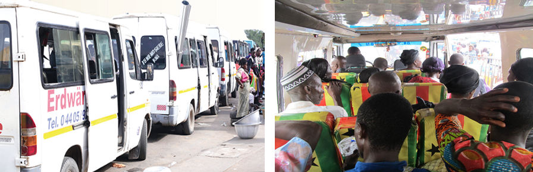
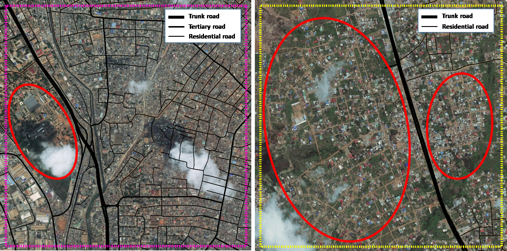
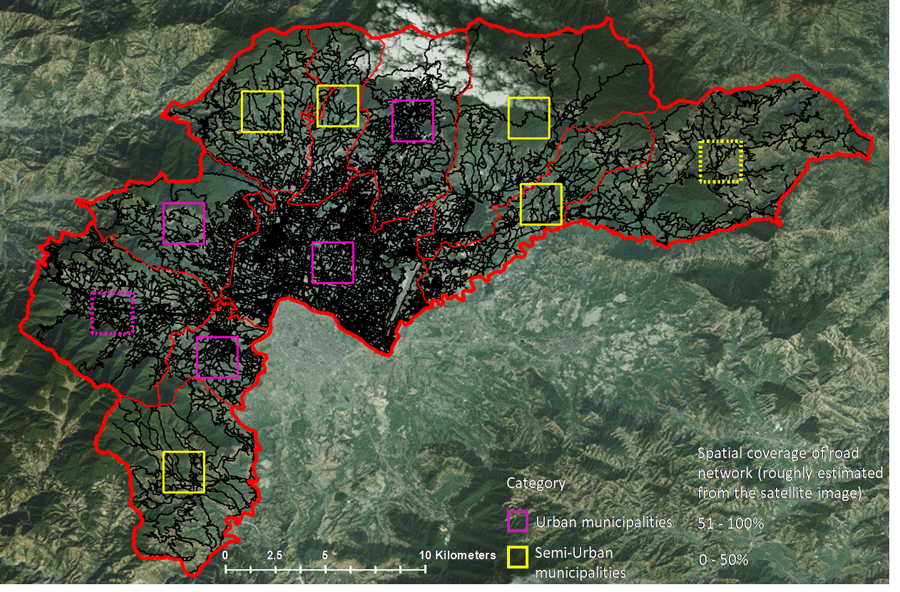
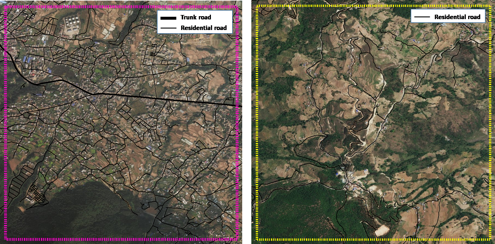

<!-- Note: this is where I'm adding the write-up for now for maximum visibility.
Can go elsewhere, e.g. as a vignette before this is open sourced. -->

```{r, echo = FALSE}
knitr::opts_chunk$set(
  out.width = "100%",
  collapse = TRUE,
  comment = "#>",
  fig.path = "README-",
  echo = FALSE
)
# add citation
# citr::tidy_bib_file(rmd_file = "README.Rmd", messy_bibliography = "~/allrefs.bib", file = "who.bib")
```

# Introduction

With mounting evidence of health [@celis-morales_association_2017], environmental and social benefits of active travel, many cities are preparing ambitious walking and cycling plans.
However many transport authorities lack strong and actionable evidence to support this investment for a number of reasons, including:

- transport models have tended to focus on motor vehicles [@boyce_forecasting_2015]
- data on active travel tends to be sparse and inaccessible [@kuzmyak_estimating_2014]
- data and models that are available tend to be unavailable for many potential stakeholders (e.g. civil society groups) and in a format that is difficult to understand and use [@naess_transport_2014]

This project aims to tackle these problems by assessing the feasibility of tools to provide *actionable*, *publicly accessible* and *geographically detailed* evidence to prioritise investment in cycling for the case study cities of Accra and Kathmandu.

This document represents an *interim report* on progress during the first week of this month-long project, which commenced on 18^th^ December 2017.

# Input data

Data were accessed from the following sources:

- Transport network and building data from **OpenStreetMap (OSM)**, an open access, freely available, crowd-sourced online mapping database [@barrington-leigh_worlds_2017].
- Population density and some demographic data from [worldpop](http://www.worldpop.org.uk/) [@tatem_worldpop_2017]
<!-- - Topographic data from NASA's open SRTM data -->

<!-- Additional data on population densities will be obtained from WorldPop and from NASA's Socioeconomic Data and Applications Center (SDAC). The -->
<!-- former provides static fine-resolution data (100$m^2$, for the year 2013 only), while the latter provides coarser (1$km^2$) future projections -->
<!-- out to 2020. -->

# Methods

We have made a number of technical breakthroughs that allow us to estimate cycling potential down to the road network level based on open data.
This involved implementing a highly computationally efficient routing algorithm in C++.
Since commencing the project we have developed a method for re-allocating the results of the routing algorithm back onto the road network.
A custom level of road segmentation was developed to create this geographical aggregated flow map, which clearly shows routes with high cycling potential ([see interactive version](http://rpubs.com/RobinLovelace/341996)):

```{r, echo=FALSE, fig.cap="Illustration of interactive map demonstrating the preliminary results: the routes in Accra with highest cycling potential."}
knitr::include_graphics("fig/accra-flow1-interactive.png")
```

# City overviews

This section provides a high-level overview about the geography of each city as it relates to active travel potential.
Both cities are included in this section, laying the ground for the next two sections which provide detailed results for Accra and then Kathmandu.
Comparing the cities at the outset will help put the results in perspective and lay the foundation for a discussion of how a tool building on this work could be useful to different stakeholders in each city.

Accra is the larger city, with a population approaching 5 million and a growth rate of around 3% per year in the Greater Accra Region according to the [Ghana Statistical Service](http://www.statsghana.gov.gh/docfiles/2010phc/Projected%20population%20by%20sex%202010%20-%202016.pdf).
Kathmandu has a population of just over 1.2 million, according to the [World Population Review](http://worldpopulationreview.com/world-cities/kathmandu-population/).

We already have some results from the OSM and demographic datasets, as outlined below.

\newpage

## OpenStreetMap data

The OpenStreetMap network for Accra has 145,827 street segments connecting
131,349 distinct points, and extends over 4,072km. The OSM data also include
24,490 buildings, of which 23,102 include geometric descriptions only, while the
remaining 1,388 buildings are divided between 28 distinct categories.

The equivalent network for Kathmandu has 79,832 street segments connecting
37,770 distinct points, and extends over 1,062km. The OSM data also include 82,333
buildings of which 75,778 include geometric descriptions only, while the
remaining 6,555 are divided between 344 distinct categories (in this case
including many named buildings).

```{r, echo=FALSE}
r = readRDS("extdata/r.rds")
names(r) = c("City", "Street nodes", "Street segments", "Network distance (km)", "Population (on network)", "N. Buildings", "nb_no_desc", "Num. Building Classes")
knitr::kable(r[c(1, 5, 6, 8)], caption = "Basic OSM characteristics of case study cities")
```


The street network for Accra is more extensive, reflecting the greater spatial
extent of the city, while data on buildings are considerable more detailed for
Kathmandu than for Accra, presumably reflecting extensive humanitarian mapping
activity in response to the 2015 earthquake.

```{r}
knitr::kable(r[1:4], caption = "Characteristics of OSM route network data for case study cities.")
```


## Demographic data

Demographic data for Accra from worldpop include population density estimates
at 172,238 points, corresponding to estimates in roughly 30-by-30m grid cells.
Estimates are available for total population density, as well as distributed
between 14 5-year age classes from 0-5 years up to 60-65 years, and 65+ years.

Demographic data for Kathmandu are not as detailed, and also do not include age
classes.

## An overview of Accra from an active travel perspective

<!-- Monsuru (1 day's work) -->
<!-- This section will provide background information on the following topics: -->

<!-- - Institutions working in transport and their aims -->
<!-- - References about the transport system in Accra -->
<!-- - Photos of current set-up -->
<!-- - What is the current modal split? -->
<!-- - Recent transport policies. -->
<!-- - How well developed are other infrastructures (e.g. sewerage.) -->

### Greater Accra Metropolitan Area (GAMA)

The Greater Accra Metropolitan Area, simply referred to as Accra city, is the smallest geographical region of Ghana’s 10 administrative regions, covering only 1.4 percent of the total land area of Ghana (see Fig. 1). It is the second most populous region, after the Ashanti region. According to the Ghana Statistical Service, Accra city’s population is estimated to be approaching 5 million, with a growth rate of around 3% per year. Forty three percent of the population is estimated to be between the age of 15 and 35 years.(Ghana, Y.P.I., 2013).

```{r, fig.cap="Geographical location of Greater Accra Metropolitan Area (GAMA)"}
knitr::include_graphics("fig/study-area-accra.png")
```

 
GAMA contains 16 of the 216 local authority districts of the Republic of Ghana. Administratively, the Accra Metropolitan local authority district serves as the capital of Accra city, and is administered by Accra Metropolitan Assembly, which is the political and administrative authority for the entire Accra city. 

[@quarshie_integrating_2007]

**Weather and Climate in Accra**

The annual average temperature of Accra city 27.6 °C, with mean monthly temperatures ranging from 25.9 °C in August (the coolest) 29.6 °C in March (the hottest). Relative humidity is high, ranging from 50% to 80%. Accra city, as with other southern cities, experiences two rainy seasons; April through June, and September through November. The harmattan is a dry desert wind that blows from the northeast from December to March. It lowers the humidity, bringing hot days and cool nights to northern parts of Ghana. This wind blows over the south in January. 
These atmospheric conditions have implications for cycling uptake, making it potentially uncomfortably hot and sweaty in the hotter months. However, the impact of climate can be overestimated. In Seville, which has a mean monthly temperature of 28.2 °C in summer, cycling grew from less than 1% to more than 5% following infrastructure investment (ref - RL).

###Brief overview of the existing public transport infrastructure in Accra

**Modal Split**

<!-- The vast majority of public transport services in Accra are provided by private operators, comprising of buses (locally called ‘tro-tros’) and taxis operators, which account for about 70 percent and 15 percent of passenger movements, respectively [@birago_level_2017]. The remaining 15 percent is split between people who walk and people who ride bicycles, estimated to be 11 percent and 4 percent, respectively, according to the Centre for Cycling Expertise, a Ghana-based, non-profit organisation in Accra focused on promoting cycling in cities.   -->
Over a half (56%) of daily passengers in Accra are carried by buses, and a further 15% by taxi with approximately 1 million passenger trips being made each day in and out of the central area of Accra by both mode of transportation (Quarshie, 2006). Additionally, a recent study by the World Bank in 2010 on the city residents’ primary transportation mode choice to and from shopping and work in Accra also indicates that the buses (tro-tros) are the most popular mode of motorised transport, accounting for 70 percent of public transport. This is followed by private cars (10%), taxis (8%) with the Metro Mass Transit (MMT), a quasi-private company buses, recording the least of 0.3% (Fig. 4X). The above studies emphasise the inefficiency of these vehicles in terms of the amount of road space used, congestion caused, and inconveniencies caused to the passengers.

<!-- The buses are typically mini-buses or vans, with the most popular type being Nissan Urvan 15-seaters and Mercedes Benz Sprinter 17-seaters. The routes followed by the buses are typically fixed, while the routine patterns of taxis are flexible, depending largely on the drivers’ or passengers’ knowledge of the area in question. While there are bus terminals that usually mark the origin and destinations of bus journeys, drivers are generally allowed to pick up passengers in-between terminals. The transport fares are generally pre-decided for passengers, however, boarding in-between terminals often requires passengers to negotiate the fares with the bus drivers themselves. Generally, en-route boarding or alighting are considered illegal on heavy traffic routes. However, the lackadaisical attitude of the bus drivers regarding the legal consequences has further popularised the ‘tro-tro’ culture, as they are rarely caught by the police. -->

<!-- A large percentage of the buses and taxis operate under the control of Transport Unions through routing, loading by turns and permission to operate on specific routes. The Ghana Private Road Transport Union (GPRTU) is the biggest transport union and a member of the Ghana Trades Union Congress (TUC) oversees commercial vehicles, whose owners have registered with them (Okoye et al., 2010). The rest of the operators who do not belong to any transport unions are not allowed to load passengers at the Union’s bus terminals, and may have to depend solely on road-side pick-ups. These buses enjoy the flexibility of operating at any time and on any routes, and further, are not bound to pay the levies imposed by the Unions.  -->

**Issues with public transport**

The public transport operators have been criticised for their disregard of operational standards and the safety of passengers, especially during late evening operation [@agyemang_bus_2015]. It has been found that the transport unions had not been able to regulate some of the behaviour of their members (Addo, 2002). For example, it is a common practice amongst the drivers to increase their fares, especially after heavy downpours, at peak-hour times, or after slight fuel hikes. There are no regulations in place by the union to combat some of these unacceptable practices (Agyemang, 2009; 2013). Similar practices can also be observed amongst the taxis operators, who often charge twice or triple the bus journey fares (Addo, 2002).

```{r, fig.cap="The mini buses at a terminal loading passengers"}

```
<!-- **Governments efforts to address the issues** -->
<!-- As a social policy intervention in 2003, the government instituted the Metro Mass Transit (MMT), a bus rapid transit (BRT)-like system for commuters within Accra city and beyond. This constituted the third generation of transport interventions in Accra, purposely to keep the activities of private operators in check, alongside encouraging better service. The first, in the late 80s and early 90s, and the second, in the late 90s, were infrastructure upgrades for roads and corresponding drainage. The coverage of the MMT network constituted only 3% of all the passengers’ movements and functioned until 2007 when it was phased out due to its inability to achieve its goals, which included providing adequate competitive environment in order to enforce good public transport services [@agyemang_traffic_2014]. Moreover, the MMT services ended up not being different to the existing transport services, due to the lack of several of the main components needed for ‘proper’ bus rapid transit infrastructures ([@levinson_bus_2003]; [@deng_recent_2011]), such as dedicated bus lanes and enhanced ticketing systems -->

<!-- In its continued effort to intervene in traffic management, the government commenced with a proper ‘BRT’ project in 2012, to cover Accra city and other major cities, such as the Ashanti Region and the Central Region of Ghana. Totalling $95 million, the project was supported by various financing from development partners, such as the World Bank, Agence Francaise de Development, and also received co-financing from the Federal government of Ghana. The new BRT system was meant to begin full operation in November of 2017.  -->

<!-- **Some stats on daily travels within Accra.** -->
<!-- With the increasing growth of car ownership in Accra city, the number of cars is estimated to increase from 181,000 in 2004 to over 1 million in 2023 (Quarshie, 2007). The highest traffic volumes are found in the Winneba Road and Liberation Road corridors, which have volumes of over 50,000 vehicles per day. Roughly, 10,000 vehicles enter the central area of Accra within the Ring Road in the morning peak hour. The average number of passengers per trip on the buses and taxis are estimated to be 13 and 2.3, respectively. Approximately 1.3 million passenger trips per day are estimated to enter or leave the areas within the Accra Ring Road and 1.6 million passenger trips go into, or out of, the area within the motorway extension (Quarshie, 2007). Approximately 56% of these trips are made by bus, and a further 15% by taxi, meaning that an approximate 1 million passenger trips are made each day, into and out of the central area of Accra. These vehicles are inefficient in terms of the amount of road space used, thereby are considered responsible for most of the traffic congestion observed around the area. Furthermore, due to the lack of proper maintenance of most of the vehicles, they constitute a significant source of carbon dioxide emissions in the city.  -->

**Making a case for cycling**

Traffic congestion is a major transport problem in Accra city, with 70% of major roads operating at an unacceptable level of capacity at certain times of the day. It has been argued that moving from low capacity vehicles, such as buses and taxis, to a high-capacity, well-planned BRT system may help to reduce the traffic congestion (Quarshie, 2007). However, in order to address both the congestion and the vehicular emission problems, there is a need for investment in non-motorised transport systems, such as cycling and walking. In developing countries, the non-motorised transport systems are generally not recognised as key components of the urban transport system; hence, the lack of  real transport policies that capture this mode of transportation.

###Cycling infrastructure in Accra

**Peoples’ attitudes towards cycling**

A study conducted for the World Bank in 2010 estimated that only 1 to 4 percent of people in Accra city use a bicycle as their means of commuting within the city. However, according to an earlier study by the Centre for Cycling Expertise (CCE), the estimate was given as 9-10%. Although, cycling is the predominant means of transportation in the north (rural parts) of the country, it is generally not seen as an acceptable means of transport in the urban cities, such as Accra. For example, an extensive study on bicycle use among the urban poor in Nima and Jamestown of Accra (Turner et al., 1995) highlighted the general negative attitudes within certain communities toward cyclists. Many people do not think that cycling is safe in the present urban settings, such as Accra city. This is largely due to the understanding that the existing transport infrastructures lack the adequate infrastructural support for a non-motorised system, such as cycling.  

**Government sponsored infrastructures (if any?)**

In a white paper prepared by the Ministry of Transportation in 2004, cycling was highlighted as a key component of the sustainable national transport policy. However, there has not been any real policy formulation regarding the integration of cycling infrastructures into the existing transport infrastructure in order to promote cycling within the city. What further demonstrates the lack of enthusiasm for non-motorised transport options was revealed in the upgrade project of the National Highway 1 (N1) motorway, which was completed in 2012. The project included the addition of more lanes to some of the sections of the N1 motorways, such as those connecting the neighbourhoods within Accra’s functional boundaries. Along an expressway’s 14km stretch for example, there are only six bridges for cyclists and pedestrians to cross, and only 1.6km of segregated bicycling lanes. This implies that cyclists must share the road with the vehicles in most cases, thereby exacerbating the safety concerns being nursed by many people towards cycling. 

In 2008, the department of Urban Roads, in collaboration with the CCE, developed the first ever Bicycle Masterplan (BMP) for Accra city. A comprehensive study was carried out in order to generate the technical details regarding the design, such as what type of bike facilities are required for a particular route. 

```{r, fig.cap="Accra bicycle masterplan (Quarshie, 2007)"}
knitr::include_graphics("fig/Bike_masterplan.png")
```

**Demography and population of Accra**

The population of GAMA grew from 2,905,726 in 2000 to 4,010,054 in 2010 (Ghana Statistical Service, 2010). With a growth rate of 2.5% the population is estimated to increase to 5.9 million by 2040. The male and female population represents 49% and 51%, respectively. Based on the last population conducted in Ghana in 2010, the age distribution is given as follows: 0 -14 years as 31.3%, 15-35 years as 43.2%, and 36 and above as 25.5%.

The region occupies a total land area of 3,245 sq. km, which makes it the smallest region of the country, geographically. It has a population density of 1,235.8 people per sq. km. The region is 90.5% urban with an annual urban growth rate of 3.1%, and recorded a positive net migration value of 1,275,425 in 2010. In terms of the economy, GAMA’s labour force participation rate for population aged 15 - 64 is estimated as 74.7%.

```{r, fig.cap="Accra population density (2013). Source: Thomas Brinkhoff: City Population, http://www.citypopulation.de "}
knitr::include_graphics("fig/accra_pop_density.png")
```

The region recorded the lowest Infant Mortality Rate (deaths of infants under age one) in 2011, with thirty-seven infant deaths per 1,000 live births.  Child Mortality Rate (deaths of children between ages one and four) was 19 deaths per 1,000 live births and Under Five Mortality (number of children who die by age five) was reported at 61 deaths per 1,000 live births. Maternal Mortality Rate (the number of deaths due to pregnancy related causes to the number of women of child-bearing age, 15 - 49 years) in the region, was 355 per 100,000 live births in 2010, this was lower than the national value of 485 per 100,000 live births. The Total Fertility Rate (TFR) of the region is slightly lower (2.5) as compared to the national TFR of 4.0, indicating that on the average women in the Greater Accra Region give birth to three children. In addition there are two births per every 100 adolescents in the region, which is the lowest among the regions. With regards to Contraceptive Prevalence Rate (CPR), the use of modern contraceptives among currently married women, it was 19.4 % in 2014, one of the lowest in the country. In 2013, the HIV prevalence rate in the region was 2.7%, higher than the national HIV prevalence of 1.3%.


## An overview of Kathmandu from an active travel perspective

<!-- This section will provide background information on the following topics:

- Institutions working in transport and their aims
- References about the transport system in Kathmandu
- Photos of current set-up
- What is the current modal split?
- Recent transport policies.
- How well developed are other infrastructures (e.g. sewerage.)

**Assessing the quality of OpenStreetMap of Kathmandu**

**Demography and population of Kathmandu** -->

### Kathmandu District, Kathmandu Metropolitan City and Kathmandu Valley

The Federal Democratic Republic of Nepal consists of 7 provinces. Kathmandu District lies within Bagmati province, along with twelve other districts, which together occupy about 14% of the country. Kathmandu District consists of eleven municipalities, one of which is the municipality of Kathmandu Metropolitan City, the capital city. According to the Nepalese Central Bureau of Statistics (CBS) <!-- to do: insert link to CBS.gov.np site-->, Kathmandu is by far the most densely populated of all 75 districts, with 1,081,845 inhabitants (4.67% of the total Nepalese population) and a population density of 2,738.9 people per square kilometer (p/km^2) in 2001. The national average district density in 2001 was 157.3 (p/km^2) and the only other district to have a population density of over one thousand was Bhaktapur (1.894,6), which borders it to the east. 

For most statistical surveys and transport planning purposes, amongst others, Kathmandu municipality is considered as part of a different geographical unit, namely Kathmandu Valley, which spans 3 districts, two municipalities of which are in Kathmandu District, one in Lalitpur District, and two in Bhaktapur District. This mismatch between administrative authorities is part of the reason why it is hard to compose, finance and execute e.g. transportaion plans for this region. <!-- to do: insert the east-west ref--> 

As Kathmandu Valley is the most urbanised region of Nepal, there is generally a good availability of utilities (water, gas, electricity), sanitation, education, and transportation. <!-- east-west ref --> 

While the elevation in Kathmandu District varies between 1,262 and 2,732 meters above sea level, Kathmandu itself is relatively flat and located at an average elevation of 1,400 meters <!-- to do: insert link to Wikipedia, because the government link they use is broken - or derive from a DEM -->. The dominant land-use type in Kathmandu Metropolitan City is classified as "Mixed" in the "Built up" category, covering nearly half the city (48.89%), followed by "Cultivation" (16.80%) and "Open area" (10.77%). Following those, a substantial part of the city is classified as Road (7.29%) or "Road median" (0.8%). <!-- east west ref-->

<!-- to do: update the east west ref in caption-->
```{r, fig.cap="Boundaries of Kathmandu, Lalitpur and Bhaktapur Districts, their municipalities, and Kathmandu Valley. Source: east-wst ref"}
knitr::include_graphics("fig/KathmanduBoundaries.png")
```

**Weather and climate in Kathmandu**
Since Kathmandu District and Kathmandu Valley both span a great elevational range, they also cover several climate zones, but Kathmandu itself falls in the warm temperate zone, with average daily temperatures ranging from 10.8°C in the coldest month (January) to 24.3°C in the warmest month (July). Annual precipitation is 1,454.9 mm, with November being the driest month with an average monthly precipition of 8.3 mm (1 precipitation day on average) and July the wettest with 363.4 mm (23 precipitation days). There is one monsoon season, which lasts from June through August, during which 64% of the annual precipitation falls over the course of 62 precipitation days <!-- to do: insert ref http://mfd.gov.np/city?id=31 for temps/rainfall and WMO for precip days http://worldweather.wmo.int/en/city.html?cityId=114-->.


**Transportation in Kathmandu**

used to be public, but cancelled, now private, etc. etc.

most trip purposes are work/school commute, good split between household heads and dropping kids off on the way multi-purpose trips


**Modal split**

most trip destinations are in the city center
used to be more cyclists but shift to motorcycles


**Transport-related air pollution in Kathmandu**

Due to the aforementioned modal split, Nepal/Kathmandu most polluted, increase bla bla

Increasing pollution and respiratory diseases due to inc


**Issues with public transport**

gender issues timeliness privately owned etc


**Government plans for alleviating congestion and pollution**

In 1990(?) all diesel/petrol(=gasoline?) three-wheelers were banned, now only electric ones
introduced green stickers (though apparently these can be bought for a bribe)
ring road, bus rapid transit. metro has been examined a few times


**Making a case for cycling**

Clean Air Network, Kathmandu Cycle City etc

most trips are under 30 mins/10 km, relatively flat, so could all be easily made on foot


**People's attitudes towards cycling**
poor people's thing, most own a bicycle, air too polluted, no space


**Government sponsored infrastructures**
already quite  a bit, but more plans than follow-through


**Demography and population of Kathmandu**

The population in Kathmandu municipality has been increasing rapidly, from 671,846 inhabitants in 2001 to 1,003,285 in 2011 (CBS <!-- to do: include ref link-->) and currently around 1.5 million <!-- to do: insert link to Wikipedia, no idea where they got it from, I can only find predictions and the 2014 population link on CBS website is broken-->.

Nationally basically 50-50 split between men and women, but slightly more men in Kathmandu distrcit/valley/... The age group distributions etc. 

While the national population has increased with only 1.35% <!-- to do: insert mmrda link, but don't know what their source is, or the time period, so preferably find another -->

also mention floating population - seems to be 3-4 million in KTMV with about 2-2.5 floating?


```{r, fig.cap="Kathmandu population density (2011). Source: Thomas Brinkhoff: City Population, http://www.citypopulation.de"}

```

#Results I: Assessing the quality of OpenStreetMap

The street network datasets used for this project were downloaded from the OpenStreetMap (OSM), an open access, freely available, online mapping database (Barrington-Leigh and Millard-Ball, 2017). Generated through crowd-sourcing (Goodchild, 2007) by volunteers, the current database has grown to almost 50 gigabytes, and thousands of features are being added by the day. One uniqueness of OSM is that it allows its users the chance to contribute their local knowledge about places, thereby ensuring the features’ accuracy, completeness and thoroughness. Furthermore, a backend control/validation is implemented in order to ensure that the datasets conform with the Open Geospatial Consortium standards, which is the internationally recognised set of data standards for the global geospatial community.

For this project, we examined the quality of our OSM datasets and evaluate how well the datasets represent the reality on the ground. The quality of geospatial datasets can be evaluated using one, or a combination of metrics, such as positional accuracy, completeness, attribute accuracy and consistency (Haklay, 2010). The choice of any metrics often depends on the data requirements stipulated for a project, as well as the higher-quality baseline datasets available relating to the area in question. We chose OSM datasets for this project due to its relatively high positional accuracy with respect to the satellite basemap of the area, as well as its notion of continuous mapping, thereby leaning towards absolute completeness. Hence, we used ‘positional accuracy’ and ‘completeness’ metrics to evaluate the quality of our OSM datasets. 

The positional accuracy is described as the position of a feature on a map relative to its actual position on the ground, while the completeness is an assessment of the amount of datasets that are missing on a map. For the baseline comparison datasets, we used the Bing areal imagery, which can be added as a background layer on OSM website, thereby allowing easy comparative analysis through visual inspection. The positional accuracy of the Bing areal imagery has been confirmed to be relatively better than that of Google Maps at nadir, with an RMSE of 7.9 as compared to 8.2 for the latter (Ubukawa, 2013). In the same study, the RMSE of OSM datasets was calculated to be 11.1m.  Furthermore, the new Bing areal imageries for every country are usually released every three to four months in order to ensure the imagery is as current as possible (Ref.).

##Bristol

```{r, fig.cap="(a) The OSM map of Bristol, with 2km x 2km grids placed at the centre of each administrative ward, and (b) the 2km x 2km grid at the centre of Bishopston administrative ward"}

```  

##Accra

A systematic visual inspection was carried out so as to assess both the positional accuracy and the completeness of the current OSM datasets covering the GAMA. This was accomplished by placing a 2km by 2km grid at the geometrical centre of each district (Fig.). From our observations, these grids provide a good cross-section of the street network across GAMA, from the high population density district of Accra metropolis to the low population density of Shai Osudoku. We classified the districts into three, namely (1) urban (2) semi-urban and (3) rural districts. This classification is based on the spatial extent of the road network across each district, roughly estimated from the satellite image. Thus, we have 51-100%, 25-50%, and 0-25% coverages classified as urban, semi-urban and rural districts, respectively. In other words, we use road infrastructure as a proxy for urbanisation (Fig. xx). 

Like many urban districts which comprise very dense street networks, the semi-urban districts such as Ga West Municipal and Ga South Municipal districs, do also contain dense street network, within certain areas that are adjacent to the urban districts. The four eastern-most districts, classified as 'rural', largely consist of trunk roads connecting GAMA to the other regions of the country.

```{r, fig.cap="The OSM map of GAMA, with 2km x 2km grids placed at the centre of each district."}
knitr::include_graphics("fig/quality grid_osm_accra.png")
```

<!-- The pink grids represent the centres of Ga Central Municipal and Accra Metropolis district (from left to right) – the two highly urbanised districts). The blue grids represent the centres of Ga West Municipal and Ashaiman Municipal districts (from left to right) – two moderately urbanised districts. -->

The visual inspection of the OSM datasets revealed very high positional accuracy across all the districts. The road segments are well-aligned and properly contained within the width of their respective raster representation. However, the completeness varies based on the three categorisation of the district, with urban district having the highest completeness, and the rural districts having the lowest completeness. In relation to the completeness, it is observed that paved roads are captured more than unpaved roads. This explains why more roads in the urban districts are captured better than both the semi-urban and rural districts. Figure xx(a) and Fig xx(b) are the 2km x 2km grid at the centre of the Accra Metropolis and Ga West Municipal districts, an urban and semi-urban districts, respectively. The oval shapes highlight the areas that are not captured at the centre of each district.

```{r, fig.cap=" (a) Accra Metropolis district - an urban district and (b) Ga West Municipal district - a semi-urban district. The oval shapes indicate areas where streets are missing."}

```

Generally, the positional accuracy of the OSM dataset is similar for all road classes. However, the "completeness" appears to vary by road classes, from trunk roads (major road) having the highest completeness level, to the residential (unpaved) with the lowest completeness level. 

##Kathmandu

In comparison with size of GAMA, Kathmandu is approximately 8 times smaller. Just like Accra metropolitan district in GAMA, Kathmandu Metropolitan City serves as the central municipality from which the road network spread out to other parts of the Kathmandu. 

ComKathmandu is very well represented on OSM, thanks to a number of local mapping organisations such as Kathmandu Living Labs (KLL) (*). The positional accuracy and the completeness of the OSM datasets is on the same level as that of Bristol.


<!-- link to KLL website-->. KLL has not only informed residents about the importance of having accurate and freely available spatial data, and how these can help improve interactions between the local governing authorities and citizens, but also arranged training workshops to educate them on how to map their environments accurately, which by 2015 had been provided to over 1,400 people. In addition to this, they have had a specific project which involved mapping schools and hospitals in the area. Their website states that their initiative has resulted in the mapping of 2,054,436 buildings and 135,063 kilometers of roads.


```{r, fig.cap="The OSM map of Kathmandu, with 2km x 2km grids placed at the centre of each district."}

```
To discuss here (~ size of kathmandu relative to accra?). 

```{r, fig.cap="(a) **  - an urban municipality and (b) ** - a semi-urban municipality."}

```

To discuss here (Incredible positional accuracy and completeness for both urban and semi-urban municipalities! - no single uncovered segment found)

#Description of existing (or lack of) Cycling infrastructure

This section describes the coverage of existing cylcing infrastructure in Accra and Kathmandu, in relation to Bristol (reference) 

```{r, fig.cap="Figure showing a typical example of a cyclist in (a) Accra, (b) Kathmandu, (c) Bristol"}
knitr::include_graphics("fig/cylcing_infrastructures.png")
```  

#Result II: Estimates of Cycling potentials in Accra

We have generated estimates for cycling potential across the larger of the two case study cities. The priority over the next 3 weeks of the project will be to calibrate this model and apply refined versions of it to both cities, using additional input datasets where available.

## Accra

```{r, fig.cap="Overview of Accra (left) and initial results of cycling potential (right).", fig.show='hold', out.width="49%"}
knitr::include_graphics(c("fig/accra-osm-overview.png", "fig/test.png"))
```

##Kathmandu

This section is work in progress.

# Validation and calibration

## Calibration Method

The preceding results were generated by calibrating models to known behaviour of
both pedestrians and cyclists in Bristol, U.K., using extensive existent
behavioural data. The models using in this preliminary report are
proof-of-concept only, and rely on a single parameter which quantifies the decay
in cycling propensity with distance. This sub-section briefly describes the
calibration methodology.

Data for the study cities (Accra and Kathmandu) are primarily population
densities within single raster grid squares, while calibration data were full
origin--destination (OD) matrices quantifying densities or probabilities of
trips between each population density grid point and all others. We developed a
computationally efficient method to convert static population densities into
estimates of dynamic flow between each grid point and all others, using a very
well-established spatial interaction model dependent on a single parameter
quantifying the extent to which ``interactions'' -- in this context, flow
densities -- decrease with increasing distance [@Wilson2008].

The calibration comprised the following three steps. First, the Bristol OD
matrix was converted to total densities at all origin points by summing values
for all destinations. These values are equivalent to the aggregate population
densities obtained for the study cities. Second, an exponential spatial
interaction model was applied to these densities to provide estimates of flows
from each origin to each destination point, dependent on a single parameter
quantifying the exponential decay in flow density with increasing distace.
Finally, the calibration was performed by finding the value of the exponential
decay parameter which best reproduced the observed OD matrix, with this
procedure repeatedly separately for pedestrian and cyclist models.

The resultant decay coefficients for pedestrians and cyclists had respective
values of 1.3 and 2.3km, indicating that 63% (1-exp(-1)) of all pedestrian
trips are 1.3km or less, while the same proportion of cycling trips are less
than 2.3km. Both of these models generated using the above procedure were very
significantly related to the actual OD matrices, with the pedestrian model
reproducing 46% of the structure of the observed OD matrix, and the cycling
model reproducing 12%.


## Validation

(MP: Is there really scope at this stage to comment on validation?)

# Discussion

This section is work in progress.

## Policy relevance of results

<!-- To what extent has this deliverable (from phase 1) been delivered? -->
<!-- **Deliverables:** This phase will provide clean datasets and summary information about the 'data landscape' of each case study city. -->
<!-- This will relate primarily to population density, trip attractors and transport infrastructure from which to -->
<!-- We will also deliver summaries of the relationships between demographic and transport infrastructure data and an assessment of the quality of local data and priorities for future data collection. -->
<!-- The deliverables will be provided in the form of datasets provided to the WHO and interactive and high quality maps. -->

## The potential uses of an online toolkit

# Next steps

This section is work in progress.

# References


<!-- Anything else to consider here guys? -->


