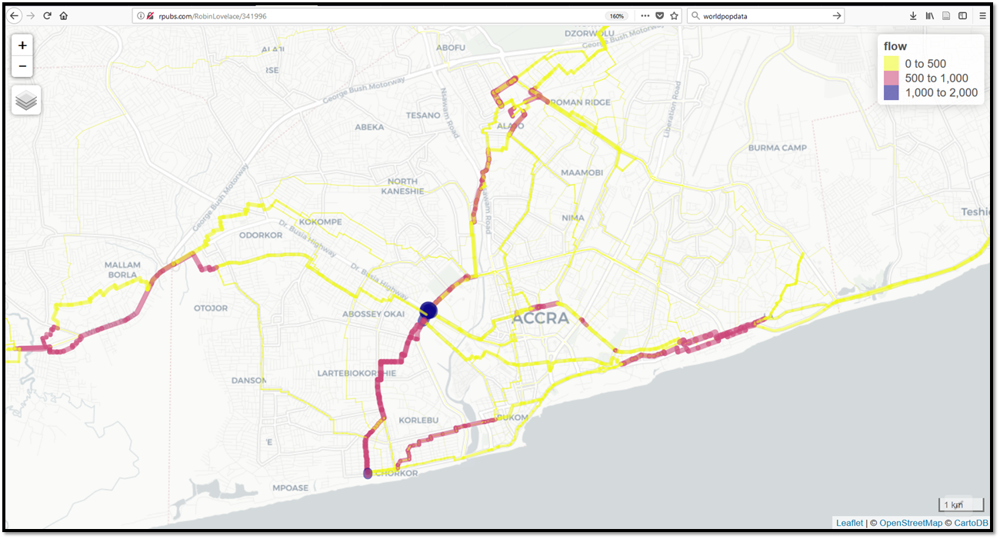

<!-- Note: this is where I'm adding the write-up for now for maximum visibility.
Can go elsewhere, e.g. as a vignette before this is open sourced. -->
Introduction
============

With mounting evidence of health (Celis-Morales et al. 2017), environmental and social benefits of active travel, many cities are preparing ambitious walking and cycling plans. However many transport authorities lack strong and actionable evidence to support this investment for a number of reasons, including:

-   transport models have tended to focus on motor vehicles (Boyce and Williams 2015)
-   data on active travel tends to be sparse and inaccessible (Kuzmyak et al. 2014)
-   data and models that are available tend to be unavailable for many potential stakeholders (e.g. civil society groups) and in a format that is difficult to understand and use (Naess et al. 2014)

This project aims to tackle these problems by assessing the feasibility of tools to provide *actionable*, *publicly accessible* and *geographically detailed* evidence to prioritise investment in cycling for the case study cities of Accra and Kathmandu.

This document represents an *interim report* on progress during the first week of this month-long project, which commenced on 18th December 2017.

Input data
==========

Data were accessed from the following sources:

-   Transport network and building data from **OpenStreetMap (OSM)**, an open access, freely available, crowd-sourced online mapping database (Barrington-Leigh and Millard-Ball 2017).
-   Population density and some demographic data from [worldpop](http://www.worldpop.org.uk/) (Tatem 2017) <!-- - Topographic data from NASA's open SRTM data -->

<!-- Additional data on population densities will be obtained from WorldPop and from NASA's Socioeconomic Data and Applications Center (SDAC). The -->
<!-- former provides static fine-resolution data (100$m^2$, for the year 2013 only), while the latter provides coarser (1$km^2$) future projections -->
<!-- out to 2020. -->
Methods
=======

We have made a number of technical breakthroughs that allow us to estimate cycling potential down to the road network level based on open data. This involved implementing a highly computationally efficient routing algorithm in C++. Since commencing the project we have developed a method for re-allocating the results of the routing algorithm back onto the road network. A custom level of road segmentation was developed to create this geographical aggregated flow map, which clearly shows routes with high cycling potential ([see interactive version](http://rpubs.com/RobinLovelace/341996)):

Illustration of interactive map demonstrating the preliminary results: the routes in Accra with highest cycling potential.

City overviews
==============

This section provides a high-level overview about the geography of each city as it relates to active travel potential. Both cities are included in this section, laying the ground for the next two sections which provide detailed results for Accra and then Kathmandu. Comparing the cities at the outset will help put the results in perspective and lay the foundation for a discussion of how a tool building on this work could be useful to different stakeholders in each city.

Accra is the larger city, with a population approaching 5 million and a growth rate of around 3% per year in the Greater Accra Region according to the [Ghana Statistical Service](http://www.statsghana.gov.gh/docfiles/2010phc/Projected%20population%20by%20sex%202010%20-%202016.pdf). Kathmandu has a population of just over 1.2 million, according to the [World Population Review](http://worldpopulationreview.com/world-cities/kathmandu-population/).

We already have some results from the OSM and demographic datasets, as outlined below.

OpenStreetMap data
------------------

The OpenStreetMap network for Accra has 145,827 street segments connecting 131,349 distinct points, and extends over 4,072km. The OSM data also include 24,490 buildings, of which 23,102 include geometric descriptions only, while the remaining 1,388 buildings are divided between 28 distinct categories.

The equivalent network for Kathmandu has 79,832 street segments connecting 37,770 distinct points, and extends over 1,062km. The OSM data also include 82,333 buildings of which 75,778 include geometric descriptions only, while the remaining 6,555 are divided between 344 distinct categories (in this case including many named buildings).

| City      |  Population (on network)|  N. Buildings|  Num. Building Classes|
|:----------|------------------------:|-------------:|----------------------:|
| accra     |                  2238470|         24490|                     29|
| kathmandu |                       NA|         82333|                    344|

The street network for Accra is more extensive, reflecting the greater spatial extent of the city, while data on buildings are considerable more detailed for Kathmandu than for Accra, presumably reflecting extensive humanitarian mapping activity in response to the 2015 earthquake.

| City      |  Street nodes|  Street segments|  Network distance (km)|
|:----------|-------------:|----------------:|----------------------:|
| accra     |        131349|           145827|                   4072|
| kathmandu |         37770|            40405|                    539|

Demographic data
----------------

Demographic data for Accra from worldpop include population density estimates at 172,238 points, corresponding to estimates in roughly 30-by-30m grid cells. Estimates are available for total population density, as well as distributed between 14 5-year age classes from 0-5 years up to 60-65 years, and 65+ years.

Demographic data for Kathmandu are not as detailed, and also do not include age classes.

An overview of Accra from an active travel perspective
------------------------------------------------------

<!-- Monsuru (1 day's work) -->
This section will provide background information on the following topics:

-   Institutions working in transport and their aims
-   References about the transport system in Accra
-   Photos of current set-up
-   What is the current modal split?
-   Recent transport policies.
-   How well developed are other infrastructures (e.g. sewerage.)

(Quarshie 2007)

An overview of Kathmandu from an active travel perspective
----------------------------------------------------------

This section will provide background information on the following topics:

-   Institutions working in transport and their aims
-   References about the transport system in Accra
-   Photos of current set-up
-   What is the current modal split?
-   Recent transport policies.
-   How well developed are other infrastructures (e.g. sewerage.)

Results I: Accra
================

This section is work in progress. We will explore how well the OSM road network illustrated in the map below represents the true state of the transport system.

Overview of Accra (left) and initial results of cycling potential (right).

We have generated estimates for cycling potential across the larger of the two case study cities. The priority over the next 3 weeks of the project will be to calibrate this model and apply refined versions of it to both cities, using additional input datasets where available.

Results II: Kathmandu
=====================

This section is work in progress.

Validation and calibration
==========================

This section is work in progress.

Discussion
==========

This section is work in progress.

Policy relevance of results
---------------------------

<!-- To what extent has this deliverable (from phase 1) been delivered? -->
<!-- **Deliverables:** This phase will provide clean datasets and summary information about the 'data landscape' of each case study city. -->
<!-- This will relate primarily to population density, trip attractors and transport infrastructure from which to -->
<!-- We will also deliver summaries of the relationships between demographic and transport infrastructure data and an assessment of the quality of local data and priorities for future data collection. -->
<!-- The deliverables will be provided in the form of datasets provided to the WHO and interactive and high quality maps. -->
The potential uses of an online toolkit
---------------------------------------

Next steps
==========

This section is work in progress.

References
==========

<!-- Anything else to consider here guys? -->
Barrington-Leigh, Christopher, and Adam Millard-Ball. 2017. “The World’s User-Generated Road Map Is More Than 80% Complete.” *PLOS ONE* 12 (8): e0180698. doi:[10.1371/journal.pone.0180698](https://doi.org/10.1371/journal.pone.0180698).

Boyce, David E., and Huw C. W. L. Williams. 2015. *Forecasting Urban Travel: Past, Present and Future*. Edward Elgar Publishing.

Celis-Morales, Carlos A, Donald M Lyall, Paul Welsh, Jana Anderson, Lewis Steell, Yibing Guo, Reno Maldonado, et al. 2017. “Association Between Active Commuting and Incident Cardiovascular Disease, Cancer, and Mortality: Prospective Cohort Study.” *BMJ*, April, j1456. doi:[10.1136/bmj.j1456](https://doi.org/10.1136/bmj.j1456).

Kuzmyak, J. Richard, Jerry Walters, Mark Bradley, and KM Kockelman. 2014. *Estimating Bicycling and Walking for Planning and Project Development*. Nchrp National Cooperative Highway Research Program Report 770. Washington, DC: Transportation Research Board of the National Academies.

Naess, Petter, Jeppe Andersen, Morten Skou Nicolaisen, and Arvid Strand. 2014. “Transport Modelling in the Context of the ‘Predict and Provide’Paradigm.” *European Journal of Transport and Infrastructure Research* 14 (2): 102–21. <http://vbn.aau.dk/ws/files/197640305/N_ss_et_al._2014_Transport_modelling_in_the_context_of_the_predict_and_provide_paradigm.pdf>.

Quarshie, Magnus. 2007. “Integrating Cycling in Bus Rapid Transit System in Accra.” In *Highway and Urban Environment*, edited by Gregory M. Morrison and S’ebastien Rauch, 103–16. Alliance for Global Sustainability Bookseries. Springer, Dordrecht. doi:[10.1007/978-1-4020-6010-6\_11](https://doi.org/10.1007/978-1-4020-6010-6_11).

Tatem, Andrew J. 2017. “WorldPop, Open Data for Spatial Demography.” *Scientific Data* 4 (January): 170004. doi:[10.1038/sdata.2017.4](https://doi.org/10.1038/sdata.2017.4).
