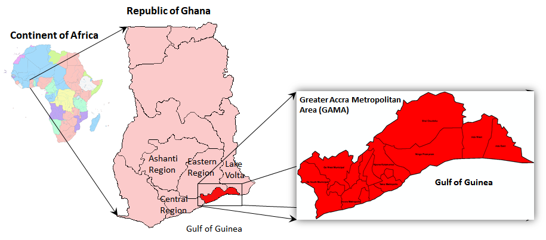
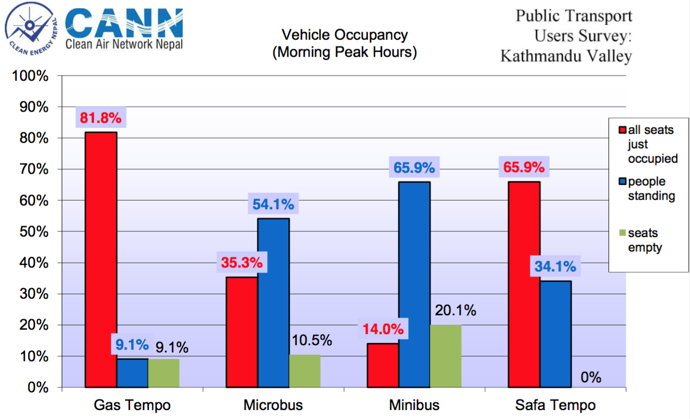
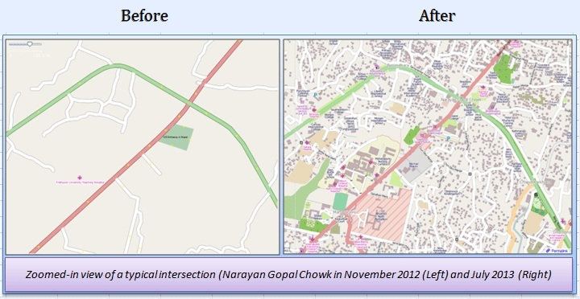

<!-- Note: this is where I'm adding the write-up for now for maximum visibility.
Can go elsewhere, e.g. as a vignette before this is open sourced. -->
Introduction
============

With mounting evidence of health (Celis-Morales et al. 2017), environmental and social benefits of active travel, many cities are preparing ambitious walking and cycling plans. However many transport authorities lack strong and actionable evidence to support this investment for a number of reasons, including:

-   transport models have tended to focus on motor vehicles (Boyce and Williams 2015)
-   data on active travel tends to be sparse and inaccessible (Kuzmyak et al. 2014)
-   data and models that are available tend to be unavailable for many potential stakeholders (e.g. civil society groups) and in a format that is difficult to understand and use (Naess et al. 2014)

This project aims to tackle these problems by assessing the feasibility of tools to provide *actionable*, *publicly accessible* and *geographically detailed* evidence to prioritise investment in cycling for the case study cities of Accra and Kathmandu.

This document represents an *interim report* on progress during the first week of this month-long project, which commenced on 18th December 2017.

Input data
==========

Data were accessed from the following sources:

-   Transport network and building data from **OpenStreetMap (OSM)**, an open access, freely available, crowd-sourced online mapping database (Barrington-Leigh and Millard-Ball 2017).
-   Population density and some demographic data from [worldpop](http://www.worldpop.org.uk/) (Tatem 2017) <!-- - Topographic data from NASA's open SRTM data -->

<!-- Additional data on population densities will be obtained from WorldPop and from NASA's Socioeconomic Data and Applications Center (SDAC). The -->
<!-- former provides static fine-resolution data (100$m^2$, for the year 2013 only), while the latter provides coarser (1$km^2$) future projections -->
<!-- out to 2020. -->
Methods
=======

We have made a number of technical breakthroughs that allow us to estimate cycling potential down to the road network level based on open data. This involved implementing a highly computationally efficient routing algorithm in C++. Since commencing the project we have developed a method for re-allocating the results of the routing algorithm back onto the road network. A custom level of road segmentation was developed to create this geographical aggregated flow map, which clearly shows routes with high cycling potential ([see interactive version](http://rpubs.com/RobinLovelace/341996)):

Illustration of interactive map demonstrating the preliminary results: the routes in Accra with highest cycling potential.

City overviews
==============

This section provides a high-level overview about the geography of each city as it relates to active travel potential. Both cities are included in this section, laying the ground for the next two sections which provide detailed results for Accra and then Kathmandu. Comparing the cities at the outset will help put the results in perspective and lay the foundation for a discussion of how a tool building on this work could be useful to different stakeholders in each city.

Accra is the larger city, with a population approaching 5 million and a growth rate of around 3% per year in the Greater Accra Region according to the [Ghana Statistical Service](http://www.statsghana.gov.gh/docfiles/2010phc/Projected%20population%20by%20sex%202010%20-%202016.pdf). Kathmandu has a population of just over 1.2 million, according to the [World Population Review](http://worldpopulationreview.com/world-cities/kathmandu-population/).

We already have some results from the OSM and demographic datasets, as outlined below.

OpenStreetMap data
------------------

The OpenStreetMap network for Accra has 145,827 street segments connecting 131,349 distinct points, and extends over 4,072km. The OSM data also include 24,490 buildings, of which 23,102 include geometric descriptions only, while the remaining 1,388 buildings are divided between 28 distinct categories.

The equivalent network for Kathmandu has 79,832 street segments connecting 37,770 distinct points, and extends over 1,062km. The OSM data also include 82,333 buildings of which 75,778 include geometric descriptions only, while the remaining 6,555 are divided between 344 distinct categories (in this case including many named buildings).

| City      |  Population (on network)|  N. Buildings|  Num. Building Classes|
|:----------|------------------------:|-------------:|----------------------:|
| accra     |                  2238470|         24490|                     29|
| kathmandu |                       NA|         82333|                    344|

The street network for Accra is more extensive, reflecting the greater spatial extent of the city, while data on buildings are considerable more detailed for Kathmandu than for Accra, presumably reflecting extensive humanitarian mapping activity in response to the 2015 earthquake.

| City      |  Street nodes|  Street segments|  Network distance (km)|
|:----------|-------------:|----------------:|----------------------:|
| accra     |        131349|           145827|                   4072|
| kathmandu |         37770|            40405|                    539|

Demographic data
----------------

Demographic data for Accra from worldpop include population density estimates at 172,238 points, corresponding to estimates in roughly 30-by-30m grid cells. Estimates are available for total population density, as well as distributed between 14 5-year age classes from 0-5 years up to 60-65 years, and 65+ years.

Demographic data for Kathmandu are not as detailed, and also do not include age classes.

An overview of Accra from an active travel perspective
------------------------------------------------------

<!-- Monsuru (1 day's work) -->
<!-- This section will provide background information on the following topics: -->
<!-- - Institutions working in transport and their aims -->
<!-- - References about the transport system in Accra -->
<!-- - Photos of current set-up -->
<!-- - What is the current modal split? -->
<!-- - Recent transport policies. -->
<!-- - How well developed are other infrastructures (e.g. sewerage.) -->
### Greater Accra Metropolitan Area (GAMA)

The Greater Accra Metropolitan Area, simply referred to as Accra city, is the smallest geographical region of Ghana’s 10 administrative regions, covering only 1.4 percent of the total land area of Ghana (see Fig. 1). It is the second most populous region, after the Ashanti region. According to the Ghana Statistical Service, Accra city’s population is estimated to be approaching 5 million, with a growth rate of around 3% per year. Forty three percent of the population is estimated to be between the age of 15 and 35 years.(Ghana, Y.P.I., 2013).

Geographical location of Greater Accra Metropolitan Area (GAMA)

GAMA contains 16 of the 216 local authority districts of the Republic of Ghana. Administratively, the Accra Metropolitan local authority district serves as the capital of Accra city, and is administered by Accra Metropolitan Assembly, which is the political and administrative authority for the entire Accra city.

(Quarshie 2007)

**Weather and Climate in Accra**

The annual average temperature of Accra city 27.6 °C, with mean monthly temperatures ranging from 25.9 °C in August (the coolest) 29.6 °C in March (the hottest). Relative humidity is high, ranging from 50% to 80%. Accra city, as with other southern cities, experiences two rainy seasons; April through June, and September through November. The harmattan is a dry desert wind that blows from the northeast from December to March. It lowers the humidity, bringing hot days and cool nights to northern parts of Ghana. This wind blows over the south in January. These atmospheric conditions have implications for cycling uptake, making it potentially uncomfortably hot and sweaty in the hotter months. However, the impact of climate can be overestimated. In Seville, which has a mean monthly temperature of 28.2 °C in summer, cycling grew from less than 1% to more than 5% following infrastructure investment (ref - RL).

### Brief overview of the existing public transport infrastructure in Accra

**Modal Split**

<!-- The vast majority of public transport services in Accra are provided by private operators, comprising of buses (locally called ‘tro-tros’) and taxis operators, which account for about 70 percent and 15 percent of passenger movements, respectively [@birago_level_2017]. The remaining 15 percent is split between people who walk and people who ride bicycles, estimated to be 11 percent and 4 percent, respectively, according to the Centre for Cycling Expertise, a Ghana-based, non-profit organisation in Accra focused on promoting cycling in cities.   -->
Over a half (56%) of daily passengers in Accra are carried by buses, and a further 15% by taxi with approximately 1 million passenger trips being made each day in and out of the central area of Accra by both mode of transportation (Quarshie, 2006). Additionally, a recent study by the World Bank in 2010 on the city residents’ primary transportation mode choice to and from shopping and work in Accra also indicates that the buses (tro-tros) are the most popular mode of motorised transport, accounting for 70 percent of public transport. This is followed by private cars (10%), taxis (8%) with the Metro Mass Transit (MMT), a quasi-private company buses, recording the least of 0.3% (Fig. 4X). The above studies emphasise the inefficiency of these vehicles in terms of the amount of road space used, congestion caused, and inconveniencies caused to the passengers.

<!-- The buses are typically mini-buses or vans, with the most popular type being Nissan Urvan 15-seaters and Mercedes Benz Sprinter 17-seaters. The routes followed by the buses are typically fixed, while the routine patterns of taxis are flexible, depending largely on the drivers’ or passengers’ knowledge of the area in question. While there are bus terminals that usually mark the origin and destinations of bus journeys, drivers are generally allowed to pick up passengers in-between terminals. The transport fares are generally pre-decided for passengers, however, boarding in-between terminals often requires passengers to negotiate the fares with the bus drivers themselves. Generally, en-route boarding or alighting are considered illegal on heavy traffic routes. However, the lackadaisical attitude of the bus drivers regarding the legal consequences has further popularised the ‘tro-tro’ culture, as they are rarely caught by the police. -->
<!-- A large percentage of the buses and taxis operate under the control of Transport Unions through routing, loading by turns and permission to operate on specific routes. The Ghana Private Road Transport Union (GPRTU) is the biggest transport union and a member of the Ghana Trades Union Congress (TUC) oversees commercial vehicles, whose owners have registered with them (Okoye et al., 2010). The rest of the operators who do not belong to any transport unions are not allowed to load passengers at the Union’s bus terminals, and may have to depend solely on road-side pick-ups. These buses enjoy the flexibility of operating at any time and on any routes, and further, are not bound to pay the levies imposed by the Unions.  -->
**Issues with public transport**

The public transport operators have been criticised for their disregard of operational standards and the safety of passengers, especially during late evening operation (Agyemang 2015). It has been found that the transport unions had not been able to regulate some of the behaviour of their members (Addo, 2002). For example, it is a common practice amongst the drivers to increase their fares, especially after heavy downpours, at peak-hour times, or after slight fuel hikes. There are no regulations in place by the union to combat some of these unacceptable practices (Agyemang, 2009; 2013). Similar practices can also be observed amongst the taxis operators, who often charge twice or triple the bus journey fares (Addo, 2002).

The mini buses at a terminal loading passengers

<!-- **Governments efforts to address the issues** -->
<!-- As a social policy intervention in 2003, the government instituted the Metro Mass Transit (MMT), a bus rapid transit (BRT)-like system for commuters within Accra city and beyond. This constituted the third generation of transport interventions in Accra, purposely to keep the activities of private operators in check, alongside encouraging better service. The first, in the late 80s and early 90s, and the second, in the late 90s, were infrastructure upgrades for roads and corresponding drainage. The coverage of the MMT network constituted only 3% of all the passengers’ movements and functioned until 2007 when it was phased out due to its inability to achieve its goals, which included providing adequate competitive environment in order to enforce good public transport services [@agyemang_traffic_2014]. Moreover, the MMT services ended up not being different to the existing transport services, due to the lack of several of the main components needed for ‘proper’ bus rapid transit infrastructures ([@levinson_bus_2003]; [@deng_recent_2011]), such as dedicated bus lanes and enhanced ticketing systems -->
<!-- In its continued effort to intervene in traffic management, the government commenced with a proper ‘BRT’ project in 2012, to cover Accra city and other major cities, such as the Ashanti Region and the Central Region of Ghana. Totalling $95 million, the project was supported by various financing from development partners, such as the World Bank, Agence Francaise de Development, and also received co-financing from the Federal government of Ghana. The new BRT system was meant to begin full operation in November of 2017.  -->
<!-- **Some stats on daily travels within Accra.** -->
<!-- With the increasing growth of car ownership in Accra city, the number of cars is estimated to increase from 181,000 in 2004 to over 1 million in 2023 (Quarshie, 2007). The highest traffic volumes are found in the Winneba Road and Liberation Road corridors, which have volumes of over 50,000 vehicles per day. Roughly, 10,000 vehicles enter the central area of Accra within the Ring Road in the morning peak hour. The average number of passengers per trip on the buses and taxis are estimated to be 13 and 2.3, respectively. Approximately 1.3 million passenger trips per day are estimated to enter or leave the areas within the Accra Ring Road and 1.6 million passenger trips go into, or out of, the area within the motorway extension (Quarshie, 2007). Approximately 56% of these trips are made by bus, and a further 15% by taxi, meaning that an approximate 1 million passenger trips are made each day, into and out of the central area of Accra. These vehicles are inefficient in terms of the amount of road space used, thereby are considered responsible for most of the traffic congestion observed around the area. Furthermore, due to the lack of proper maintenance of most of the vehicles, they constitute a significant source of carbon dioxide emissions in the city.  -->
**Making a case for cycling**

Traffic congestion is a major transport problem in Accra city, with 70% of major roads operating at an unacceptable level of capacity at certain times of the day. It has been argued that moving from low capacity vehicles, such as buses and taxis, to a high-capacity, well-planned BRT system may help to reduce the traffic congestion (Quarshie, 2007). However, in order to address both the congestion and the vehicular emission problems, there is a need for investment in non-motorised transport systems, such as cycling and walking. In developing countries, the non-motorised transport systems are generally not recognised as key components of the urban transport system; hence, the lack of real transport policies that capture this mode of transportation.

### Cycling infrastructure in Accra

**Peoples’ attitudes towards cycling**

A study conducted for the World Bank in 2010 estimated that only 1 to 4 percent of people in Accra city use a bicycle as their means of commuting within the city. However, according to an earlier study by the Centre for Cycling Expertise (CCE), the estimate was given as 9-10%. Although, cycling is the predominant means of transportation in the north (rural parts) of the country, it is generally not seen as an acceptable means of transport in the urban cities, such as Accra. For example, an extensive study on bicycle use among the urban poor in Nima and Jamestown of Accra (Turner et al., 1995) highlighted the general negative attitudes within certain communities toward cyclists. Many people do not think that cycling is safe in the present urban settings, such as Accra city. This is largely due to the understanding that the existing transport infrastructures lack the adequate infrastructural support for a non-motorised system, such as cycling.

**Government sponsored infrastructures (if any?)**

In a white paper prepared by the Ministry of Transportation in 2004, cycling was highlighted as a key component of the sustainable national transport policy. However, there has not been any real policy formulation regarding the integration of cycling infrastructures into the existing transport infrastructure in order to promote cycling within the city. What further demonstrates the lack of enthusiasm for non-motorised transport options was revealed in the upgrade project of the National Highway 1 (N1) motorway, which was completed in 2012. The project included the addition of more lanes to some of the sections of the N1 motorways, such as those connecting the neighbourhoods within Accra’s functional boundaries. Along an expressway’s 14km stretch for example, there are only six bridges for cyclists and pedestrians to cross, and only 1.6km of segregated bicycling lanes. This implies that cyclists must share the road with the vehicles in most cases, thereby exacerbating the safety concerns being nursed by many people towards cycling.

In 2008, the department of Urban Roads, in collaboration with the CCE, developed the first ever Bicycle Masterplan (BMP) for Accra city. A comprehensive study was carried out in order to generate the technical details regarding the design, such as what type of bike facilities are required for a particular route.

Accra bicycle masterplan (Quarshie, 2007)

**Demography and population of Accra**

The population of GAMA grew from 2,905,726 in 2000 to 4,010,054 in 2010 (Ghana Statistical Service, 2010). With a growth rate of 2.5% the population is estimated to increase to 5.9 million by 2040. The male and female population represents 49% and 51%, respectively. Based on the last population conducted in Ghana in 2010, the age distribution is given as follows: 0 -14 years as 31.3%, 15-35 years as 43.2%, and 36 and above as 25.5%.

The region occupies a total land area of 3,245 sq. km, which makes it the smallest region of the country, geographically. It has a population density of 1,235.8 people per sq. km. The region is 90.5% urban with an annual urban growth rate of 3.1%, and recorded a positive net migration value of 1,275,425 in 2010. In terms of the economy, GAMA’s labour force participation rate for population aged 15 - 64 is estimated as 74.7%.

Accra population density (2013). Source: Thomas Brinkhoff: City Population, <http://www.citypopulation.de>

The region recorded the lowest Infant Mortality Rate (deaths of infants under age one) in 2011, with thirty-seven infant deaths per 1,000 live births. Child Mortality Rate (deaths of children between ages one and four) was 19 deaths per 1,000 live births and Under Five Mortality (number of children who die by age five) was reported at 61 deaths per 1,000 live births. Maternal Mortality Rate (the number of deaths due to pregnancy related causes to the number of women of child-bearing age, 15 - 49 years) in the region, was 355 per 100,000 live births in 2010, this was lower than the national value of 485 per 100,000 live births. The Total Fertility Rate (TFR) of the region is slightly lower (2.5) as compared to the national TFR of 4.0, indicating that on the average women in the Greater Accra Region give birth to three children. In addition there are two births per every 100 adolescents in the region, which is the lowest among the regions. With regards to Contraceptive Prevalence Rate (CPR), the use of modern contraceptives among currently married women, it was 19.4 % in 2014, one of the lowest in the country. In 2013, the HIV prevalence rate in the region was 2.7%, higher than the national HIV prevalence of 1.3%.

An overview of Kathmandu from an active travel perspective
----------------------------------------------------------

### Kathmandu District, Metropolitan City and Valley

The Federal Democratic Republic of Nepal consists of 7 provinces. Kathmandu District lies within Bagmati province, along with twelve other districts, which together occupy about 14% of the country. Kathmandu District consists of eleven municipalities, one of which is the municipality of Kathmandu Metropolitan City, the capital city. According to the Nepalese Central Bureau of Statistics (CBS, 2001), Kathmandu is by far the most densely populated of all 75 districts, with 1,081,845 inhabitants (4.67% of the total Nepalese population) and a population density of 2,738.9 people per square kilometre (p/km2) in 2001. The national average district density in 2001 was 157.3 p/km2 and the only other district to have a population density of over one thousand was Bhaktapur (1.894,6), which borders it to the east.

For most statistical surveys and transport planning purposes, amongst others, Kathmandu municipality is considered as part of a different geographical unit, namely Kathmandu Valley, which spans 3 districts, two municipalities of which are in Kathmandu District, one in Lalitpur District, and two in Bhaktapur District. This mismatch between administrative authorities is part of the reason why it is hard to compose, finance and execute e.g. transportation plans for this region (East-West Center, 2009). In 2013 Kathmandu Valley had a density of 4,400 p/km2, with a density of 19,250 p/km2 in Kathmandu municipality alone (World Bank, 2013). In September 2017 the population of Kathmandu Valley was estimated at approximately 3 million permanent residents, with an additional floating population of 2.5 million. Since Kathmandu has had an annual growth rate of 4.63% for at least the last decade (compared to 1.53% nationally), this means an increase of the population with 57% over this period of time. New municipalities in Kathmandu Valley even exhibit annual growth rates of 5.7%, while the national average is only 1.53%. (Pradhan, 2017)

As Kathmandu Valley is the most urbanized region of Nepal, there is generally a good availability of utilities (water, gas, electricity), sanitation, education, and transportation, though recent rapid haphazard urbanization accounts for worse conditions in the expanding areas and increased pressures on the existing infrastructures and facilities (East-West Center, 2009). In 2011 there were 1329 people per kilometre of sewerage service in Kathmandu municipality, with the Nepalese average being 1942. The roads in Kathmandu District were 67.7% black topped, 15.4% gravelled and 16.8% earthen in 2011. The district had 7896 people per km of road at the time, with a total road length of 220.89 km, and a density of 56 km of road per square km, as opposed to 2445 people/km and 7 km/km2 on average nationally. In Kathmandu Municipality nearly all roads were black topped in 2011 (99.7%), with the remainder being gravelled, and there were just over ten thousand people per kilometre of road (CBS, 2014.)

While the elevation in Kathmandu District varies between 1,262 and 2,732 meters above sea level, Kathmandu itself is relatively flat and located at an average elevation of 1400 meters (Wikipedia, 2018a; 2018b). In a report from February 2009 (East-West Center, 2009), the dominant land-use type in Kathmandu Metropolitan City is classified as "Mixed" in the "Built up" category, covering nearly half the city (48.89%), followed by "Cultivation" (16.80%) and "Open area" (10.77%). Following those, a substantial part of the city is classified as Road (7.29%) or "Road median" (0.8%).

Boundaries of Kathmandu, Lalitpur and Bhaktapur Districts, their municipalities, and Kathmandu Valley. Source: East-West Center, 2009

**Weather and climate in Kathmandu** Since Kathmandu District and Kathmandu Valley both span a great elevation range, they also cover multiple climate zones, but Kathmandu itself falls in the warm temperate zone, with four seasons and average daily temperatures ranging from 10.8°C in the coldest month (January; average minimum 2,4°C, maximum 19.1°C) to 24.3°C in the warmest month (July; avg. min. 20.2°C, max. 28.4°C). Annual precipitation is 1,454.9 mm, with November being the driest month with an average monthly precipitation of 8.3 mm (1 precipitation day on average) and July the wettest with 363.4 mm (23 precipitation days). There is one monsoon season, which lasts from June through August, during which 64% of the annual precipitation falls over the course of 62 precipitation days. If September is included, 78% of the average annual precipitation is accounted for. (precipitation & temperatures: MFD, 2018; precipitation days: WMO, 2018)

### Brief overview of the existing public transport infrastructure in Kathmandu

**Kathmandu Valley public transport and modal split** In 2011 3.5 million trips were made each day on average in Kathmandu Valley. Walking was found to be the most dominant mode of transportation in Kathmandu Valley (40.7%), followed by transportation by bus (27.6%), motorcycle (26.0%) and car (4.2%). The travel mode share of cycling was only 1.5%, though it had been 6.6% two decades before, prior to the onset of the rapid urbanization and motorization of the region, whereas the motorcycle share had only been just over a third of the 2011 share in 1991 (9.3%). The public transport share remained similar (27.2% in 1991). Walking, as the other non-motorized mode, also saw a decreased share in 2011, down from its 1991 share of 53%. Despite the removal of pavements on major roads in the cities, in an attempt to create more space for motorized traffic, three of these roads still saw foot traffic at average rates of 690-2010 people per hour (maximum 816-2214/hr) a 2011 study revealed. Kathmandu was classed as "not walkable" and Kathmandu came out as one of the least walkable cities of Asia in a 2010 study. There are also no provisions for people with disabilities. In 2012 an average 270 cyclists per hour were found to be headed in each direction on Tundhikel Road during rush hour (9-11 a.m.) and 194 per hour during the rest of the day. (CEN, 2013c; Khanal & Shrestha (CEN), 2012) Though motorcycles and cars together account for 93% of the vehicles in Kathmandu Valley, and public transportation buses for 3%, their travel mode share in 2011 was comparable. During the 2001-2011 decade, the rate of increase in the amount of vehicles being newly registered each year greatly outpaced the population increase in Kathmandu Valley, with a growth of 14% per year across all vehicles and 17% per year for motorcycles alone (CEN, 2013a).

Congestion in Kathmandu. Source: Cover photo from Udas (CEN), 2012; photo by Keshav Thapa (CEN)

Kathmandu Valley public transport operates from 4:30-21:00, with peak hours being from 8:30-11:00 and 17:00-19:00. An attempt in 2012 to run public transport services until 11 p.m. with the presence of armed police on each vehicle was found to be financially intractable due to the low number of passengers and the associated security costs. Should people require transportation for work-related purposes at night, their company will provided or a taxi will be used. The main trip purpose is work (40% in men, 36% in women) or education. Other journeys are generally made between noon and 4 p.m. Most journeys last 15-30 minutes and only 10% last more than an hour. During peak travel times at least a third to half of the passengers will be female. 'Trip chaining' (because of e.g. shopping or child care) is done by men and women in equal measures. The majority of people walk 5-10 minutes to reach their public transport service (46.2%) and a further 5-10 minutes (39.1%) to reach their final destination. Equally, most passengers have to wait 5-10 minutes for an available vehicle at their origin and destination stops, both during morning peak hours (55%), during the evening peak (45.8%), and in transit (49.2% during morning peak hours, 47.7% in the evenings). (World Bank, 2013)

In a 2012 public transport survey the main purposes of public transport journeys in Kathmandu Valley were revealed to be for work (38.64%) or study (34.3%). Nearly a third (32.2%) of all journey destinations were in the 'city core area', with just under a third (29.73%) of all transits also occurring in this area. (Udas (CEN), 2012)

Men are more likely than women to have access to a family owned vehicle (including bicycles), though as of 2013 women were rapidly acquiring small scooters, which is why there are fewer men (16%) with no alternative to using public transport than women (26%). If they do have access to an alternative, the number one determining factor for mode of transportation for both genders is overall journey duration (men 84%, women 74%). (World Bank, 2013.)

A wealth of different types of public transport vehicles have operated and are operating in Kathmandu Valley, all of which are currently privately owned and run by a syndicate, with exception of the Sahja buses, which are operated by a cooperative. Most individual operators only own one vehicle, where in some cases they will also operate the vehicle, and there are few individuals who own more than ten vehicles. (Wolrd Bank, 2013.)

Nepal Transport Service initiated public transport in Kathmandu Valley in September 1959 with eventually 11 buses operating between Kathmandu and Patan (in Lalitpur District, which borders Kathmandu municipality to the south), transporting over ten thousand passengers each day during its prime. The service shut down in 1966. (CEN, 2014a)

Meanwhile, Sahja Cooperative Yatayat had been founded in 1961/62 to offer a means of affordable public transportation, not only in Kathmandu Valley, but across the entire country. While they operated a fleet of 200 Sahja buses (54 seating capacity, 100 including standing) in their peak days, they started to encounter financial difficulties from 1990 onwards due to government mismanagement and the private sector starting to get involved in the public transport sector. Consequently their services started to dwindle, until being suspended completely in 2006/07. After purchasing 16 buses, they resumed their services in Kathmandu Valley in 2012 Sahja buses. The buses follow regular routes and the government set distance-based fare structure. To aid in route planning and fare calculation, the Monsoon Collective, in collaboration with students from Kathmandu University, have developed an open-source and freely accessible application (OpenStreetMap Wiki, 2014). Additionally there is a number which can be phoned, to enquire when the next bus will be. The main reason people prefer other modes of public transportation over the Sahja buses is due to their infrequent operation schedule (World Bank, 2013).

The electric trolley bus system, which had been a gift from the Chinese government, suffered a similar, but ultimately more final, fate. It ran from the centrally located Tripureshwor, through the valley for 13 km in an east-southeasterly direction, towards Surya Binayak from the end of 1975 until 1990, when it also started incurring losses due to mismanagement, amongst other causes. It suspended its services at the end of 2001, and when it reopened under Kathmandu Metropolitan City management in September 2013, it only operated on the 5 km stretch that fell within its municipality limits. After an additional year of suspended services, the system was officially terminated in November 2009. Though there have been plans to reinstate the trolley bus system, these have yet to materialise. (Udas (CEN), 2012)

In 1993, USAID supported the introduction of seven Safa Tempos (electric three wheelers). In a further effort to control pollution, the government banned all diesel-operated three wheelers in 1999/2000, resulting in the Safa Tempo fleet size increasing to the current capacity of 600 vehicles and the introduction of micro buses. (CEN, 2014a.) A Danida-funded project encouraged women to become Safa Tempo drivers, resulting in approximately 200 female drivers, with some being owners as well (World Bank, 2013). In addition to the Safa Tempos and the Sahja buses, minibuses and large buses are operational in Kathmandu Valley as well, resulting in an overall public transport fleet size of over 5,321 vehicles, servicing 222 routes in 2012/13 (CEN, 2014a). Additionally, there is a fleet of around seven thousand taxis, but very few people can afford to use them, and they will rarely use their meter, so their modal share is minimal, despite occupying around 55% of the public transport fleet (World Bank, 2013). The majority of passengers prefer to travel in the microbuses (49.3%), followed by buses and minibuses (39.5%), with only 10% expressing a preference for Safa Tempos. In general people prefer to travel in larger vehicles, due to the higher availability of seats, which are more comfortable, and increased speeds (Udas (CEN), 2012).

Distribution of the different public transport vehicle types in Kathmandu Valley (2010). Source: Fig. 5 from Udas (CEN), 2012 (originally KSUT Project Report)

Capacity and fleet of the different public transport vehicle types in Kathmandu Valley (2010). Source: Table 2 from Udas (CEN), 2012 (originally KSUT Project Report)

Routes and fleet size of the different public transport vehicle types in Kathmandu Valley (2010). Source: Fig.1 from CEN, 2014a (originally MoPIT/JICA 2012, Sahja Yatayat 2013)

**Transport-related air pollution in Kathmandu** Due to the bowl-shaped mountain-surrounded topography of Kathmandu Valley, emissions from vehicles and other sources can get trapped in the Valley for a prolonged period, especially during the winter months, when atmospheric inversion occurs, and the rest of the dry season. Combined with the aforementioned recent rapid motorization trend in Kathmandu, which has been 12% per year in the Bagmati zone (which encompasses the three Kathmandu Valley districts and five others) in the decade from 2002/03-2012/13, this has led to 2-hourly PM10 levels being recorded in Putali Sadak, a traffic-dense areas in Kathmandu, during the winter of 2013/14, which were up to sevenfold that of the nationally set limits (NAAQS) and up to 15 times in excess of the WHO guidelines. (CEN, 2014b)

Already in 2006, when there were far fewer vehicles in Kathmandu Valley, 63% of PM10 emissions was attributed to transportation, with vehicle emissions themselves accounting for 38% of PM10 emissions and resuspended dust from unpaved and degraded roads for the remaining 25%. A more recent study from 2010 attributed 98% of PM10 emissions to the transportation sector. (CEN, 2014b)

Along with an increase in respiratory diseases, the increasing levels of air pollution have also led to a substantial increase in the number of deaths from chronic obstructive pulmonary disease in children (+24.2%) and across all ages (+15.9%) during the period 2005-2016, making it the second most prominent cause of death for the former and fifth most prominent cause of premature death causes for the latter across all of Nepal. (IHME, 2018.)

**Issues with public transport** The mains issue with public transport in Kathmandu as given by both men (80%%) and women (70%) was "overcrowding", followed by "personal insecurity" (33% in women, 16% in men) and "reckless driving and fear of accidents" (18% in women, 16% in men). In general there were few differences between men and women with regards to their perception of public transport, the main difference being in the feelings of personal insecurity while traveling, and experiencing physical difficulties while boarding or traveling, mainly due to the aforementioned overcrowding. Because of this, women are more likely to wait for the next vehicle. The second most mentioned issue with public transport is also related to overcrowding, since it increases opportunities for pickpocketing, personal abuse or inappropriate touching. (World Bank, 2013.)

Women aged 19-35, but especially those aged 19-25 years, were the most likely to list personal insecurity as an issue, with 43% of them mentioning it due to fearing or experiencing inappropriate touching. Men in the 19-25 age group on the other hand were among the least likely to list personal insecurity as in issue (just over 5%), together with those aged 65 or above. For both women and men of over 35, the fear of inappropriate touching is much less of an issue, though the other personal insecurity concerns remain. While women feel most insecure while on the vehicles, men mainly experience personal insecurity while boarding or disembarking. Of those for whom personal insecurity is an issue, it was revealed that 37% of women and 6% of men had actually experienced inappropriate touching during the preceding year. When taking the entire survey population into account, this figure was 26% for 19-35 year old women and 3.4% for men of all ages. (World Bank, 2013.)

Overcrowding is higher in the evening peak hours, than in morning peak hours, partially due to a lower operational fleet in the evenings. Safa Tempos will only have an additional 2-3 people during peak hours, due to their dimensions not allowing for standing passengers, unless hanging from the back. Micro buses will carry an additional 5-6 passengers during the morning and evening peak respectively, and mini buses 10 to 13. Both female (59.7%) and male (49.2%) passengers feel unsafe when traveling at night. (Udas (CEN), 201).

<!--

Morning peak hours vehicle type occupancy in Kathmandu Valley (2010). Source: Fig. 15 from Udas (CEN), 2012 (originally KSUT Project Report)

Evening peak hours vehicle type occupancy in Kathmandu Valley (2010). Source: Fig. 16 from Udas (CEN), 2012 (originally KSUT Project Report)

-->

Peak hours vehicle type occupancy numbers in Kathmandu Valley (2010). Source: Tables 8 & 9 from Udas (CEN), 2012 (originally KSUT Project Report)

Nearly one in six people was concerned with the transport fares, with some of the lower-waged workers having to allocate 20-40% of their wages to public transport costs. Many people had to relocate to save on commute costs. Since women have less access to personal vehicles, they tend to have to spend more on transport. Another concern, besides the actual costs, is that there is no consistent or transparent fare structure levied, despite the government providing a set distance-based fare structure. The government will adjust the fares, following for example fluctuations in petrol prices, but since the rates are not signposted inside the vehicle or elsewhere, people are at the mercy of what conductors feel like charging them. (World Bank, 2013.)

A lot of issues arise from the fact that the public transport system is privately run by in a syndicate system. Decisions on matters like fare, routing, departure times, vehicle occupancy, operation hours, amongst others, are dictated by vehicle owners wanting to maximise their profits, resulting in e.g. overcrowding, long wait times due to operators wanting to depart only with a vehicle which is completely filled (usually far beyond its official capacity), and no services in the evening when passenger numbers are generally quite low. Furthermore it is impossible for any potential competitors to enter the market, which could otherwise benefit passengers. (Udas (CEN), 2012).

While just over a third (34.5%) of passengers feels neither comfortable, nor uncomfortable, with the amount of seating space whilst traveling, a similar share (34.2%) does feel uncomfortable and nearly two thirds (61.7%) of female passengers feel uncomfortable with the available space. A similar proportion of passengers (61.3%) feel that most drivers of public transport vehicles generally drive recklessly and 67.3% finds the actual vehicles themselves unhygienic and not properly maintained. Furthermore, both drivers and passengers generally do not respect the actual locations of public transport stops, which, an overwhelming majority of passengers (84.1%) feel they should do. Most passengers find it easy (53.9%) or even very easy (10.5%) to identify the public transport vehicle for their intended route, but many passengers struggle to do so, with 21.7% finding it difficult and 7.6% very difficult and 6.3% who found it difficult initially, but are now managing to correctly identify them, generally once they have journeyed on that particular route for over a month. (Udas (CEN), 2012)

Overall, the majority of passengers (57.6%) rate the experience of using public transport in Kathmandu Valley as "average", though nearly a third (32.9%) finds it "unpleasant" and only 9.5% of passengers rate it "pleasant". (Udas (CEN), 2012)

**Government plans for alleviating congestion and pollution** While the government has already introduced some measures previously (banning diesel- and petrol-operated three wheelers and introducing a green sticker system for vehicles in December 1999 (CEN, 2014b)), most focus to date has been on widening existing roads to 6 or 8 lanes and building more roads as the urbanization has spread. Since this has proven to be far from adequate in coping with the increased motorization, congestion and pollution, more sustainable and long-term plans have been constructed. In July 2015 an introduction of the "Project on Urban Transport Improvement for Kathmandu Valley in Federal Democratic Republic of Nepal" was presented. For the road system, a radial-circumferential system will be adopted, allowing vehicles whose origin or destination is not in the central business district to avoid having to pass through there. (Government of Nepal, 2015.)

Kathmandu road plans. Source: Government of Nepal, 2015.

Similarly, for the public transport system, a hierarchical route network will be made, keeping only a third of the routes based on mobility numbers, and four transfer terminals will be created in each cardinal direction, to alleviate pressure on the central terminal. By reducing the import fees for vehicles with a seating capacity of over 40 seats, they hope to encourage a shift towards larger public transport vehicles. Furthermore, they intended to have short-, mid- and long-term transport master plans in place in the following 5, 10 and 15 years respectively. They envisioned plans for a number of different sectors, including non-motorized transport. (Government of Nepal, 2015.)

Kathmandu Sustainable Urban Transport Project public transport plans. Source: KSUTP, 2016

**Making a case for cycling** According to a 2011 travel survey, journeys by private vehicle are 5 km long on average and 90% of non-motorized trips undertaken are completed in under half an hour (CEN, 2013c).

A number of organisations in Kathmandu and Nepal are committed to increasing the cycle mode share, to alleviate congestion and improve air quality and general road safety. On World Environment Day 2009, ["Team for Nature and Wildlife"](https://www.tnwnepal.org/download/KathmanduCycleCity2020.pdf) (TNW Nepal), a local NGO, launched a campaign for making Kathmandu a cycle-friendly city by 2020. In addition to lobbying for better cycling infrastructure, and cycle training, they hope to convince especially those who are currently using non-public motorized transport to switch to cycling. The Kathmandu Cycle City 2020 (KCC 2020) campaign is coordinated by ["Cycle City Network Nepal"](http://cyclecity.org.np/) (CCNN), whose members are students of three Nepali Universities (two of which are located in Kathmandu District). <!-- (TNW, 2018.) --> In addition to the KCC 2020 campaign, CCNN also coordinates 4 other campaigns, namely Women on Wheels, Bike to School, Bike to Work, and Critical Mass.

["Clean Energy Nepal"](http://www.cen.org.np) (CEN) is an organisation, which works on a "Clean Air & Urban Mobility" program, as well as two other programs, hence their interest in sustainable transport. They hope to raise awareness and achieve required policy and behavioural changes. Clean Air Network Nepal (CANN) is part of the ["Clean Air Asia"](http://cleanairasia.org/) NGO, with similar objectives. These two organisations, together with Cycle City Network Nepal, UN-Habitat, and Nepalese Youth for Climate Action, have initiated "A Campaign for People-centric Transport System", which is abbreviated as "MaYA" in Nepali.

While most children in Kathmandu Valley know how to cycle (77%), very few actually cycle to school, preferring to go on foot (&gt;77%) or by school bus or public transportation (19%) instead. The main reason for not cycling to school was that it is perceived as unsafe (41%), followed by not owning a bicycle (36%), pollution (13%), and distance (5%). Practically none (&lt;1%) said it would be unaffordable. Though they generally do not cycle to school, most children will cycle when there is a general strike, since there is no traffic on the roads then, and 26% will cycle some times per week, with 5% cycling every day. Thus, providing a safer cycling infrastructure will enable more students to cycle to school. (CEN, 2013c.)

During the 2013 "Cycling in Nepal: Challenges and Opportunities" workshop, participants vowed to make Kathmandu a cycle city by 2020, and have made a declaration to this affect, noting various points of action to follow through with the relevant stakeholders. The second of these involves ensuring cycle lanes are included in any future developments in a connected and well thought-out manner. (CEN, 2013b)

### Cycling infrastructure in Kathmandu

**People's attitudes towards cycling** While cycling used to be a popular mode of transportation in Kathmandu Valley historically, there has been a shift towards motorcycle transportation during the past decades, decreasing the cycling modal share to just 1.5% in 2011. Though nationally 29.9% of urban residents owned a bicycle in 2011, in Kathmandu Valley this was only 11.4%. Part of the reason people are averse to cycling in Kathmandu Valley these days is due to the fact that they see it as a poor man's transportation mode. The remainder is mostly down to it being dangerous due to the lack of proper cycling infrastructures and unhealthy due to the high levels of air pollution. Pedestrians and cyclists are often casualties in road accidents, with 7 cyclist fatalities recorded in the fiscal year of 2011/12 out of a total of 180 involved in accidents that year and 8 fatalities recorded for 2012/13. (CEN, 2013c) In general 130 major road accidents are reported in the valley each day, in addition to over a thousand minor incidents (World Bank, 2013).

**Government sponsored infrastructures** On paper, great plans have been proposed by the government with regards to building cycling tracks, yet it has taken a lot of pressure from Cycle City Network Nepal (CCNN) to get the Maitighar-Tinkune (both towards the southern boundary of Kathmandu Metropolitan City) cycle lane, which was promised back in 2000, realised well over a decade later (CEN, 2013c). However, an evaluation by the Clean Air Network Nepal of this 2.7 km long cycle track found it to be rarely used, with cyclists preferring to stay on the carriageway, due to it seriously lacking in terms of signage, connectivity, surfacing, safe passage at intersections and bridges, presence of obstructions, amongst other issues and make recommendations for how these matters can be improved (CEN & CANN, 2015). The 44 km of cycle tracks promised in 2005, as part of the 'Velo Mondial Charter and Action Plan for Bicycle Friendly Communities', and cycle lanes on roads wider than 22 meters, have yet to materialise. The first cycle track to be constructed runs from Tilganga to Sinamagal towards the easternmost boundary of the metropolitan city. This 1.2 km track benefits from being separated from the road and offers a lane for pedestrians as well, but it is due to it suffering from most of the same problems mentioned above, this cycle track too is rarely used (CEN, 2012).

Planned (brown), being constructed (red) and existing (green) cycle tracks as of December 2013. Source: Fig. 12 CEN, 2013c

OpenStreetMap Cycle Map and Google Aerial for Kathmandu Metropolitan City. Source: openstreetmap.org.

### Assessing the quality of OpenStreetMap of Kathmandu

Kathmandu is very well represented on OpenStreetMap, thanks to a number of projects by the Kathmandu Living Labs (KLL) organisation. KLL has not only informed residents about the importance of having accurate and freely available spatial data, and how these can help improve interactions between the local governing authorities and citizens, but also arranged training workshops to educate them in how to map their environments accurately, which by 2015 had been provided to over 1,400 people. In addition to this, they have had a specific project which involved mapping the 2600 schools and 300 hospitals in the area in 2013. Their initiative has resulted in the mapping of 2,054,436 buildings and 135,063 kilometres of roads. (KLL, 2018.)

Improved representation of Kathmandu on OpenStreetMap after KLL efforts. Source: KLL, 2018.

**Demography and population of Kathmandu**

The population in Kathmandu municipality has been increasing rapidly, from 671,846 inhabitants in 2001 to 1,003,285 (254,764 households) in 2011 (CBS, 2014) and currently around 1.5 million (Wikipedia, 2018a), thus increasing at a much higher rate than the national 1.35%. While nationally the sex ratio is close to parity, in Kathmandu municipality the male population was 113.39% that of the female population in 2011 (CSB, 2014). Based on the results from the CBS 2011 survey, 23.76% of Kathmandu Metropolitan City residents are aged 0-14, 48.59% is 15-35 and 27.65% is over 35, with the distributions being similar for both genders.

<!-- mention migration etc, birth rates, employment, have them for all of nepal, but not kathmandu -->

Kathmandu population density (2011). Source: Thomas Brinkhoff: City Population, <http://www.citypopulation.de>

Results I: Assessing the quality of OpenStreetMap
=================================================

The street network datasets used for this project were downloaded from the OpenStreetMap (OSM), an open access, freely available, online mapping database (Barrington-Leigh and Millard-Ball, 2017). Generated through crowd-sourcing (Goodchild, 2007) by volunteers, the current database has grown to almost 50 gigabytes, and thousands of features are being added by the day. One uniqueness of OSM is that it allows its users the chance to contribute their local knowledge about places, thereby ensuring the features’ accuracy, completeness and thoroughness. Furthermore, a backend control/validation is implemented in order to ensure that the datasets conform with the Open Geospatial Consortium standards, which is the internationally recognised set of data standards for the global geospatial community.

For this project, we examined the quality of our OSM datasets and evaluate how well the datasets represent the reality on the ground. The quality of geospatial datasets can be evaluated using one, or a combination of metrics, such as positional accuracy, completeness, attribute accuracy and consistency (Haklay, 2010). The choice of any metrics often depends on the data requirements stipulated for a project, as well as the higher-quality baseline datasets available relating to the area in question. We chose OSM datasets for this project due to its relatively high positional accuracy with respect to the satellite basemap of the area, as well as its notion of continuous mapping, thereby leaning towards absolute completeness. Hence, we used ‘positional accuracy’ and ‘completeness’ metrics to evaluate the quality of our OSM datasets.

The positional accuracy is described as the position of a feature on a map relative to its actual position on the ground, while the completeness is an assessment of the amount of datasets that are missing on a map. For the baseline comparison datasets, we used the Bing areal imagery, which can be added as a background layer on OSM website, thereby allowing easy comparative analysis through visual inspection. The positional accuracy of the Bing areal imagery has been confirmed to be relatively better than that of Google Maps at nadir, with an RMSE of 7.9 as compared to 8.2 for the latter (Ubukawa, 2013). In the same study, the RMSE of OSM datasets was calculated to be 11.1m. Furthermore, the new Bing areal imageries for every country are usually released every three to four months in order to ensure the imagery is as current as possible (Ref.).

Bristol OSM network dataset as reference positional accuracy and completeness
-----------------------------------------------------------------------------

Bristol is a city in South West England with a population density of 3,892/km2, according the the UK Office of National Statistics (2015), making the district one of the most densely populated district in the UK. Bristol OSM network dataset is shown in the figure below; showing what could be considered ideal positional accuracy and completeness expected of an OSM dataset.

In order to inspect the dataset, we placed 2km by 2km grids at the geometrical centre of all the district (Fig.xx(a)), providing a good cross-section of the street network across Bristol. A careful visual inspection of each of the grid revealed very high positional accuracy and completeness of OSM network datasets.

1.  The OSM map of Bristol, with 2km x 2km grids placed at the centre of each administrative ward, and (b) the 2km x 2km grid at the centre of Bishopston administrative ward
    

    

    Fig. xx (b) is the 2km x 2km grid at the central of a randomly selected administrative ward - Bishopston. The figure shows perfectly aligned road segments along the central of their raster representation - indicating a very high positional accuracy. Furthermore, we could not find a single case of uncaptured road segment; indicating a hundred percent completeness.

In order to inspect the positional accuracy and the completeness of both GAMA and Kathmandu, we used the same strategy of drawing 2km x 2km grids inside the administrative sub-division each study area, and visually inspect each of the grid.

GAMA
----

In comparison with Bristol, GAMA is roughly thirty times bigger in size. Bristol is only about the same size as the Accra Metropolis, one of the 16 districts of GAMA. As a result of the relative size of GAMA as compared to Bristol, it is expected that more mapping efforts will be required to cover GAMA.

Fig. xx shows the distribution of the 2km x 2km grids drawn at the central of district sub-divisions of GAMA. The distibution of the grids also portrays a good cross-section of the street network across GAMA, from the high population density district of Accra metropolis in the south west, to the low population density of Shai Osudoku in the far east. We classified the districts into three, namely (1) urban (2) semi-urban and (3) rural districts. We based this classification on the spatial extent of the road network across each district, roughly estimated from the satellite image, through visual inspection. Thus, we have the districts whose network coverage have between 51-100%, 25-50%, and 0-25%, classified as urban, semi-urban and rural districts, respectively. In other words, we use road infrastructure as a proxy for city classification (Fig. xx).

Like many urban districts, two semi-urban districts; Ga West Municipal and Ga South Municipal districs, contain very dense street network in areas that are adjacent to the urban district of Ga Central Municipal district. The four eastern-most districts, classified as 'rural', consist largely of trunk roads connecting GAMA to the other regions of the country.

The OSM map of GAMA, with 2km x 2km grids placed at the centre of each district.

<!-- The pink grids represent the centres of Ga Central Municipal and Accra Metropolis district (from left to right) – the two highly urbanised districts). The blue grids represent the centres of Ga West Municipal and Ashaiman Municipal districts (from left to right) – two moderately urbanised districts. -->
The OSM datasets of GAMA revealed very high positional accuracy across all the districts. The positional accuracy is also uniform for all road classes. Though, many of the OSM road segments are not prefectly aligned at the central of the roads' raster representation, they are nevetheless contained within the widths of the roads.

There is variations in completeness level based on the three district categorisations, with urban district having the best completeness level, followed by the semi-rural districts. Furthermore, it is observed that there are more OSM datasets in areas where roads are paved, than areas where roads are unpaved. This explains why more roads in the urban districts are captured better than the roads in both the semi-urban and rural districts. Figure xx(a) and Fig xx(b) are the 2km x 2km grids at the centre of the Accra Metropolis and Ga West Municipal districts, an urban district and a semi-urban district, respectively. The oval shapes highlight examples of areas with missing OSM datasets. It can be observed that areas with missing OSM datasets are more prominent in semi-urban district than in the urban district.

1.  Accra Metropolis district - an urban district, and (b) Ga West Municipal district - a semi-urban district. The oval shapes indicate areas where streets are missing.
    

    

The "completeness" is also observed to vary by road classes, from trunk roads (major road) having the highest completeness level, to the residential (unpaved) with the lowest completeness level. Even in the rural districts where the general completeness level is very poor, the trunk road class are the only well-captured roads.

Kathmandu
---------

In comparison with Bristol, Kathmandu is roughly four times bigger in size, but approximately eight times smaller than GAMA. While we expect that more mapping efforts will be required to cover Kathmandu as compared to Bristol, the former can still be covered relatively easier than GAMA.

The same strategy of drawing 2km x 2km grids at the central of each administrative sub-division (here referred to as municipality) is employed. We also observed that the distibution of the grids is provide a good cross-section of the street network across the whole area. Based on the spatial extent of the road network across each municipality, we classified the municipalities into two, namely; (1) urban and (2) semi-urban municipalities, with 51-100% and 0-50% network coverages, respectively.

<!-- Kathmandu is very well represented on OSM, thanks to a number of local mapping organisations such as Kathmandu Living Labs (KLL) (*).KLL has not only informed residents about the importance of having accurate and freely available spatial data, and how these can help improve interactions between the local governing authorities and citizens, but also arranged training workshops to educate them on how to map their environments accurately, which by 2015 had been provided to over 1,400 people. In addition to this, they have had a specific project which involved mapping schools and hospitals in the area. Their website states that their initiative has resulted in the mapping of 2,054,436 buildings and 135,063 kilometers of roads. -->

The OSM map of Kathmandu, with 2km x 2km grids placed at the centre of each municipality.

Kathmandu is very well represented on OSM, thanks to a number of local mapping organisations such as Kathmandu Living Labs (KLL) (\*). The positional accuracy and the completeness of the OSM datasets is observed to be very similar to that of Bristol. In other words, in comparison with GAMA, the quality of OSM dataset of kathmandu is better. For example, zooming into two randomly selected municipalities; BaadBhanjyang (fig. xx(a)) and Lapsephedi (fig. xx(b)), representing an urban and semi-urban municipalities, respectively, we found the positional accuracy of the OSM road network to be very similar to that of Bristol area. Also, we found every single road segment to have been properly captured, indicating a 100% completeness level.

1.  BaadBhanjyang - an urban municipality and (b) Lapsephedi - a semi-urban municipality.
    

    

Description of existing (or lack of) Cycling infrastructure
===========================================================

This section describes the coverage of existing cylcing infrastructure in Accra and Kathmandu, in relation to Bristol (reference)

Figure showing a typical example of a cyclist in (a) Accra, (b) Kathmandu, (c) Bristol

Result II: Estimates of Cycling potentials in Accra
===================================================

We have generated estimates for cycling potential across the larger of the two case study cities. The priority over the next 3 weeks of the project will be to calibrate this model and apply refined versions of it to both cities, using additional input datasets where available.

Accra
-----

Overview of Accra (left) and initial results of cycling potential (right).

Kathmandu
---------

This section is work in progress.

Validation and calibration
==========================

Calibration Method
------------------

The preceding results were generated by calibrating models to known behaviour of both pedestrians and cyclists in Bristol, U.K., using extensive existent behavioural data. The models using in this preliminary report are proof-of-concept only, and rely on a single parameter which quantifies the decay in cycling propensity with distance. This sub-section briefly describes the calibration methodology.

Data for the study cities (Accra and Kathmandu) are primarily population densities within single raster grid squares, while calibration data were full origin--destination (OD) matrices quantifying densities or probabilities of trips between each population density grid point and all others. We developed a computationally efficient method to convert static population densities into estimates of dynamic flow between each grid point and all others, using a very well-established spatial interaction model dependent on a single parameter quantifying the extent to which \`\`interactions'' -- in this context, flow densities -- decrease with increasing distance (**???**).

The calibration comprised the following three steps. First, the Bristol OD matrix was converted to total densities at all origin points by summing values for all destinations. These values are equivalent to the aggregate population densities obtained for the study cities. Second, an exponential spatial interaction model was applied to these densities to provide estimates of flows from each origin to each destination point, dependent on a single parameter quantifying the exponential decay in flow density with increasing distace. Finally, the calibration was performed by finding the value of the exponential decay parameter which best reproduced the observed OD matrix, with this procedure repeatedly separately for pedestrian and cyclist models.

The resultant decay coefficients for pedestrians and cyclists had respective values of 1.3 and 2.3km, indicating that 63% (1-exp(-1)) of all pedestrian trips are 1.3km or less, while the same proportion of cycling trips are less than 2.3km. Both of these models generated using the above procedure were very significantly related to the actual OD matrices, with the pedestrian model reproducing 46% of the structure of the observed OD matrix, and the cycling model reproducing 12%.

Validation
----------

(MP: Is there really scope at this stage to comment on validation?)

Discussion
==========

This section is work in progress.

Policy relevance of results
---------------------------

<!-- To what extent has this deliverable (from phase 1) been delivered? -->
<!-- **Deliverables:** This phase will provide clean datasets and summary information about the 'data landscape' of each case study city. -->
<!-- This will relate primarily to population density, trip attractors and transport infrastructure from which to -->
<!-- We will also deliver summaries of the relationships between demographic and transport infrastructure data and an assessment of the quality of local data and priorities for future data collection. -->
<!-- The deliverables will be provided in the form of datasets provided to the WHO and interactive and high quality maps. -->
The potential uses of an online toolkit
---------------------------------------

Next steps
==========

This section is work in progress.

References
==========

CBS. 2001. ["Population Density."](http://cbs.gov.np/image/data/Gis_Maps/Population/Population%20Density.gif)

CBS. 2014. ["Environmental Statistics of Nepal - 2013."](http://cbs.gov.np/image/data/2015/Environment%20Statistics%20of%20Nepal%202013.pdf) *CNN Printing Press, Kathmandu, Nepal.*

CEN. 2013a. "Sustainable Urban Mobility - Kathmandu Valley." [Poster](http://www.cen.org.np/uploaded/Poster_Urban%20Mobility%20Kathmandu.pdf)

CEN. 2013b. ["Kathmandu Declaration 2013 for establishing Kathmandu as a Cycle City by 2020."](http://www.cen.org.np/uploaded/Kathmandu%20Declaration%202013%20for%20establishing%20Kathmandu%20as%20a%20Cycle%20City%20by%202020.pdf)

CEN. 2013c. "Cycling in Kathmandu Valley - Pedal power for Equity and Sustainability." [MaYA Fact Sheet \#3](http://www.cen.org.np/uploaded/Cycling%20in%20Kathmandu%20Valley_MaYA%20Factsheet%203.pdf)

CEN. 2014a. "Public Transportation in Kathmandu Valley - Restructuring and Reforming the System." [MaYA Fact Sheet \#4](http://www.cen.org.np/uploaded/Public%20Transportation%20in%20KV_Maya%20Factsheet%204.pdf)

CEN. 2014b. "Air Quality Status and Management in Kathmandu Valley - Make the City Air Breathable." [MaYA Fact Sheet \#5](http://www.cen.org.np/uploaded/AQ%20Status%20and%20Managment%20in%20KV_Maya%20Factsheet%205.pdf)

CEN & CANN. 2015. ["Assesment of Tinkune-Maitighar Cycle Track Design."](http://www.cen.org.np/uploaded/Cycle%20Track%20Assessment_Final%20Report.pdf)

East-West Center. 2009. "Governance and Infrastructure Development Challenges in the Kathmandu Valley." [Final Workshop Report, February 2009, Kathmandu, Nepal.](https://www.eastwestcenter.org/fileadmin/resources/seminars/Urbanization_Seminar/KMC_Workshop/EWC-KMC_Report__FINAL_for_web.pdf)

Government of Nepal. 2015. ["The Project on Urban Transport Improvement for Kathmandu Valley in Federal Democratic Republic of Nepal - Introduction of the Project."](https://www.jica.go.jp/nepal/english/office/topics/c8h0vm00009n66lq-att/150710_08.pdf) *July, 2015.*

IHME (Institute for Health Metrics and Evaluation). 2018. ["Nepal."](http://www.healthdata.org/nepal) *Accessed January 2018.*

Khanal, Prashanta & Shresta, Krity (CEN). 2012. "Walking and Cycling - A policy brief on non-motorized transport (NMT) system in Kathmandu Valley." [Policy Brief \#2, September 2012.](http://www.cen.org.np/uploaded/Policy%20Brief%202%20Non_Motorized%20Transport_September%202012.pdf)

KLL (Kathmandu Living Labs). 2018. ["Our Projects."](http://www.kathmandulivinglabs.org/) *Accessed January 2018.*

KSUTP. 2016. ["Kathmandu Sustainable Urban Transport Project (KSUTP) - A Sustainable Transport Project - Status and Progress."](http://www.unescap.org/sites/default/files/3.1%20%20Status%20and%20progress%20of%20Kathmandu%20Sustainable%20Urban%20Transport%20Project.pdf) *September 2016.*

MFD (Meteorological Forecasting Division, Government of Nepal). 2018. ["Kathmandu."](http://mfd.gov.np/city?id=31) *Accessed January 2018.*

OpenStreetMap Wiki. 2014. ["Nepal/Yatayat."](https://wiki.openstreetmap.org/wiki/Nepal/Yatayat) *Last modified 12 January 2014; accessed January 2018.*

Pradhan, Saroj Kumar (MPIT). 2017. "Initiatives of Multimodal Transportation Planning in Kathmandu Valley, Nepal." [Multimodal Transportation Planning Best Practices and Integration of Transportation Technologies (Smart Cities) Workshop. September 13-15, 2017. Mumbai, India.](https://mmrda.maharashtra.gov.in/documents/10180/10653740/8/0823504f-1090-47fa-9056-b271f2bb2f52)

Udas, Suman (CEN). 2012. ["Public Transport Quality Survey."](http://www.cen.org.np/uploaded/Public%20Transport%20Survey%20report.pdf)

Wikipedia. 2018a. ["Kathmandu."](https://en.wikipedia.org/wiki/Kathmandu) *Accessed January 2018.*

Wikipedia. 2018b. ["Kathmandu District."](https://en.wikipedia.org/wiki/Kathmandu_District) *Accessed January 2018.*

WMO. 2018. ["Kathmandu."](http://worldweather.wmo.int/en/city.html?cityId=114) *Accessed January 2018.*

World Bank. 2013. *Gender and Public Transport: Kathmandu, Nepal.* Nepal. © [World Bank.](https://openknowledge.worldbank.org/handle/10986/17872) License: CC BY 3.0 IGO.

<!-- with italics and without inline-style links

CBS. 2001. "Population Density." http://cbs.gov.np/image/data/Gis_Maps/Population/Population%20Density.gif

CBS. 2014. "Environmental Statistics of Nepal - 2013." _CNN Printing Press, Kathmandu, Nepal._ http://cbs.gov.np/image/data/2015/Environment%20Statistics%20of%20Nepal%202013.pdf

CEN. 2013a. "Sustainable Urban Mobility - Kathmandu Valley." _Poster_ http://www.cen.org.np/uploaded/Poster_Urban%20Mobility%20Kathmandu.pdf

CEN. 2013b. "Kathmandu Declaration 2013 for establishing Kathmandu as a Cycle City by 2020." http://www.cen.org.np/uploaded/Kathmandu%20Declaration%202013%20for%20establishing%20Kathmandu%20as%20a%20Cycle%20City%20by%202020.pdf

CEN. 2013c. "Cycling in Kathmandu Valley - Pedal power for Equity and Sustainability." _MaYA Fact Sheet #3_ http://www.cen.org.np/uploaded/Cycling%20in%20Kathmandu%20Valley_MaYA%20Factsheet%203.pdf

CEN. 2014a. "Public Transportation in Kathmandu Valley - Restructuring and Reforming the System." _MaYA Fact Sheet #4_ http://www.cen.org.np/uploaded/Public%20Transportation%20in%20KV_Maya%20Factsheet%204.pdf

CEN. 2014b. "Air Quality Status and Management in Kathmandu Valley - Make the City Air Breathable." _MaYA Fact Sheet #5_ http://www.cen.org.np/uploaded/AQ%20Status%20and%20Managment%20in%20KV_Maya%20Factsheet%205.pdf

CEN & CANN. 2015. "Assesment of Tinkune-Maitighar Cycle Track Design." http://www.cen.org.np/uploaded/Cycle%20Track%20Assessment_Final%20Report.pdf

East-West Center. 2009. "Governance and Infrastructure Development Challenges in the Kathmandu Valley." _Final Workshop Report, February 2009, Kathmandu, Nepal._ https://www.eastwestcenter.org/fileadmin/resources/seminars/Urbanization_Seminar/KMC_Workshop/EWC-KMC_Report__FINAL_for_web.pdf

Government of Nepal. 2015. "The Project on Urban Transport Improvement for Kathmandu Valley in Federal Democratic Republic of Nepal - Introduction of the Project." _July, 2015._ https://www.jica.go.jp/nepal/english/office/topics/c8h0vm00009n66lq-att/150710_08.pdf

IHME (Institute for Health Metrics and Evaluation). 2018. "Nepal." _Accessed January 2018._ http://www.healthdata.org/nepal

Khanal, Prashanta & Shresta, Krity (CEN). 2012. "Walking and Cycling - A policy brief on non-motorized transport (NMT) system in Kathmandu Valley." _Policy Brief #2, September 2012._ http://www.cen.org.np/uploaded/Policy%20Brief%202%20Non_Motorized%20Transport_September%202012.pdf

KLL (Kathmandu Living Labs). 2018. "Our Projects." _Accessed January 2018._ http://www.kathmandulivinglabs.org/

KSUTP. 2016. "Kathmandu Sustainable Urban Transport Project (KSUTP) - A Sustainable Transport Project - Status and Progress." _September 2016._ http://www.unescap.org/sites/default/files/3.1%20%20Status%20and%20progress%20of%20Kathmandu%20Sustainable%20Urban%20Transport%20Project.pdf

MFD (Meteorological Forecasting Division, Government of Nepal). 2018. "Kathmandu." _Accessed January 2018._ http://mfd.gov.np/city?id=31

OpenStreetMap Wiki. 2014. "Nepal/Yatayat." _Last modified 12 January 2014; accessed January 2018._ https://wiki.openstreetmap.org/wiki/Nepal/Yatayat

Pradhan, Saroj Kumar (MPIT). 2017. "Initiatives of Multimodal Transportation Planning in Kathmandu Valley, Nepal." _Multimodal Transportation Planning Best Practices and Integration of Transportation Technologies (Smart Cities) Workshop._ September 13-15, 2017. Mumbai, India. https://mmrda.maharashtra.gov.in/documents/10180/10653740/8/0823504f-1090-47fa-9056-b271f2bb2f52

Udas, Suman (CEN). 2012. "Public Transport Quality Survey." http://www.cen.org.np/uploaded/Public%20Transport%20Survey%20report.pdf

Wikipedia. 2018a. "Kathmandu." _Accessed January 2018._ https://en.wikipedia.org/wiki/Kathmandu

Wikipedia. 2018b. "Kathmandu District." _Accessed January 2018._ https://en.wikipedia.org/wiki/Kathmandu_District

WMO. 2018. "Kathmandu." _Accessed January 2018._ http://worldweather.wmo.int/en/city.html?cityId=114

World Bank. 2013. _Gender and Public Transport: Kathmandu, Nepal._ Nepal. © World Bank. https://openknowledge.worldbank.org/handle/10986/17872 License: CC BY 3.0 IGO.

-->
<!-- Anything else to consider here guys? -->
Agyemang, Ernest. 2015. *The Bus Rapid Transit System in the Greater Accra Metropolitan Area, Ghana: Looking Back to Look Forward*. Vol. 69. doi:[10.1080/00291951.2014.992808](https://doi.org/10.1080/00291951.2014.992808).

Barrington-Leigh, Christopher, and Adam Millard-Ball. 2017. “The World’s User-Generated Road Map Is More Than 80% Complete.” *PLOS ONE* 12 (8): e0180698. doi:[10.1371/journal.pone.0180698](https://doi.org/10.1371/journal.pone.0180698).

Boyce, David E., and Huw C. W. L. Williams. 2015. *Forecasting Urban Travel: Past, Present and Future*. Edward Elgar Publishing.

Celis-Morales, Carlos A, Donald M Lyall, Paul Welsh, Jana Anderson, Lewis Steell, Yibing Guo, Reno Maldonado, et al. 2017. “Association Between Active Commuting and Incident Cardiovascular Disease, Cancer, and Mortality: Prospective Cohort Study.” *BMJ*, April, j1456. doi:[10.1136/bmj.j1456](https://doi.org/10.1136/bmj.j1456).

Kuzmyak, J. Richard, Jerry Walters, Mark Bradley, and KM Kockelman. 2014. *Estimating Bicycling and Walking for Planning and Project Development*. Nchrp National Cooperative Highway Research Program Report 770. Washington, DC: Transportation Research Board of the National Academies.

Naess, Petter, Jeppe Andersen, Morten Skou Nicolaisen, and Arvid Strand. 2014. “Transport Modelling in the Context of the ‘Predict and Provide’Paradigm.” *European Journal of Transport and Infrastructure Research* 14 (2): 102–21. <http://vbn.aau.dk/ws/files/197640305/N_ss_et_al._2014_Transport_modelling_in_the_context_of_the_predict_and_provide_paradigm.pdf>.

Quarshie, Magnus. 2007. “Integrating Cycling in Bus Rapid Transit System in Accra.” In *Highway and Urban Environment*, edited by Gregory M. Morrison and S’ebastien Rauch, 103–16. Alliance for Global Sustainability Bookseries. Springer, Dordrecht. doi:[10.1007/978-1-4020-6010-6\_11](https://doi.org/10.1007/978-1-4020-6010-6_11).

Tatem, Andrew J. 2017. “WorldPop, Open Data for Spatial Demography.” *Scientific Data* 4 (January): 170004. doi:[10.1038/sdata.2017.4](https://doi.org/10.1038/sdata.2017.4).
