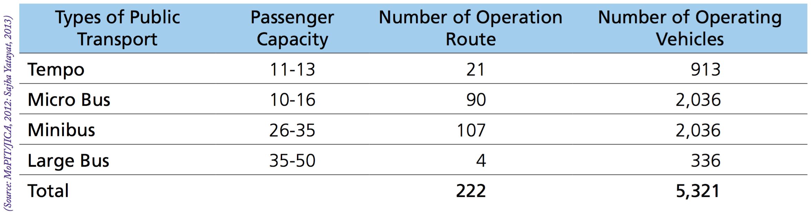
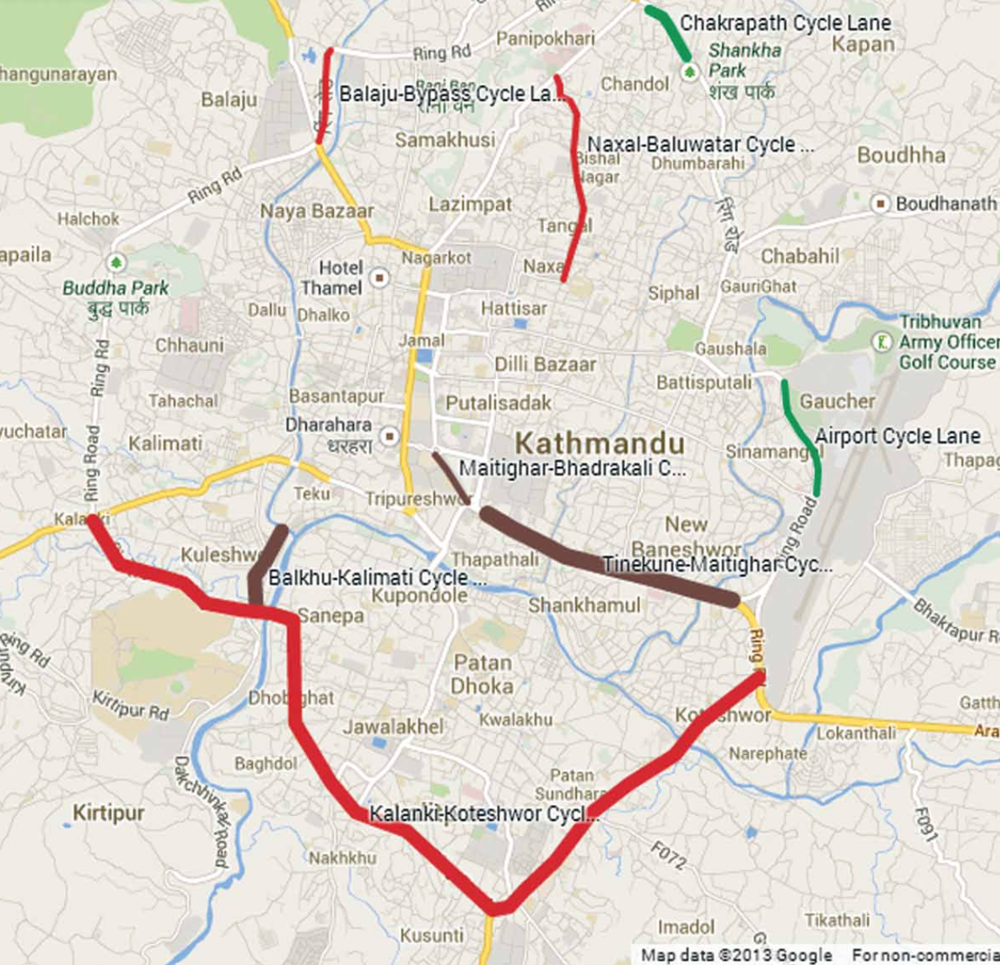
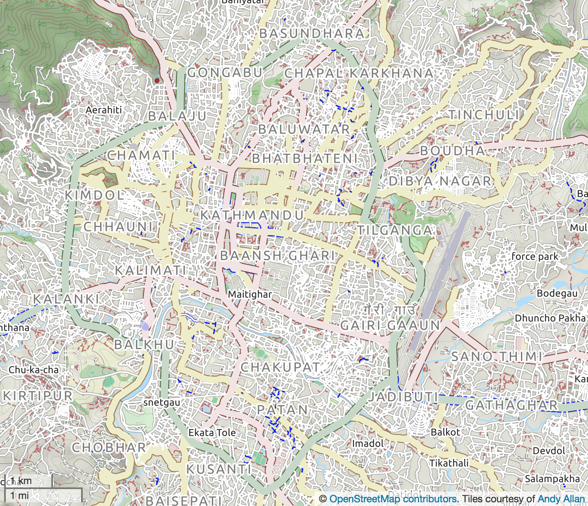

<!-- Note: this is where I'm adding the write-up for now for maximum visibility.
Can go elsewhere, e.g. as a vignette before this is open sourced. -->
An overview of Kathmandu from an active travel perspective
----------------------------------------------------------

### Kathmandu District, Metropolitan City and Valley

The Federal Democratic Republic of Nepal consists of 7 provinces. Kathmandu District lies within Bagmati province, along with twelve other districts, which together occupy about 14% of the country. Kathmandu District consists of eleven municipalities, one of which is the municipality of Kathmandu Metropolitan City, the capital city. According to the Nepalese Central Bureau of Statistics (CBS, 2001), Kathmandu is by far the most densely populated of all 75 districts, with 1,081,845 inhabitants (4.67% of the total Nepalese population) and a population density of 2,738.9 people per square kilometre (p/km2) in 2001. The national average district density in 2001 was 157.3 p/km2 and the only other district to have a population density of over one thousand was Bhaktapur (1.894,6), which borders it to the east.

For most statistical surveys and transport planning purposes, amongst others, Kathmandu municipality is considered as part of a different geographical unit, namely Kathmandu Valley, which spans 3 districts, two municipalities of which are in Kathmandu District, one in Lalitpur District, and two in Bhaktapur District. This mismatch between administrative authorities is part of the reason why it is hard to compose, finance and execute e.g. transportation plans for this region (East-West Center, 2009). In 2013 Kathmandu Valley had a density of 4,400 p/km2, with a density of 19,250 p/km2 in Kathmandu municipality alone (World Bank, 2013). In September 2017 the population of Kathmandu Valley was estimated at approximately 3 million permanent residents, with an additional floating population of 2.5 million. Since Kathmandu has had an annual growth rate of 4.63% for at least the last decade (compared to 1.53% nationally), this means an increase of the population with 57% over this period of time. New municipalities in Kathmandu Valley even exhibit annual growth rates of 5.7%, while the national average is only 1.53%. (Pradhan, 2017)

As Kathmandu Valley is the most urbanized region of Nepal, there is generally a good availability of utilities (water, gas, electricity), sanitation, education, and transportation, though recent rapid haphazard urbanization accounts for worse conditions in the expanding areas and increased pressures on the existing infrastructures and facilities (East-West Center, 2009). In 2011 there were 1329 people per kilometre of sewerage service in Kathmandu municipality, with the Nepalese average being 1942. The roads in Kathmandu District were 67.7% black topped, 15.4% gravelled and 16.8% earthen in 2011. The district had 7896 people per km of road at the time, with a total road length of 220.89 km, and a density of 56 km of road per square km, as opposed to 2445 people/km and 7 km/km2 on average nationally. In Kathmandu Municipality nearly all roads were black topped in 2011 (99.7%), with the remainder being gravelled, and there were just over ten thousand people per kilometre of road (CBS, 2014.)

While the elevation in Kathmandu District varies between 1,262 and 2,732 meters above sea level, Kathmandu itself is relatively flat and located at an average elevation of 1400 meters (Wikipedia, 2018a; 2018b). In a report from February 2009 (East-West Center, 2009), the dominant land-use type in Kathmandu Metropolitan City is classified as "Mixed" in the "Built up" category, covering nearly half the city (48.89%), followed by "Cultivation" (16.80%) and "Open area" (10.77%). Following those, a substantial part of the city is classified as Road (7.29%) or "Road median" (0.8%).

Boundaries of Kathmandu, Lalitpur and Bhaktapur Districts, their municipalities, and Kathmandu Valley. Source: East-West Center, 2009

**Weather and climate in Kathmandu**

Since Kathmandu District and Kathmandu Valley both span a great elevation range, they also cover multiple climate zones, but Kathmandu itself falls in the warm temperate zone, with four seasons and average daily temperatures ranging from 10.8°C in the coldest month (January; average minimum 2,4°C, maximum 19.1°C) to 24.3°C in the warmest month (July; avg. min. 20.2°C, max. 28.4°C). Annual precipitation is 1,454.9 mm, with November being the driest month with an average monthly precipitation of 8.3 mm (1 precipitation day on average) and July the wettest with 363.4 mm (23 precipitation days). There is one monsoon season, which lasts from June through August, during which 64% of the annual precipitation falls over the course of 62 precipitation days. If September is included, 78% of the average annual precipitation is accounted for. (precipitation & temperatures: MFD, 2018; precipitation days: WMO, 2018)

### Brief overview of the existing public transport infrastructure in Kathmandu

**Kathmandu Valley public transport and modal split**

In 2011 3.5 million trips were made each day on average in Kathmandu Valley. Walking was found to be the most dominant mode of transportation in Kathmandu Valley (40.7%), followed by transportation by bus (27.6%), motorcycle (26.0%) and car (4.2%). The travel mode share of cycling was only 1.5%, though it had been 6.6% two decades before, prior to the onset of the rapid urbanization and motorization of the region, whereas the motorcycle share had only been just over a third of the 2011 share in 1991 (9.3%). The public transport share remained similar (27.2% in 1991). Walking, as the other non-motorized mode, also saw a decreased share in 2011, down from its 1991 share of 53%. Despite the removal of pavements on major roads in the cities, in an attempt to create more space for motorized traffic, three of these roads still saw foot traffic at average rates of 690-2010 people per hour (maximum 816-2214/hr) a 2011 study revealed. Kathmandu was classed as "not walkable" and Kathmandu came out as one of the least walkable cities of Asia in a 2010 study. There are also no provisions for people with disabilities. In 2012 an average 270 cyclists per hour were found to be headed in each direction on Tundhikel Road during rush hour (9-11 a.m.) and 194 per hour during the rest of the day. (CEN, 2013c; Khanal & Shrestha (CEN), 2012) Though motorcycles and cars together account for 93% of the vehicles in Kathmandu Valley, and public transportation buses for 3%, their travel mode share in 2011 was comparable. During the 2001-2011 decade, the rate of increase in the amount of vehicles being newly registered each year greatly outpaced the population increase in Kathmandu Valley, with a growth of 14% per year across all vehicles and 17% per year for motorcycles alone (CEN, 2013a).

Congestion in Kathmandu. Source: Cover photo from Udas (CEN), 2012; photo by Keshav Thapa (CEN)

Kathmandu Valley public transport operates from 4:30-21:00, with peak hours being from 8:30-11:00 and 17:00-19:00. An attempt in 2012 to run public transport services until 11 p.m. with the presence of armed police on each vehicle was found to be financially intractable due to the low number of passengers and the associated security costs. Should people require transportation for work-related purposes at night, their company will provided or a taxi will be used. The main trip purpose is work (40% in men, 36% in women) or education. Other journeys are generally made between noon and 4 p.m. Most journeys last 15-30 minutes and only 10% last more than an hour. During peak travel times at least a third to half of the passengers will be female. 'Trip chaining' (because of e.g. shopping or child care) is done by men and women in equal measures. The majority of people walk 5-10 minutes to reach their public transport service (46.2%) and a further 5-10 minutes (39.1%) to reach their final destination. Equally, most passengers have to wait 5-10 minutes for an available vehicle at their origin and destination stops, both during morning peak hours (55%), during the evening peak (45.8%), and in transit (49.2% during morning peak hours, 47.7% in the evenings). (World Bank, 2013)

In a 2012 public transport survey the main purposes of public transport journeys in Kathmandu Valley were revealed to be for work (38.64%) or study (34.3%). Nearly a third (32.2%) of all journey destinations were in the 'city core area', with just under a third (29.73%) of all transits also occurring in this area. (Udas (CEN), 2012)

Men are more likely than women to have access to a family owned vehicle (including bicycles), though as of 2013 women were rapidly acquiring small scooters, which is why there are fewer men (16%) with no alternative to using public transport than women (26%). If they do have access to an alternative, the number one determining factor for mode of transportation for both genders is overall journey duration (men 84%, women 74%). (World Bank, 2013.)

A wealth of different types of public transport vehicles have operated and are operating in Kathmandu Valley, all of which are currently privately owned and run by a syndicate, with exception of the Sahja buses, which are operated by a cooperative. Most individual operators only own one vehicle, where in some cases they will also operate the vehicle, and there are few individuals who own more than ten vehicles. (Wolrd Bank, 2013.)

Nepal Transport Service initiated public transport in Kathmandu Valley in September 1959 with eventually 11 buses operating between Kathmandu and Patan (in Lalitpur District, which borders Kathmandu municipality to the south), transporting over ten thousand passengers each day during its prime. The service shut down in 1966. (CEN, 2014a)

Meanwhile, Sahja Cooperative Yatayat had been founded in 1961/62 to offer a means of affordable public transportation, not only in Kathmandu Valley, but across the entire country. While they operated a fleet of 200 Sahja buses (54 seating capacity, 100 including standing) in their peak days, they started to encounter financial difficulties from 1990 onwards due to government mismanagement and the private sector starting to get involved in the public transport sector. Consequently their services started to dwindle, until being suspended completely in 2006/07. After purchasing 16 buses, they resumed their services in Kathmandu Valley in 2012 Sahja buses. The buses follow regular routes and the government set distance-based fare structure. To aid in route planning and fare calculation, the Monsoon Collective, in collaboration with students from Kathmandu University, have developed an open-source and freely accessible application (OpenStreetMap Wiki, 2014). Additionally there is a number which can be phoned, to enquire when the next bus will be. The main reason people prefer other modes of public transportation over the Sahja buses is due to their infrequent operation schedule (World Bank, 2013).

The electric trolley bus system, which had been a gift from the Chinese government, suffered a similar, but ultimately more final, fate. It ran from the centrally located Tripureshwor, through the valley for 13 km in an east-southeasterly direction, towards Surya Binayak from the end of 1975 until 1990, when it also started incurring losses due to mismanagement, amongst other causes. It suspended its services at the end of 2001, and when it reopened under Kathmandu Metropolitan City management in September 2013, it only operated on the 5 km stretch that fell within its municipality limits. After an additional year of suspended services, the system was officially terminated in November 2009. Though there have been plans to reinstate the trolley bus system, these have yet to materialise. (Udas (CEN), 2012)

In 1993, USAID supported the introduction of seven Safa Tempos (electric three wheelers). In a further effort to control pollution, the government banned all diesel-operated three wheelers in 1999/2000, resulting in the Safa Tempo fleet size increasing to the current capacity of 600 vehicles and the introduction of micro buses. (CEN, 2014a.) A Danida-funded project encouraged women to become Safa Tempo drivers, resulting in approximately 200 female drivers, with some being owners as well (World Bank, 2013). In addition to the Safa Tempos and the Sahja buses, minibuses and large buses are operational in Kathmandu Valley as well, resulting in an overall public transport fleet size of over 5,321 vehicles, servicing 222 routes in 2012/13 (CEN, 2014a). Additionally, there is a fleet of around seven thousand taxis, but very few people can afford to use them, and they will rarely use their meter, so their modal share is minimal, despite occupying around 55% of the public transport fleet (World Bank, 2013). The majority of passengers prefer to travel in the microbuses (49.3%), followed by buses and minibuses (39.5%), with only 10% expressing a preference for Safa Tempos. In general people prefer to travel in larger vehicles, due to the higher availability of seats, which are more comfortable, and increased speeds (Udas (CEN), 2012).

Distribution of the different public transport vehicle types in Kathmandu Valley (2010). Source: Fig. 5 from Udas (CEN), 2012 (originally KSUT Project Report)

Capacity and fleet of the different public transport vehicle types in Kathmandu Valley (2010). Source: Table 2 from Udas (CEN), 2012 (originally KSUT Project Report)

Routes and fleet size of the different public transport vehicle types in Kathmandu Valley (2010). Source: Fig.1 from CEN, 2014a (originally MoPIT/JICA 2012, Sahja Yatayat 2013)

**Transport-related air pollution in Kathmandu**

Due to the bowl-shaped mountain-surrounded topography of Kathmandu Valley, emissions from vehicles and other sources can get trapped in the Valley for a prolonged period, especially during the winter months, when atmospheric inversion occurs, and the rest of the dry season. Combined with the aforementioned recent rapid motorization trend in Kathmandu, which has been 12% per year in the Bagmati zone (which encompasses the three Kathmandu Valley districts and five others) in the decade from 2002/03-2012/13, this has led to 2-hourly PM10 levels being recorded in Putali Sadak, a traffic-dense areas in Kathmandu, during the winter of 2013/14, which were up to sevenfold that of the nationally set limits (NAAQS) and up to 15 times in excess of the WHO guidelines. (CEN, 2014b)

Already in 2006, when there were far fewer vehicles in Kathmandu Valley, 63% of PM10 emissions was attributed to transportation, with vehicle emissions themselves accounting for 38% of PM10 emissions and resuspended dust from unpaved and degraded roads for the remaining 25%. A more recent study from 2010 attributed 98% of PM10 emissions to the transportation sector. (CEN, 2014b)

Along with an increase in respiratory diseases, the increasing levels of air pollution have also led to a substantial increase in the number of deaths from chronic obstructive pulmonary disease in children (+24.2%) and across all ages (+15.9%) during the period 2005-2016, making it the second most prominent cause of death for the former and fifth most prominent cause of premature death causes for the latter across all of Nepal. (IHME, 2018.)

**Issues with public transport**

The mains issue with public transport in Kathmandu as given by both men (80%%) and women (70%) was "overcrowding", followed by "personal insecurity" (33% in women, 16% in men) and "reckless driving and fear of accidents" (18% in women, 16% in men). In general there were few differences between men and women with regards to their perception of public transport, the main difference being in the feelings of personal insecurity while traveling, and experiencing physical difficulties while boarding or traveling, mainly due to the aforementioned overcrowding. Because of this, women are more likely to wait for the next vehicle. The second most mentioned issue with public transport is also related to overcrowding, since it increases opportunities for pickpocketing, personal abuse or inappropriate touching. (World Bank, 2013.)

Women aged 19-35, but especially those aged 19-25 years, were the most likely to list personal insecurity as an issue, with 43% of them mentioning it due to fearing or experiencing inappropriate touching. Men in the 19-25 age group on the other hand were among the least likely to list personal insecurity as in issue (just over 5%), together with those aged 65 or above. For both women and men of over 35, the fear of inappropriate touching is much less of an issue, though the other personal insecurity concerns remain. While women feel most insecure while on the vehicles, men mainly experience personal insecurity while boarding or disembarking. Of those for whom personal insecurity is an issue, it was revealed that 37% of women and 6% of men had actually experienced inappropriate touching during the preceding year. When taking the entire survey population into account, this figure was 26% for 19-35 year old women and 3.4% for men of all ages. (World Bank, 2013.)

Overcrowding is higher in the evening peak hours, than in morning peak hours, partially due to a lower operational fleet in the evenings. Safa Tempos will only have an additional 2-3 people during peak hours, due to their dimensions not allowing for standing passengers, unless hanging from the back. Micro buses will carry an additional 5-6 passengers during the morning and evening peak respectively, and mini buses 10 to 13. Both female (59.7%) and male (49.2%) passengers feel unsafe when traveling at night. (Udas (CEN), 201).

<!--

Morning peak hours vehicle type occupancy in Kathmandu Valley (2010). Source: Fig. 15 from Udas (CEN), 2012 (originally KSUT Project Report)

Evening peak hours vehicle type occupancy in Kathmandu Valley (2010). Source: Fig. 16 from Udas (CEN), 2012 (originally KSUT Project Report)

-->

Peak hours vehicle type occupancy numbers in Kathmandu Valley (2010). Source: Tables 8 & 9 from Udas (CEN), 2012 (originally KSUT Project Report)

Nearly one in six people was concerned with the transport fares, with some of the lower-waged workers having to allocate 20-40% of their wages to public transport costs. Many people had to relocate to save on commute costs. Since women have less access to personal vehicles, they tend to have to spend more on transport. Another concern, besides the actual costs, is that there is no consistent or transparent fare structure levied, despite the government providing a set distance-based fare structure. The government will adjust the fares, following for example fluctuations in petrol prices, but since the rates are not signposted inside the vehicle or elsewhere, people are at the mercy of what conductors feel like charging them. (World Bank, 2013.)

A lot of issues arise from the fact that the public transport system is privately run by in a syndicate system. Decisions on matters like fare, routing, departure times, vehicle occupancy, operation hours, amongst others, are dictated by vehicle owners wanting to maximise their profits, resulting in e.g. overcrowding, long wait times due to operators wanting to depart only with a vehicle which is completely filled (usually far beyond its official capacity), and no services in the evening when passenger numbers are generally quite low. Furthermore it is impossible for any potential competitors to enter the market, which could otherwise benefit passengers. (Udas (CEN), 2012).

While just over a third (34.5%) of passengers feels neither comfortable, nor uncomfortable, with the amount of seating space whilst traveling, a similar share (34.2%) does feel uncomfortable and nearly two thirds (61.7%) of female passengers feel uncomfortable with the available space. A similar proportion of passengers (61.3%) feel that most drivers of public transport vehicles generally drive recklessly and 67.3% finds the actual vehicles themselves unhygienic and not properly maintained. Furthermore, both drivers and passengers generally do not respect the actual locations of public transport stops, which, an overwhelming majority of passengers (84.1%) feel they should do. Most passengers find it easy (53.9%) or even very easy (10.5%) to identify the public transport vehicle for their intended route, but many passengers struggle to do so, with 21.7% finding it difficult and 7.6% very difficult and 6.3% who found it difficult initially, but are now managing to correctly identify them, generally once they have journeyed on that particular route for over a month. (Udas (CEN), 2012)

Overall, the majority of passengers (57.6%) rate the experience of using public transport in Kathmandu Valley as "average", though nearly a third (32.9%) finds it "unpleasant" and only 9.5% of passengers rate it "pleasant". (Udas (CEN), 2012)

**Government plans for alleviating congestion and pollution**

While the government has already introduced some measures previously (banning diesel- and petrol-operated three wheelers and introducing a green sticker system for vehicles in December 1999 (CEN, 2014b)), most focus to date has been on widening existing roads to 6 or 8 lanes and building more roads as the urbanization has spread. Since this has proven to be far from adequate in coping with the increased motorization, congestion and pollution, more sustainable and long-term plans have been constructed. In July 2015 an introduction of the "Project on Urban Transport Improvement for Kathmandu Valley in Federal Democratic Republic of Nepal" was presented. For the road system, a radial-circumferential system will be adopted, allowing vehicles whose origin or destination is not in the central business district to avoid having to pass through there. (Government of Nepal, 2015.)

Kathmandu road plans. Source: Government of Nepal, 2015.

Similarly, for the public transport system, a hierarchical route network will be made, keeping only a third of the routes based on mobility numbers, and four transfer terminals will be created in each cardinal direction, to alleviate pressure on the central terminal. By reducing the import fees for vehicles with a seating capacity of over 40 seats, they hope to encourage a shift towards larger public transport vehicles. Furthermore, they intended to have short-, mid- and long-term transport master plans in place in the following 5, 10 and 15 years respectively. They envisioned plans for a number of different sectors, including non-motorized transport. (Government of Nepal, 2015.)

Kathmandu Sustainable Urban Transport Project public transport plans. Source: KSUTP, 2016

**Making a case for cycling**

According to a 2011 travel survey, journeys by private vehicle are 5 km long on average and 90% of non-motorized trips undertaken are completed in under half an hour (CEN, 2013c).

A number of organisations in Kathmandu and Nepal are committed to increasing the cycle mode share, to alleviate congestion and improve air quality and general road safety. On World Environment Day 2009, ["Team for Nature and Wildlife"](https://www.tnwnepal.org/download/KathmanduCycleCity2020.pdf) (TNW Nepal), a local NGO, launched a campaign for making Kathmandu a cycle-friendly city by 2020. In addition to lobbying for better cycling infrastructure, and cycle training, they hope to convince especially those who are currently using non-public motorized transport to switch to cycling. The Kathmandu Cycle City 2020 (KCC 2020) campaign is coordinated by ["Cycle City Network Nepal"](http://cyclecity.org.np/) (CCNN), whose members are students of three Nepali Universities (two of which are located in Kathmandu District). <!-- (TNW, 2018.) --> In addition to the KCC 2020 campaign, CCNN also coordinates 4 other campaigns, namely Women on Wheels, Bike to School, Bike to Work, and Critical Mass.

["Clean Energy Nepal"](http://www.cen.org.np) (CEN) is an organisation, which works on a "Clean Air & Urban Mobility" program, as well as two other programs, hence their interest in sustainable transport. They hope to raise awareness and achieve required policy and behavioural changes. Clean Air Network Nepal (CANN) is part of the ["Clean Air Asia"](http://cleanairasia.org/) NGO, with similar objectives. These two organisations, together with Cycle City Network Nepal, UN-Habitat, and Nepalese Youth for Climate Action, have initiated "A Campaign for People-centric Transport System", which is abbreviated as "MaYA" in Nepali.

While most children in Kathmandu Valley know how to cycle (77%), very few actually cycle to school, preferring to go on foot (&gt;77%) or by school bus or public transportation (19%) instead. The main reason for not cycling to school was that it is perceived as unsafe (41%), followed by not owning a bicycle (36%), pollution (13%), and distance (5%). Practically none (&lt;1%) said it would be unaffordable. Though they generally do not cycle to school, most children will cycle when there is a general strike, since there is no traffic on the roads then, and 26% will cycle some times per week, with 5% cycling every day. Thus, providing a safer cycling infrastructure will enable more students to cycle to school. (CEN, 2013c.)

During the 2013 "Cycling in Nepal: Challenges and Opportunities" workshop, participants vowed to make Kathmandu a cycle city by 2020, and have made a declaration to this affect, noting various points of action to follow through with the relevant stakeholders. The second of these involves ensuring cycle lanes are included in any future developments in a connected and well thought-out manner. (CEN, 2013b)

### Cycling infrastructure in Kathmandu

**People's attitudes towards cycling**

While cycling used to be a popular mode of transportation in Kathmandu Valley historically, there has been a shift towards motorcycle transportation during the past decades, decreasing the cycling modal share to just 1.5% in 2011. Though nationally 29.9% of urban residents owned a bicycle in 2011, in Kathmandu Valley this was only 11.4%. Part of the reason people are averse to cycling in Kathmandu Valley these days is due to the fact that they see it as a poor man's transportation mode. The remainder is mostly down to it being dangerous due to the lack of proper cycling infrastructures and unhealthy due to the high levels of air pollution. Pedestrians and cyclists are often casualties in road accidents, with 7 cyclist fatalities recorded in the fiscal year of 2011/12 out of a total of 180 involved in accidents that year and 8 fatalities recorded for 2012/13. (CEN, 2013c) In general 130 major road accidents are reported in the valley each day, in addition to over a thousand minor incidents (World Bank, 2013).

**Government sponsored infrastructures**

On paper, great plans have been proposed by the government with regards to building cycling tracks, yet it has taken a lot of pressure from Cycle City Network Nepal (CCNN) to get the Maitighar-Tinkune (both towards the southern boundary of Kathmandu Metropolitan City) cycle lane, which was promised back in 2000, realised well over a decade later (CEN, 2013c). However, an evaluation by the Clean Air Network Nepal of this 2.7 km long cycle track found it to be rarely used, with cyclists preferring to stay on the carriageway, due to it seriously lacking in terms of signage, connectivity, surfacing, safe passage at intersections and bridges, presence of obstructions, amongst other issues and make recommendations for how these matters can be improved (CEN & CANN, 2015). The 44 km of cycle tracks promised in 2005, as part of the 'Velo Mondial Charter and Action Plan for Bicycle Friendly Communities', and cycle lanes on roads wider than 22 meters, have yet to materialise. The first cycle track to be constructed runs from Tilganga to Sinamagal towards the easternmost boundary of the metropolitan city. This 1.2 km track benefits from being separated from the road and offers a lane for pedestrians as well, but it is due to it suffering from most of the same problems mentioned above, this cycle track too is rarely used (CEN, 2012).

Planned (brown), being constructed (red) and existing (green) cycle tracks as of December 2013. Source: Fig. 12 CEN, 2013c

OpenStreetMap Cycle Map and Google Aerial for Kathmandu Metropolitan City. Source: openstreetmap.org.

### Assessing the quality of OpenStreetMap of Kathmandu

Kathmandu is very well represented on OpenStreetMap, thanks to a number of projects by the Kathmandu Living Labs (KLL) organisation. KLL has not only informed residents about the importance of having accurate and freely available spatial data, and how these can help improve interactions between the local governing authorities and citizens, but also arranged training workshops to educate them in how to map their environments accurately, which by 2015 had been provided to over 1,400 people. In addition to this, they have had a specific project which involved mapping the 2600 schools and 300 hospitals in the area in 2013. Their initiative has resulted in the mapping of 2,054,436 buildings and 135,063 kilometres of roads. (KLL, 2018.)

Improved representation of Kathmandu on OpenStreetMap after KLL efforts. Source: KLL, 2018.

**Demography and population of Kathmandu**

The population in Kathmandu municipality has been increasing rapidly, from 671,846 inhabitants in 2001 to 1,003,285 (254,764 households) in 2011 (CBS, 2014) and currently around 1.5 million (Wikipedia, 2018a), thus increasing at a much higher rate than the national 1.35%. While nationally the sex ratio is close to parity, in Kathmandu municipality the male population was 113.39% that of the female population in 2011 (CSB, 2014). Based on the results from the CBS 2011 survey, 23.76% of Kathmandu Metropolitan City residents are aged 0-14, 48.59% is 15-35 and 27.65% is over 35, with the distributions being similar for both genders.

<!-- mention migration etc, birth rates, employment, have them for all of nepal, but not kathmandu -->

Kathmandu population density (2011). Source: Thomas Brinkhoff: City Population, <http://www.citypopulation.de>

References
==========

CBS. 2001. ["Population Density."](http://cbs.gov.np/image/data/Gis_Maps/Population/Population%20Density.gif)

CBS. 2014. ["Environmental Statistics of Nepal - 2013."](http://cbs.gov.np/image/data/2015/Environment%20Statistics%20of%20Nepal%202013.pdf) *CNN Printing Press, Kathmandu, Nepal.*

CEN. 2013a. "Sustainable Urban Mobility - Kathmandu Valley." [Poster](http://www.cen.org.np/uploaded/Poster_Urban%20Mobility%20Kathmandu.pdf)

CEN. 2013b. ["Kathmandu Declaration 2013 for establishing Kathmandu as a Cycle City by 2020."](http://www.cen.org.np/uploaded/Kathmandu%20Declaration%202013%20for%20establishing%20Kathmandu%20as%20a%20Cycle%20City%20by%202020.pdf)

CEN. 2013c. "Cycling in Kathmandu Valley - Pedal power for Equity and Sustainability." [MaYA Fact Sheet \#3](http://www.cen.org.np/uploaded/Cycling%20in%20Kathmandu%20Valley_MaYA%20Factsheet%203.pdf)

CEN. 2014a. "Public Transportation in Kathmandu Valley - Restructuring and Reforming the System." [MaYA Fact Sheet \#4](http://www.cen.org.np/uploaded/Public%20Transportation%20in%20KV_Maya%20Factsheet%204.pdf)

CEN. 2014b. "Air Quality Status and Management in Kathmandu Valley - Make the City Air Breathable." [MaYA Fact Sheet \#5](http://www.cen.org.np/uploaded/AQ%20Status%20and%20Managment%20in%20KV_Maya%20Factsheet%205.pdf)

CEN & CANN. 2015. ["Assesment of Tinkune-Maitighar Cycle Track Design."](http://www.cen.org.np/uploaded/Cycle%20Track%20Assessment_Final%20Report.pdf)

East-West Center. 2009. "Governance and Infrastructure Development Challenges in the Kathmandu Valley." [Final Workshop Report, February 2009, Kathmandu, Nepal.](https://www.eastwestcenter.org/fileadmin/resources/seminars/Urbanization_Seminar/KMC_Workshop/EWC-KMC_Report__FINAL_for_web.pdf)

Government of Nepal. 2015. ["The Project on Urban Transport Improvement for Kathmandu Valley in Federal Democratic Republic of Nepal - Introduction of the Project."](https://www.jica.go.jp/nepal/english/office/topics/c8h0vm00009n66lq-att/150710_08.pdf) *July, 2015.*

IHME (Institute for Health Metrics and Evaluation). 2018. ["Nepal."](http://www.healthdata.org/nepal) *Accessed January 2018.*

Khanal, Prashanta & Shresta, Krity (CEN). 2012. "Walking and Cycling - A policy brief on non-motorized transport (NMT) system in Kathmandu Valley." [Policy Brief \#2, September 2012.](http://www.cen.org.np/uploaded/Policy%20Brief%202%20Non_Motorized%20Transport_September%202012.pdf)

KLL (Kathmandu Living Labs). 2018. ["Our Projects."](http://www.kathmandulivinglabs.org/) *Accessed January 2018.*

KSUTP. 2016. ["Kathmandu Sustainable Urban Transport Project (KSUTP) - A Sustainable Transport Project - Status and Progress."](http://www.unescap.org/sites/default/files/3.1%20%20Status%20and%20progress%20of%20Kathmandu%20Sustainable%20Urban%20Transport%20Project.pdf) *September 2016.*

MFD (Meteorological Forecasting Division, Government of Nepal). 2018. ["Kathmandu."](http://mfd.gov.np/city?id=31) *Accessed January 2018.*

OpenStreetMap Wiki. 2014. ["Nepal/Yatayat."](https://wiki.openstreetmap.org/wiki/Nepal/Yatayat) *Last modified 12 January 2014; accessed January 2018.*

Pradhan, Saroj Kumar (MPIT). 2017. "Initiatives of Multimodal Transportation Planning in Kathmandu Valley, Nepal." [Multimodal Transportation Planning Best Practices and Integration of Transportation Technologies (Smart Cities) Workshop. September 13-15, 2017. Mumbai, India.](https://mmrda.maharashtra.gov.in/documents/10180/10653740/8/0823504f-1090-47fa-9056-b271f2bb2f52)

Udas, Suman (CEN). 2012. ["Public Transport Quality Survey."](http://www.cen.org.np/uploaded/Public%20Transport%20Survey%20report.pdf)

Wikipedia. 2018a. ["Kathmandu."](https://en.wikipedia.org/wiki/Kathmandu) *Accessed January 2018.*

Wikipedia. 2018b. ["Kathmandu District."](https://en.wikipedia.org/wiki/Kathmandu_District) *Accessed January 2018.*

WMO. 2018. ["Kathmandu."](http://worldweather.wmo.int/en/city.html?cityId=114) *Accessed January 2018.*

World Bank. 2013. *Gender and Public Transport: Kathmandu, Nepal.* Nepal. © [World Bank.](https://openknowledge.worldbank.org/handle/10986/17872) License: CC BY 3.0 IGO.

<!-- with italics and without inline-style links

CBS. 2001. "Population Density." http://cbs.gov.np/image/data/Gis_Maps/Population/Population%20Density.gif

CBS. 2014. "Environmental Statistics of Nepal - 2013." _CNN Printing Press, Kathmandu, Nepal._ http://cbs.gov.np/image/data/2015/Environment%20Statistics%20of%20Nepal%202013.pdf

CEN. 2013a. "Sustainable Urban Mobility - Kathmandu Valley." _Poster_ http://www.cen.org.np/uploaded/Poster_Urban%20Mobility%20Kathmandu.pdf

CEN. 2013b. "Kathmandu Declaration 2013 for establishing Kathmandu as a Cycle City by 2020." http://www.cen.org.np/uploaded/Kathmandu%20Declaration%202013%20for%20establishing%20Kathmandu%20as%20a%20Cycle%20City%20by%202020.pdf

CEN. 2013c. "Cycling in Kathmandu Valley - Pedal power for Equity and Sustainability." _MaYA Fact Sheet #3_ http://www.cen.org.np/uploaded/Cycling%20in%20Kathmandu%20Valley_MaYA%20Factsheet%203.pdf

CEN. 2014a. "Public Transportation in Kathmandu Valley - Restructuring and Reforming the System." _MaYA Fact Sheet #4_ http://www.cen.org.np/uploaded/Public%20Transportation%20in%20KV_Maya%20Factsheet%204.pdf

CEN. 2014b. "Air Quality Status and Management in Kathmandu Valley - Make the City Air Breathable." _MaYA Fact Sheet #5_ http://www.cen.org.np/uploaded/AQ%20Status%20and%20Managment%20in%20KV_Maya%20Factsheet%205.pdf

CEN & CANN. 2015. "Assesment of Tinkune-Maitighar Cycle Track Design." http://www.cen.org.np/uploaded/Cycle%20Track%20Assessment_Final%20Report.pdf

East-West Center. 2009. "Governance and Infrastructure Development Challenges in the Kathmandu Valley." _Final Workshop Report, February 2009, Kathmandu, Nepal._ https://www.eastwestcenter.org/fileadmin/resources/seminars/Urbanization_Seminar/KMC_Workshop/EWC-KMC_Report__FINAL_for_web.pdf

Government of Nepal. 2015. "The Project on Urban Transport Improvement for Kathmandu Valley in Federal Democratic Republic of Nepal - Introduction of the Project." _July, 2015._ https://www.jica.go.jp/nepal/english/office/topics/c8h0vm00009n66lq-att/150710_08.pdf

IHME (Institute for Health Metrics and Evaluation). 2018. "Nepal." _Accessed January 2018._ http://www.healthdata.org/nepal

Khanal, Prashanta & Shresta, Krity (CEN). 2012. "Walking and Cycling - A policy brief on non-motorized transport (NMT) system in Kathmandu Valley." _Policy Brief #2, September 2012._ http://www.cen.org.np/uploaded/Policy%20Brief%202%20Non_Motorized%20Transport_September%202012.pdf

KLL (Kathmandu Living Labs). 2018. "Our Projects." _Accessed January 2018._ http://www.kathmandulivinglabs.org/

KSUTP. 2016. "Kathmandu Sustainable Urban Transport Project (KSUTP) - A Sustainable Transport Project - Status and Progress." _September 2016._ http://www.unescap.org/sites/default/files/3.1%20%20Status%20and%20progress%20of%20Kathmandu%20Sustainable%20Urban%20Transport%20Project.pdf

MFD (Meteorological Forecasting Division, Government of Nepal). 2018. "Kathmandu." _Accessed January 2018._ http://mfd.gov.np/city?id=31

OpenStreetMap Wiki. 2014. "Nepal/Yatayat." _Last modified 12 January 2014; accessed January 2018._ https://wiki.openstreetmap.org/wiki/Nepal/Yatayat

Pradhan, Saroj Kumar (MPIT). 2017. "Initiatives of Multimodal Transportation Planning in Kathmandu Valley, Nepal." _Multimodal Transportation Planning Best Practices and Integration of Transportation Technologies (Smart Cities) Workshop._ September 13-15, 2017. Mumbai, India. https://mmrda.maharashtra.gov.in/documents/10180/10653740/8/0823504f-1090-47fa-9056-b271f2bb2f52

Udas, Suman (CEN). 2012. "Public Transport Quality Survey." http://www.cen.org.np/uploaded/Public%20Transport%20Survey%20report.pdf

Wikipedia. 2018a. "Kathmandu." _Accessed January 2018._ https://en.wikipedia.org/wiki/Kathmandu

Wikipedia. 2018b. "Kathmandu District." _Accessed January 2018._ https://en.wikipedia.org/wiki/Kathmandu_District

WMO. 2018. "Kathmandu." _Accessed January 2018._ http://worldweather.wmo.int/en/city.html?cityId=114

World Bank. 2013. _Gender and Public Transport: Kathmandu, Nepal._ Nepal. © World Bank. https://openknowledge.worldbank.org/handle/10986/17872 License: CC BY 3.0 IGO.

-->
